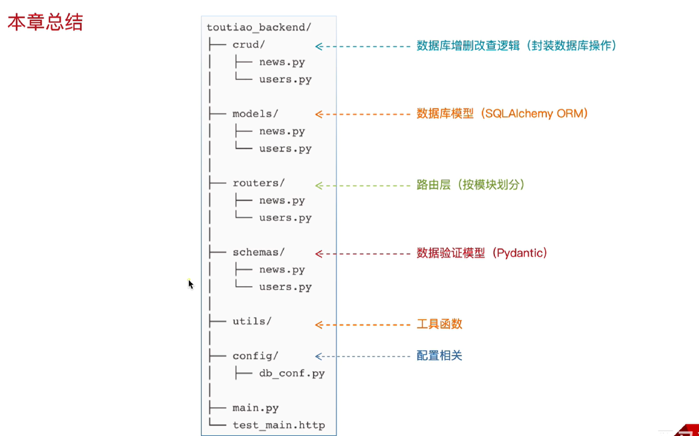

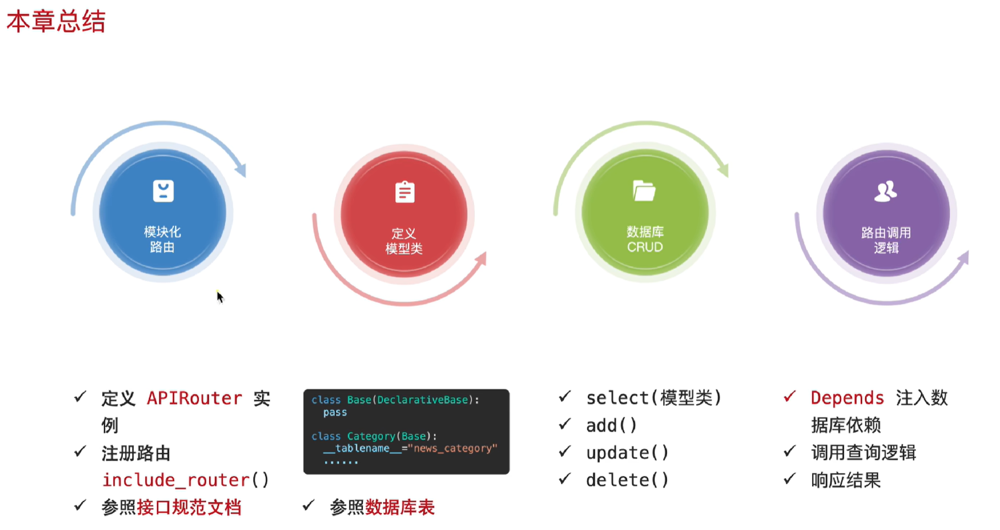

# 获取新闻列表-查询功能

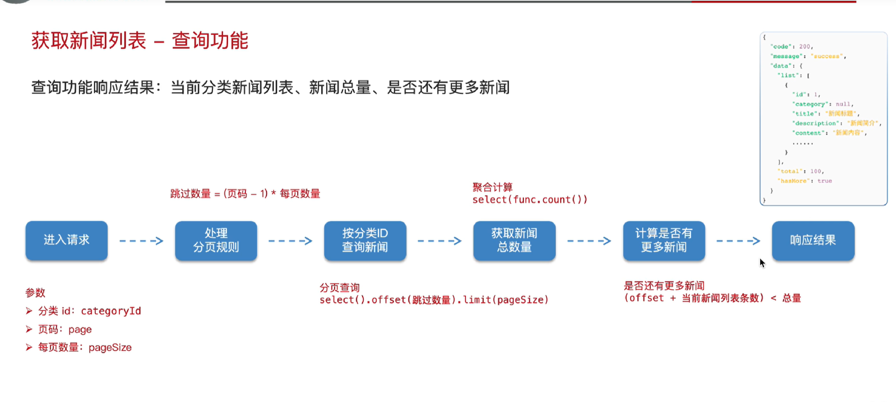

# 获取新闻详情

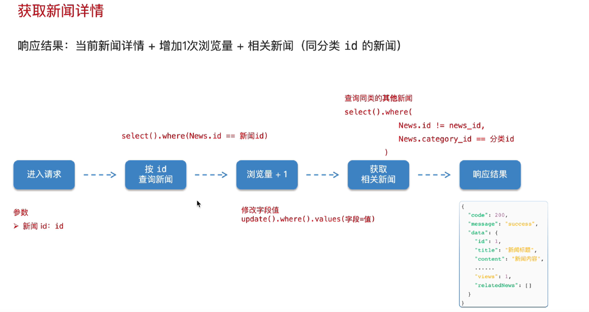

# 用户注册

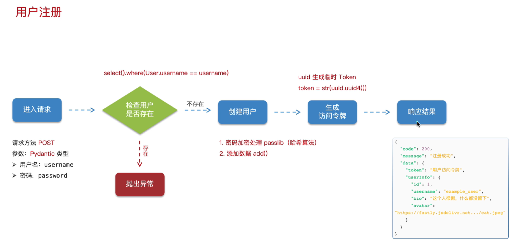

# passlib密码加密

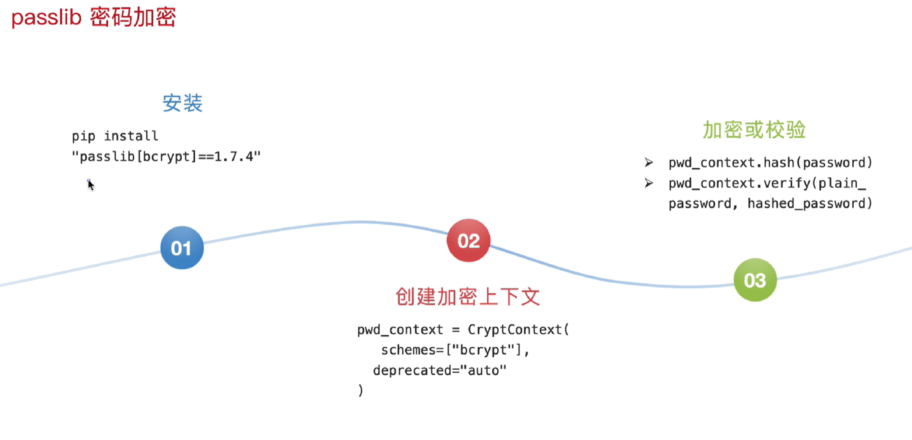

# 访问令牌生成响应给前端

- 访问令牌作用：用户是否登录的凭证。有访问令牌，说明登录了，可以看以及修改个人信息。没有访问令牌，说明没有登录，则不可以看以及修改个人信息。

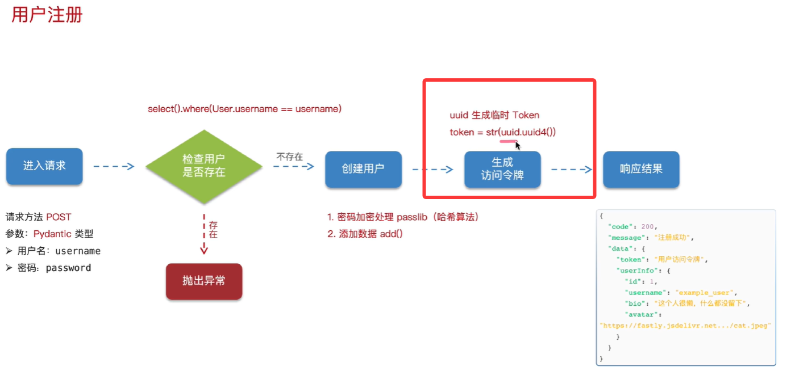

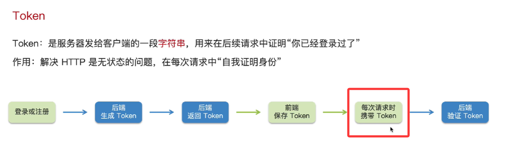

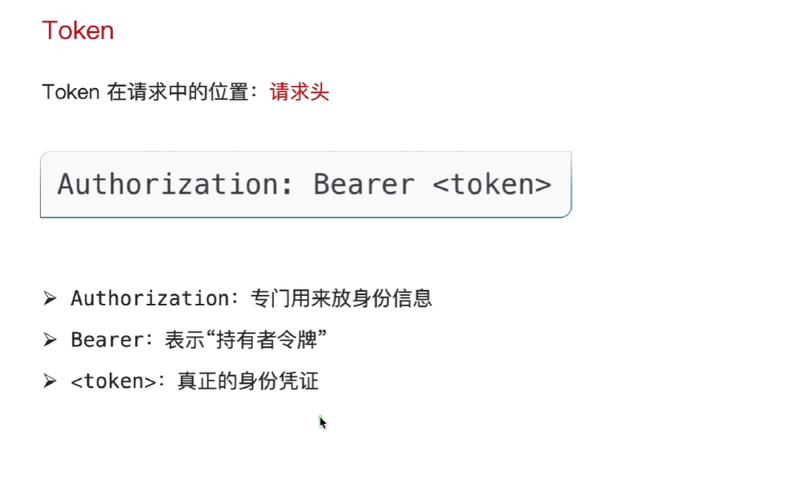

# 封装通用成功响应格式

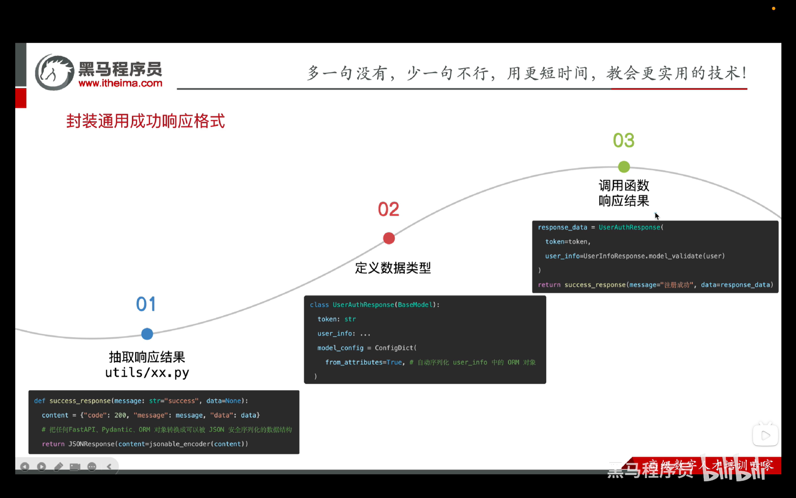

# 全局异常处理器

- 全局异常处理器（Global Exception Handler）是注册在FastAPI应用级别的`异常处理函数`，用于捕获业务层、数据库层以及系统抛出的异常，并以`统一的响应格式`返回给前端
- 异常：
  - SQL错误
  - 外键关联失败
  - 数据库连接异常
  - 提交事务失败
  - ......

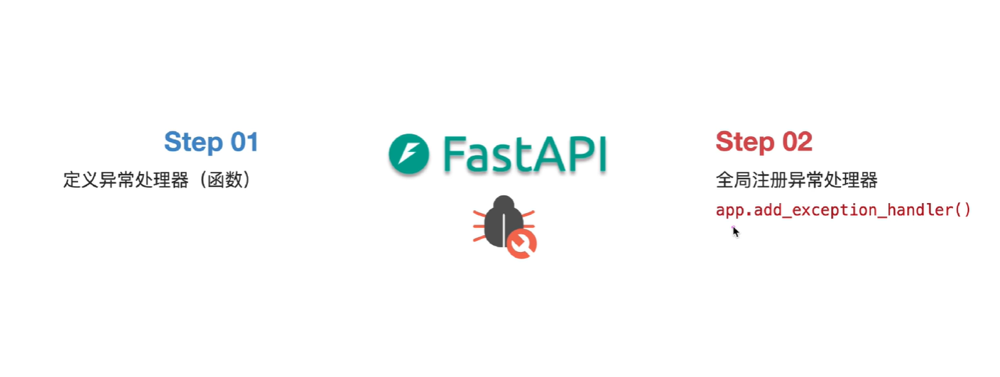

# 用户登录

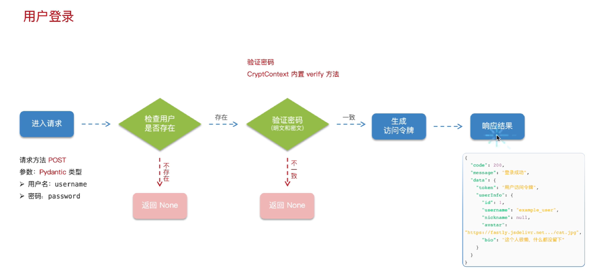

# 获取用户信息

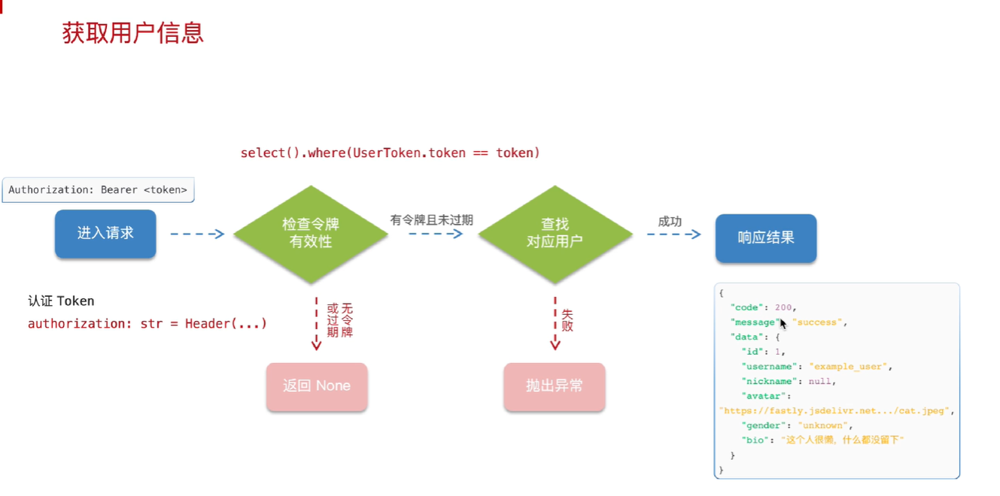

- **检查令牌有效性**以及**查找对应的用户**这两个功能在后面**修改用户信息**、**修改密码**都用得到，所以整合这两个功能到工具函数当中

# 修改用户信息

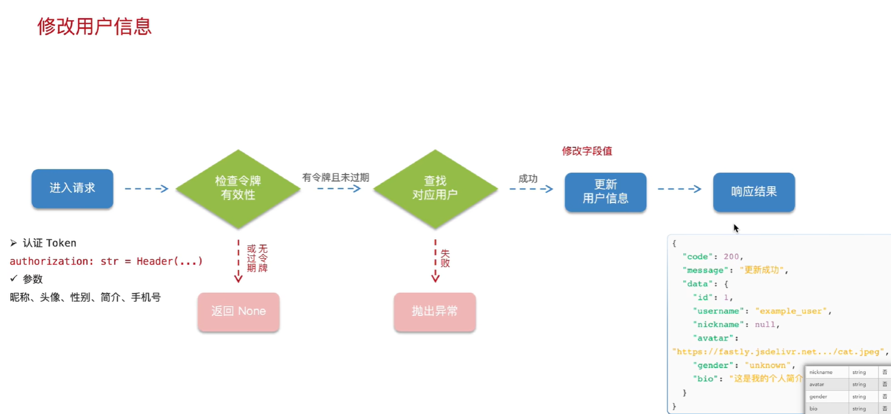

# 修改密码

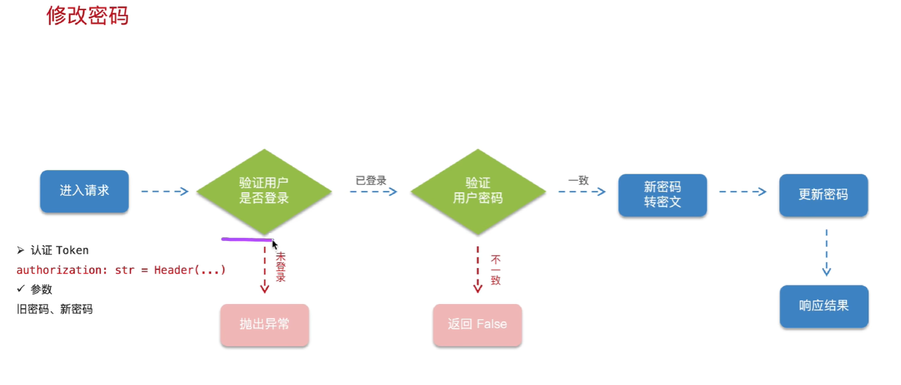