# web开发

- 大多数应用都是基于webview技术实现
  - 网页做出一切APP，然后在外面套上一个安卓，IOS，鸿蒙，windows的app外壳
- 前端
  - 界面的呈现
  - 美观
  - 交互
  - **运行在客户端(浏览器)上**
- 后端
  - 负责业务交互逻辑
  - **运行在服务器上**

# 前端开发环境安装

- 安装vscode
  - 官方地址：https://code.visualstudio.com/

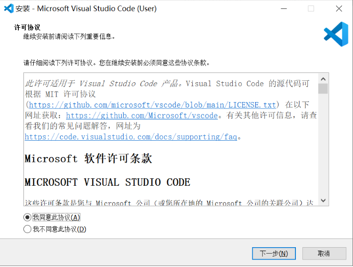

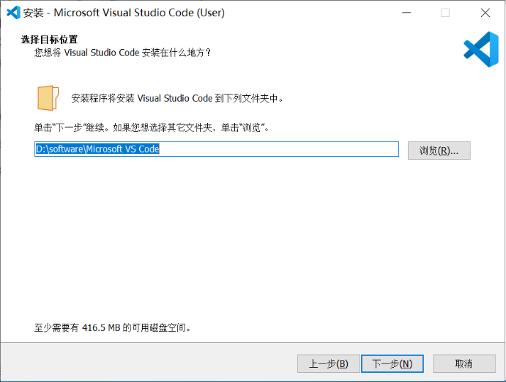

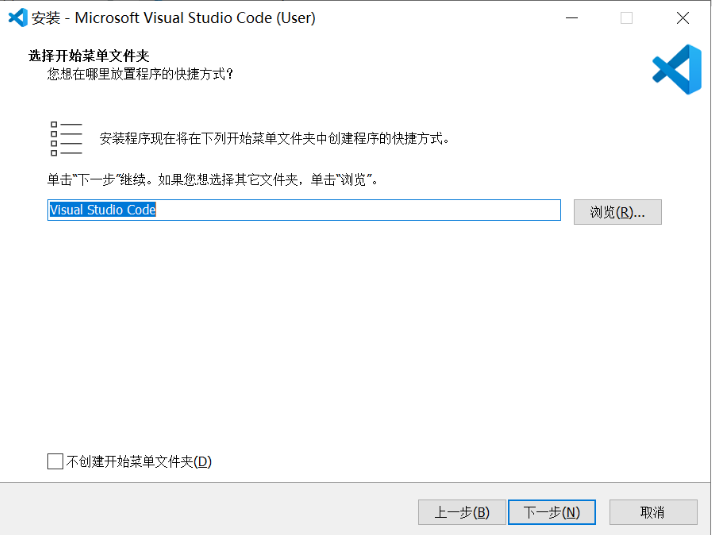

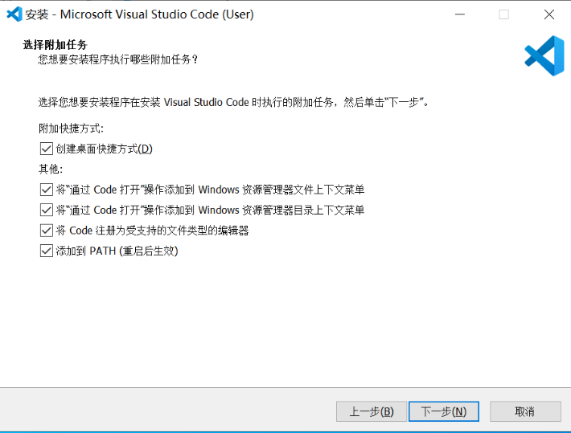

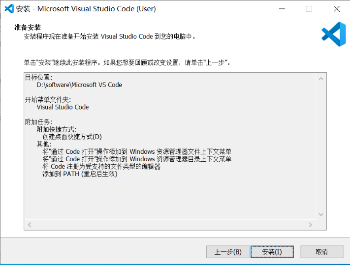

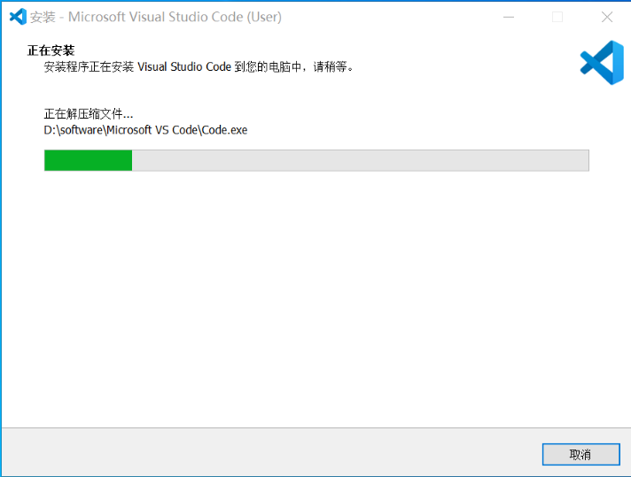

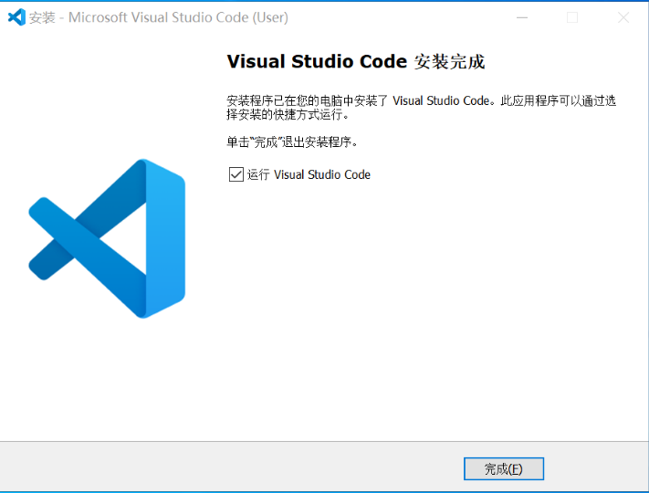

- 推荐的插件
- 简体中文语言包

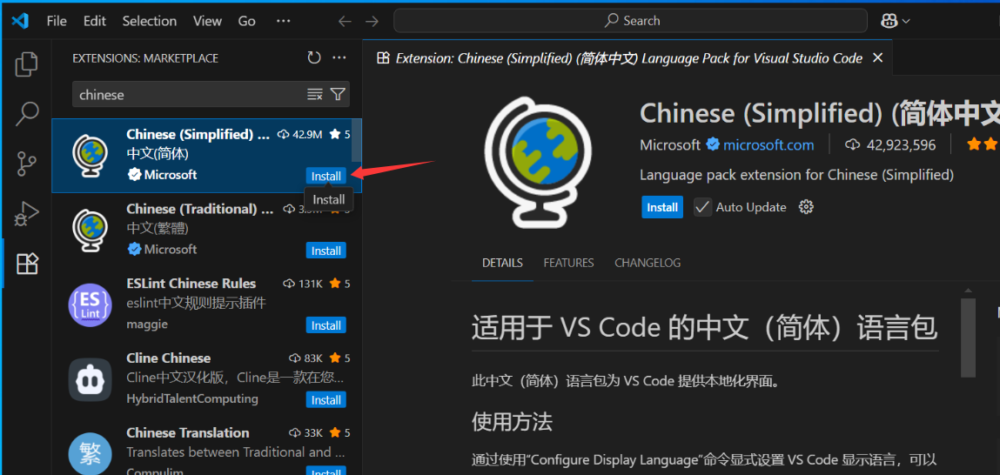

- 按下Ctrl+Shift+p，输入Display，选择配置语言

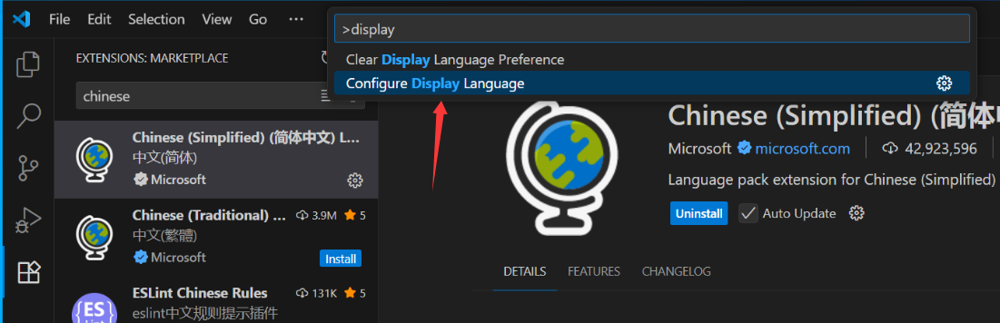

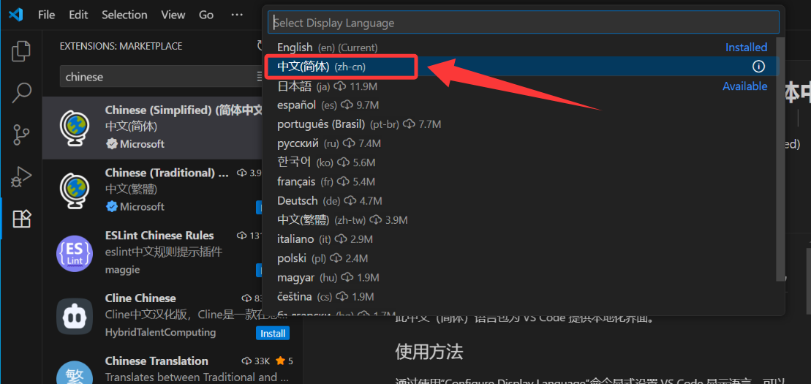

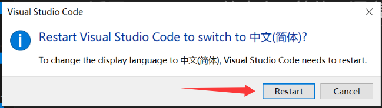

- HTML+CSS+JS 开发辅助插件

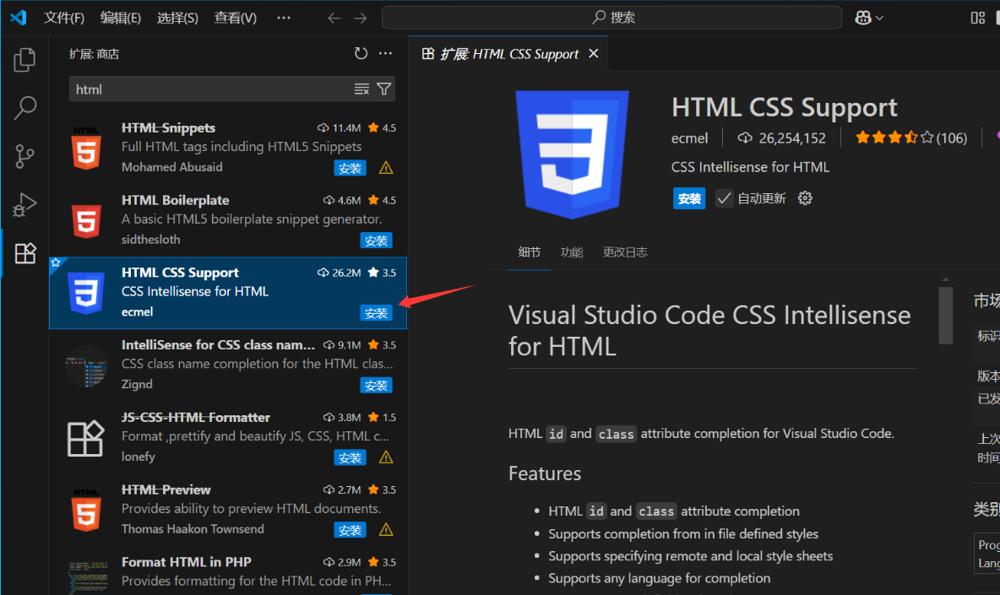

- AI辅助插件

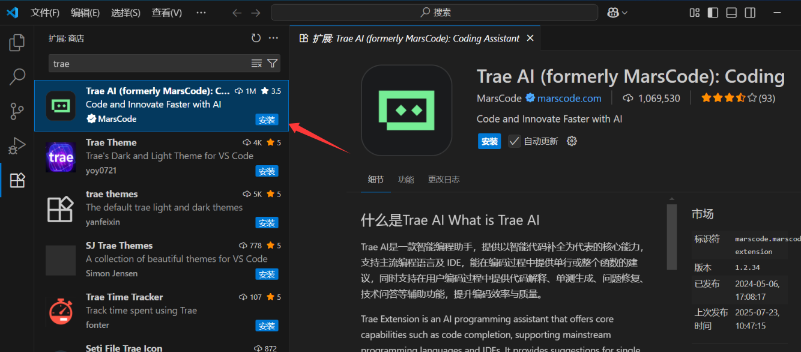

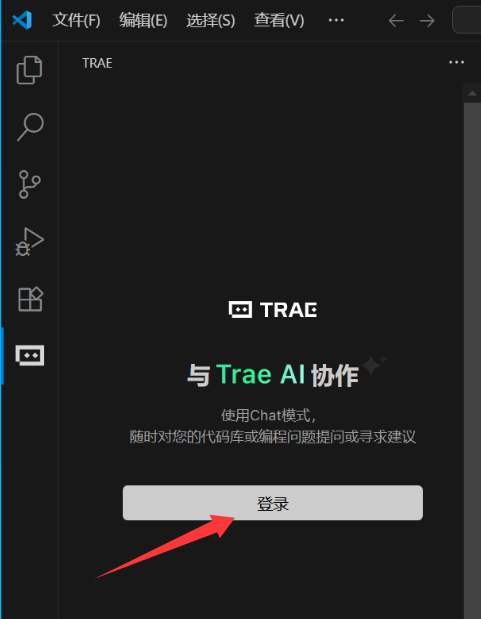

- 登录完成后，可以选择一下模型，推荐DS R1

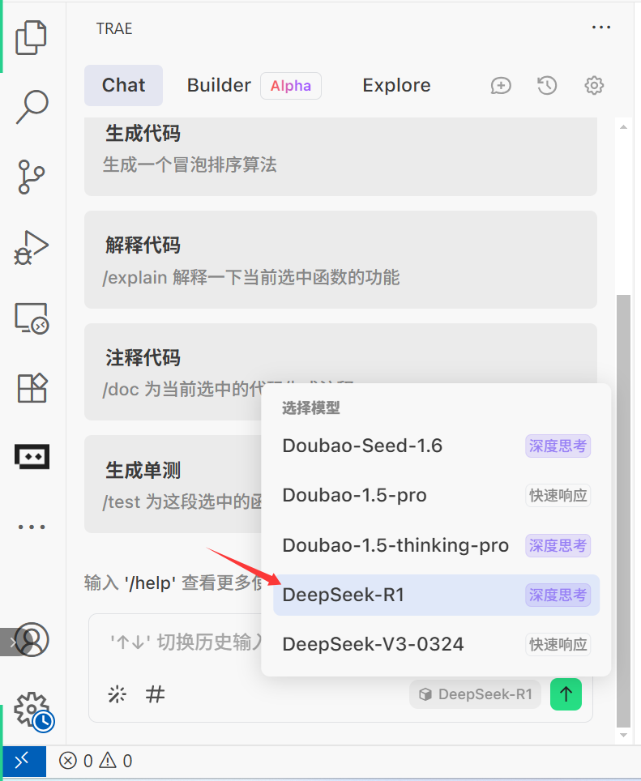

- 安装ssh插件

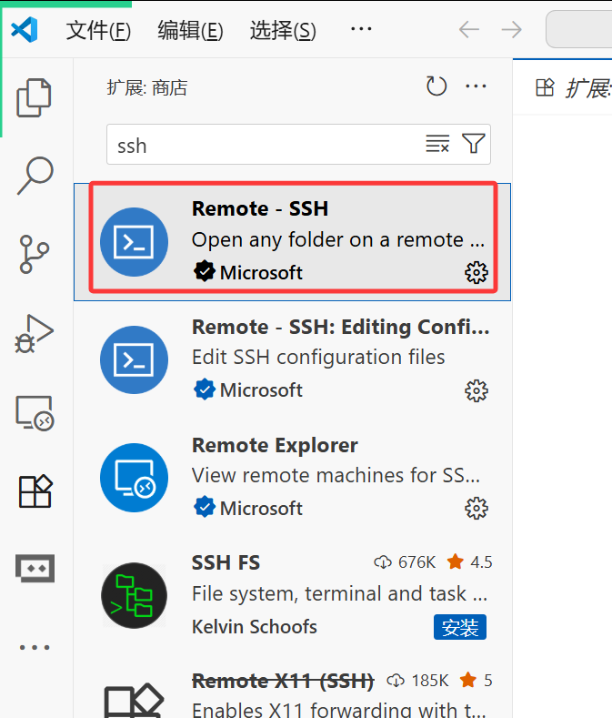

- 推荐设置

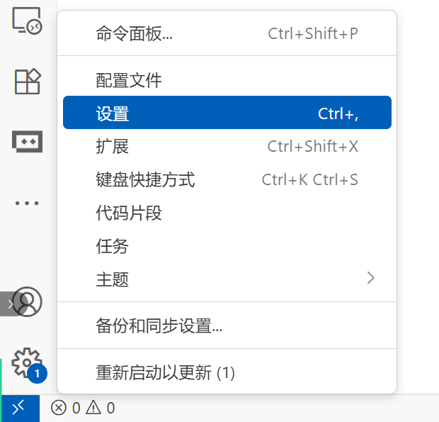

- 自动保存

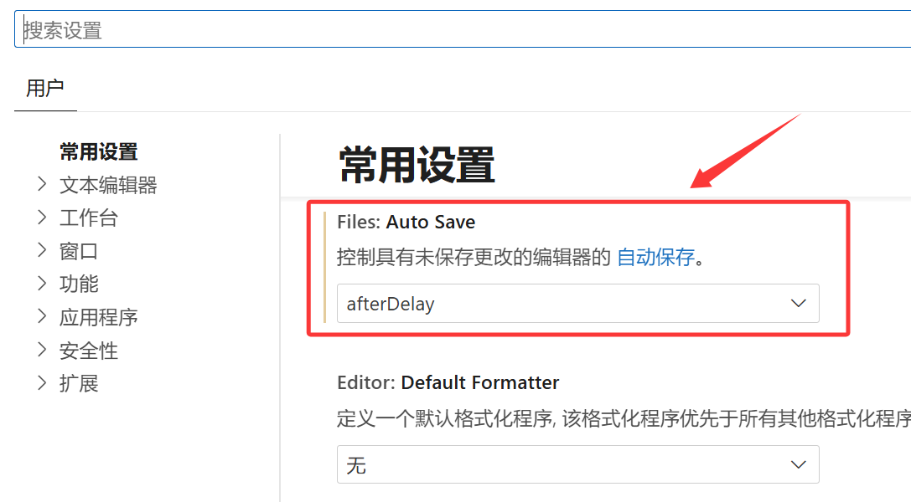

- 字体大小

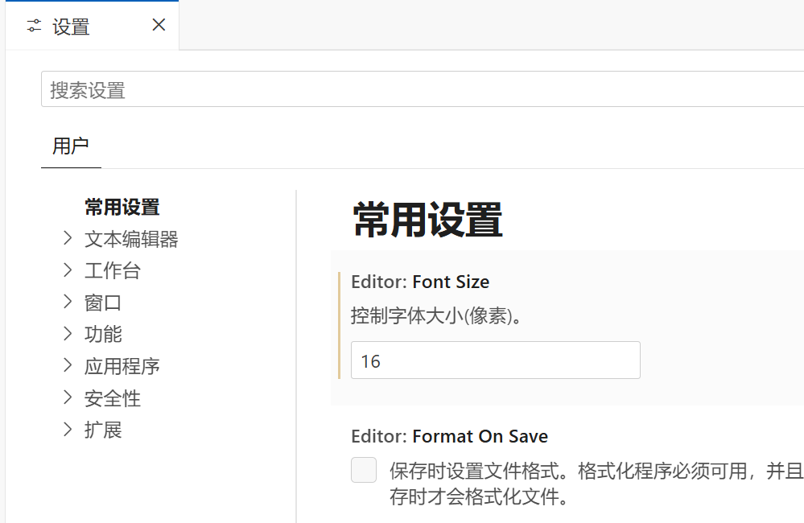

- 主题更换

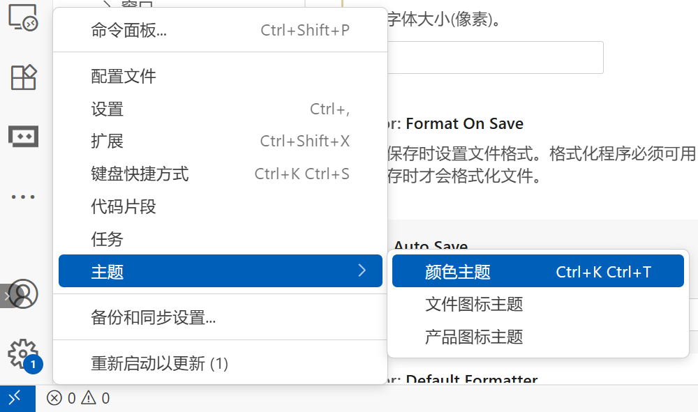

- 打开代码存放的文件夹

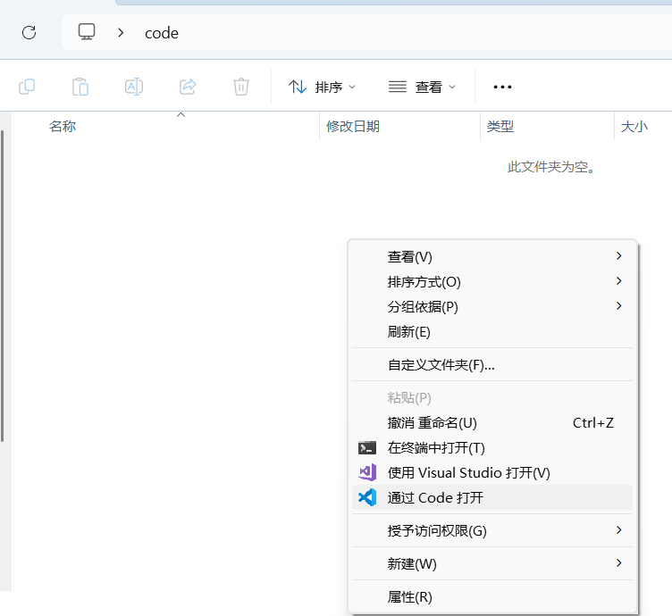

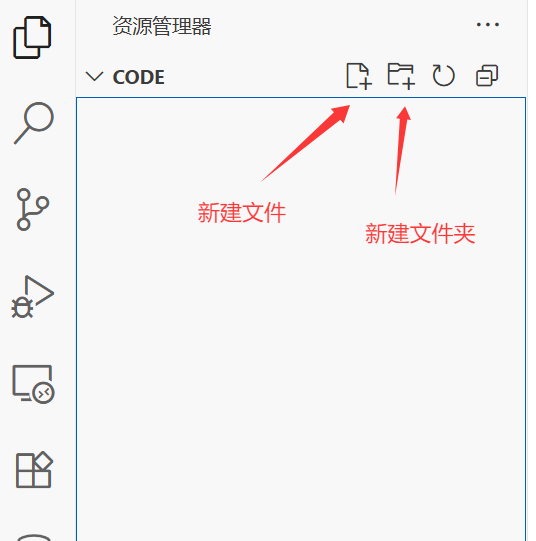

# HTML

- 一种标记语言，不是编程语言，用于书写页面的内容
- 根据HTML规范，HTML开头必须注明
  - `<!DOCTYPE html>` 
- HTML使用标签(tag)标记各个内容,大部分标签是成对出现的，表示标记的范围
  - `<标签名>标签的范围</标签名>`
- vscode便捷操作，比如想要写一对标签，直接输入标签名，按回车键，就可以得到一对
- 标签名，有HTML官方规定的，也可以写自定义的，都不会报错

## HTML骨架

- 根据HTML规范，HTML必须要有如下结构
  - 在vscode中，顶行顶格打一个英文的`!` ,然后回车，就可以快速得到HTML骨架

```HTML
<!DOCTYPE html>
<html lang="en">
<head>
    <meta charset="UTF-8">
    <meta name="description" content="全球最大的学习资料网站，48终身会员。">
    <meta http-equiv="refresh" content="5;url=http://www.baidu.com/">
    <meta name="viewport" content="width=device-width, initial-scale=1.0">
    <title>Document</title>
</head>
<body>
    
</body>
</html>
```

- <!DOCTYPE html> 声明此文件为html格式
- <html lang="en"></html>  html标签表示HTML代码的部分，lang="en" 为此标签的属性
  - 标签的属性是key = "value" 格式
  - 标签有约定好的属性，也可以自定义
  - lang="en" 此页面的语言为英文，此属性是给浏览器看的
- <head></head> 此页面的头部，可以放一些页面的属性，比如此页面的关键字，此页面的文字编码，此页面的渲染处理等等，
- <meta> 不需要成对出现，使用属性声明一些内容
  - charset  文字编码，字符集
  - description  描述内容，主要给搜索引擎爬虫
  - http-equiv="refresh"  页面跳转
- <title></title>  页面的标题
- <body></body>  显示在页面中的内容

## 注释

- vscode注释快捷键是`ctrl+/` 自动注释光标所在行

```XML
<h1>你好世界</h1>
<!-- h1是一级标题，一共有h1~h6 -->
```

## 常用标签

- 常用有效果的标签：https://main.eagleslab.com/html5/

```HTML
<!DOCTYPE html>
<html lang="en">
<head>
    <meta charset="UTF-8">
    <meta name="viewport" content="width=device-width, initial-scale=1.0">
    <title>Document</title>
</head>
<body>
    <h1>我是一级标题</h1>
    <h2>我是二级标题</h2>
    <font color="blue" size="7">字体标签,大小是1-7档位</font>
    <center>
        <h3>我是居中的三级标题</h3>
    </center>
    <hr>
    <!-- 这个是水平分割线 -->
    <hr>
    <p>我是一段<b>文字</b>，也叫做<s>段落</s>。</p>
    <p>在html中，多个空格，或者多个<u>换行符</u>，只被认为是一个<i>空格</i>。</p>
    <a href="https://iproute.cn">我是一个超链接，点我呀！</a>
    <br>
    <!-- br是html中的换行 -->
    <a target="_blank" href="https://iproute.cn">设置target="_blank"可以让新页面，在新标签中打开</a>
    <br>
    
    <ul>
        <li>我是第一个</li>
        <li>我是第二个</li>
        <li>我是第三个</li>
        <ul>
            <li>啦啦啦</li>
        </ul>
    </ul>
    <ol>
        <li>我是第一个</li>
        <li>我是第二个</li>
        <li>我是第三个</li>
        <ol>
            <li>啦啦啦</li>
        </ol>
    </ol>
</body>
</html>
```

## table标签

```HTML
<!DOCTYPE html>
<html lang="en">

<head>
    <meta charset="UTF-8">
    <meta name="viewport" content="width=device-width, initial-scale=1.0">
    <title>table标签示例</title>
</head>

<body>
    <center>
        <h1>table标签示例</h1>
    </center>
    <table border="1" cellspacing="0" align="center"><!-- 创建表格 -->
        <tr height="50px" align="center" bgcolor="pink" valign="middle"><!-- 创建行 -->
            <td width="50px"><!-- 创建列 -->
                序号
            </td>
            <td width="100px"><!-- 创建列 -->
                姓名
            </td>
            <td width="100px">
                性别
            </td>
            <td width="300px">
                爱好
            </td>
        </tr>
        <tr align="center">
            <td>1</td>
            <td>张三</td>
            <td colspan="2" bgcolor="purple">男</td>
        </tr>
        <tr align="center">
            <td>2</td>
            <td>李四</td>
            <td rowspan="2">男</td>
            <td>抽烟喝酒烫头</td>
        </tr>
        <tr align="center">
            <td>3</td>
            <td>王五</td>
            <td>睡觉</td>
        </tr>
    </table>

</body>

</html>
```

- table 创建一个表格
  - border 设置表格的边框宽度，默认是0
  - cellspacing  设置单元格之间的空隙，默认是1
  - align 设置表格在网页中的对其形式， left right center
- tr 只能写在table中，创建一行
  - height 调整行的高度
  - align   调整此行文字的对齐  left right center
  - bgcolor  调整背景色
  - valign  调整文字水平对齐  top middle bottom
- td 只能写在tr中，创建一列
  - width  调整宽度，一列中，只要调整一个就可以影响一整列
  - colspan  合并单元格，意思是此单元格需要占用两列的位置
  - rowspan 合并单元格，意思是此单元格需要占用两行的位置
  - bgcolor  修改单元格颜色

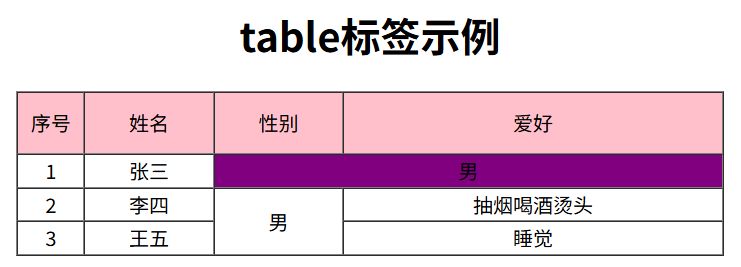

- 小练习，大学生信息登记表

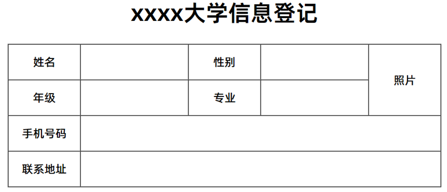

练习结果：

```html
<!DOCTYPE html>
<html lang="en">
<head>
    <meta charset="UTF-8">
    <meta name="viewport" content="width=device-width, initial-scale=1.0">
    <title>Document</title>
</head>
<body>
    <center>
        <h1>常工院信息登记</h1>
    </center>
    <table border="1" cellspacing="0" align="center"> 
        <tr height="50px" align="center" valign="middle" >
            <td width="80px">姓名</td>
            <td width="100px"></td>
            <td width="80px">年龄</td>
            <td width="100px"></td>
            <td width="80px" rowspan="2">照片</td>
        </tr>
        <tr height="50px" align="center" valign="middle">
            <td>年级</td>
            <td></td>
            <td>专业</td>
            <td></td>
        </tr>
        <tr height="50px" align="center" valign="middle">
            <td>手机号码</td>
            <td colspan="4"></td>
        </tr>
        <tr height="50px" align="center" valign="middle">
            <td>联系地址</td>
            <td colspan="4"></td>
        </tr>
    </table>
</body>
</html>
```

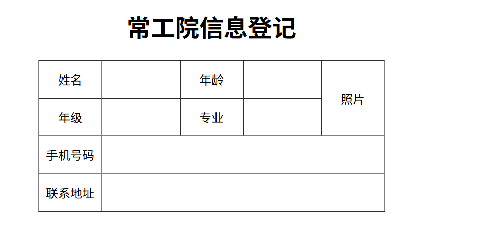

# CSS

- CSS是用来修饰和页面排版，不是编程语言
- CSS所有能用的属性：https://main.eagleslab.com/css3/
- CSS的应用方式
  - 行内样式，在标签中加入style
  - 内部样式，在head标签中，加入style
- 行内样式

```HTML
<a style="color: green;" href="https://www.baidu.com">点我呀</a>
```

- 内部样式
  - 在style中必须要加上选择器
    - 选择生效的标签
    - id选择器，`#xxx`
      - 在标签中有属性`id=xxx`
      - 建议id在整个页面是唯一的
    - class选择器，`.xxx`
      - 在标签中有属性`class="xxx"`
      - 多个标签可以使用同一个class
    - 标签选择器，`a`
      - 直接选择标签

```HTML
<!DOCTYPE html>
<html lang="en">

<head>
    <meta charset="UTF-8">
    <meta name="viewport" content="width=device-width, initial-scale=1.0">
    <title>CSS演示</title>
    <style>
        #effect {
            color: green;
            font-size: 32px;
            text-decoration: none;
            cursor: wait;
            text-shadow: 1px 1px 1px black;
            background-color: pink;
            border: 2px solid orange;
            padding: 20px;
            position: absolute;
            top: 20%;
            border-radius: 10px;
        }
    </style>
</head>

<body>
    <a id="effect" href="https://www.baidu.com">点我呀</a>
    <a href="#">不关我的事</a>
</body>

</html>
```

- 外部样式
  - index.css文件

```CSS
#effect {
    color: green;
    font-size: 32px;
    text-decoration: none;
    cursor: wait;
    text-shadow: 1px 1px 1px black;
    background-color: pink;
    border: 2px solid orange;
    padding: 20px;
    position: absolute;
    top: 20%;
    border-radius: 10px;
}
```

- 在index.html中可以引用外部的css文件

```HTML
<!DOCTYPE html>
<html lang="en">

<head>
    <meta charset="UTF-8">
    <meta name="viewport" content="width=device-width, initial-scale=1.0">
    <title>CSS演示</title>
    <link rel="stylesheet" href="index.css">
</head>

<body>
    <a id="effect" href="https://www.baidu.com">点我呀</a>
    <a href="#">不关我的事</a>
</body>

</html>
```

- 颜色代码
  - 在css中需要描述颜色的地方，可以使用颜色的英文单词，`green` `blue` `pink` ，但是颜色单词是不准确
  - 使用RGB可以精准的获取颜色，屏幕上面红绿蓝三种色彩亮度划分为0~255等级，使用rgb(红色，绿色，蓝色)可以描述，数字改为16进制，简写为`#aabbcc` 
  - 为了表示透明度，引入了alpha通道，也就是透明度，1是完全不透明，0是完全透明，表示为rgba(123,123,123,0.5)

## 常见的css样式

```CSS
color: green;            /* 设置字体颜色 */
font-size: 32px;        /* 设置字体大小 */
text-decoration: none;             /* 设置字体下划线为none */
cursor: wait;                    /* 设置光标的图案 */
text-shadow: 1px 1px 1px black;        /* 设置文字阴影，水平偏移 垂直偏移 模糊程度 阴影颜色 */
background-color: pink;                /* 设置元素背景颜色 */
border: 2px solid orange;            /* 设置元素边框，边框宽度 实线 边框颜色*/
padding: 20px;                    /* 设置元素到边框之间的距离 */
position: absolute;            /* 设置元素的定位方式 */
top: 20%;                        /* 设置元素离顶部20%的空间，相对于窗口 */
border-radius: 10px;            /* 设置元素边框角落的圆度 */
```

## 实战

- 安装插件live server，可以自动刷新页面

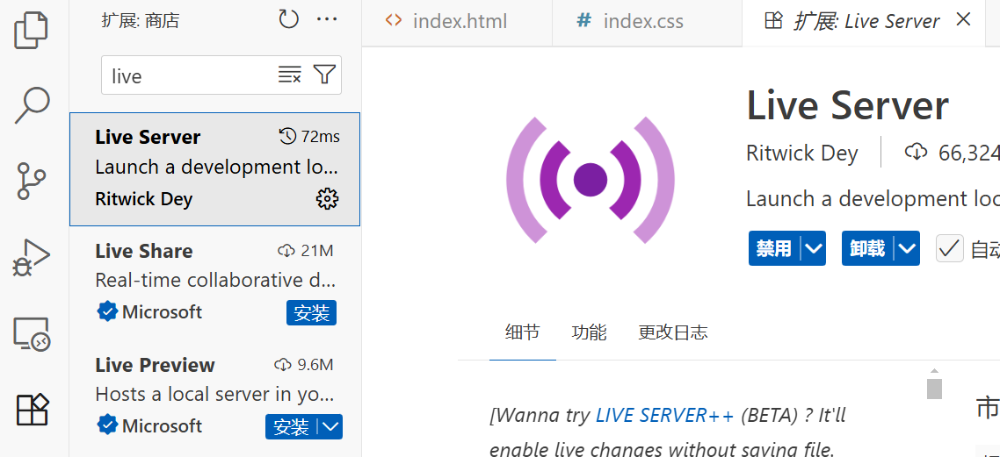

- 打开页面

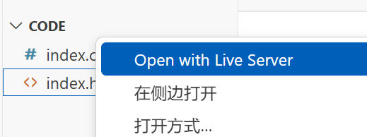

- 先写一个a标签，并且引入额外的css样式文件

```HTML
<!DOCTYPE html>
<html lang="en">
<head>
    <meta charset="UTF-8">
    <meta name="viewport" content="width=device-width, initial-scale=1.0">
    <title>Document</title>
    <link rel="stylesheet" href="index.css">
</head>
<body>
    <a href="#">来玩呀！</a>
</body>
</html>
```

- 写一个css文件

```CSS
body {
    background-color: black;
}
```

### 盒子模型

- 为了更好的服务于网页布局，css存在盒子模型概念，可以帮助调整每个元素之间的距离

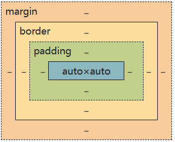

- 最中间是元素本身
- padding 内边距，元素到边框之间的距离
- border  边框
- margin  外边距，元素之间的距离
- 大多数标签都有默认的盒子模型参数，在开发的时候，需要注意，或者全部去掉

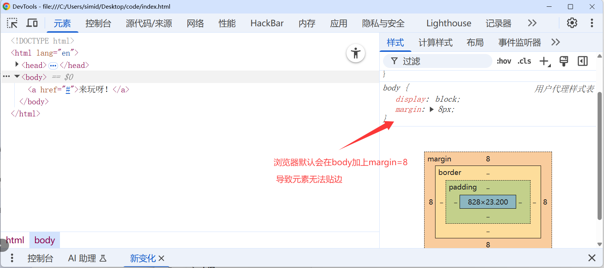

- 编辑index.css

```CSS
* {
    margin: 0;
    padding: 0;
}
```

- 将元素移动到网页正中间
  - position  给内容定位
    - static  默认，无定位
    - relative  相对定位，相对于父元素
    - absoulte  绝对定位，基于浏览器窗口
    - fixed  固定在窗口上，不会随着页面滚动而改变位置

```CSS
a {
    text-decoration: none;
    position: absolute;
    top: 50%;
    left: 50%;
    transform: translate(-50%, -50%);
}
```

- 美化一下a标签

```CSS
a {
    text-decoration: none;
    position: absolute;
    top: 50%;
    left: 50%;
    transform: translate(-50%, -50%);
    
    font-size: 24px;
    background: linear-gradient(90deg, red, blue, white, yellow, green);
    /* linear-gradient() 用于创建渐变色，其中第一个参数是角度，后面可以跟上若干个颜色  */
    width: 400px;
    height: 100px;
    color: white;
    text-align: center;
    line-height: 100px;
    /* 行高，如果行高和高度一致，文字就会垂直居中 */
    text-shadow: 1px 1px 1px black;
    border-radius: 50px;
}
```

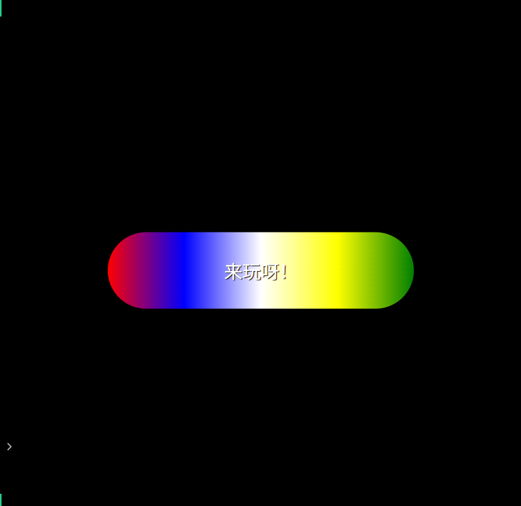

- 再美化一下
  - 伪元素，在选择器后加上::before或者::after可以在被选中的元素前后加上一个相同的html不存在的元素

```CSS
a::before {
    content: "";                /* 建立伪元素只是为设置背景色，不需要文字，语法需要，必须写，但是保留为空字符串 */
    position: absolute;
    top: -5px;
    left: -5px;
    right: -5px;
    bottom: -5px;            /* 将背景撑开，比原本的元素大5px */
    background: linear-gradient(90deg, red, blue, white, yellow, green);   
    border-radius: 55px;
    z-index: -1;            /* 元素叠放顺序，默认是0 */
    filter: blur(20px);        /* 添加高斯模糊的滤镜 */
}
```

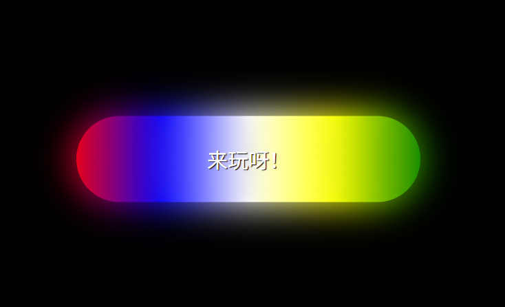

### 加上特效

- 完整的index.css文件

```CSS
* {
    margin: 0;
    padding: 0;
}

body {
    background-color: black;
}

a {
    text-decoration: none;
    position: absolute;
    top: 50%;
    left: 50%;
    transform: translate(-50%, -50%);

    font-size: 24px;
    background: linear-gradient(90deg, red, blue, white, yellow, green);
    width: 400px;
    height: 100px;
    color: white;
    text-align: center;
    line-height: 100px;
    text-shadow: 1px 1px 1px black;
    border-radius: 50px;
    background-size: 400%;        /* 背景放大4倍 */
}

a::before {
    content: "";
    position: absolute;
    top: -10px;
    left: -10px;
    right: -10px;
    bottom: -10px;
    background: linear-gradient(90deg, red, blue, white, yellow, green);
    border-radius: 55px;
    z-index: -1;
    filter: blur(20px);
    background-size: 400%;         /* 背景光晕放大4倍 */
}

@keyframes sun{             /* 定义一个叫做sun的动作 */
    0%{
        background-position: 0% 0;         /* 时间0%，背景原地不动 */
    }
    100%{
        background-position: -400% 0;        /* 时间100%，背景移动到最左边 */
    }
}

a:hover::before{                            /* 伪元素选择器，表示的是鼠标停在元素上会发生的操作 */
    animation: sun 4s linear infinite;         /* 调用动作，动作名 持续时间 速度匀速 无线循环 */
}

a:hover{
    animation: sun 4s linear infinite;
}
```

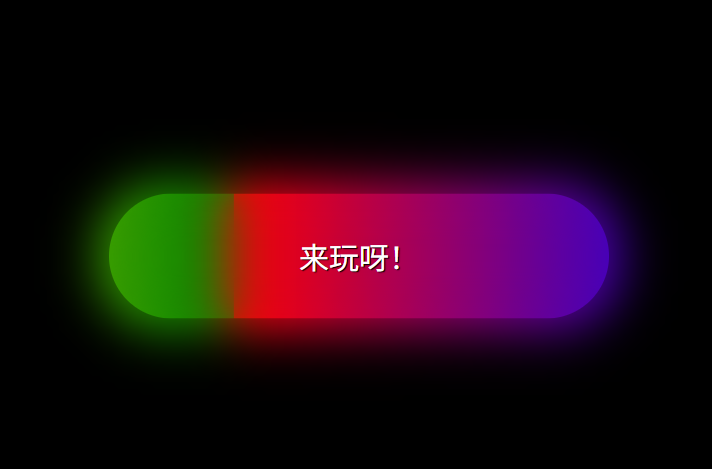

效果：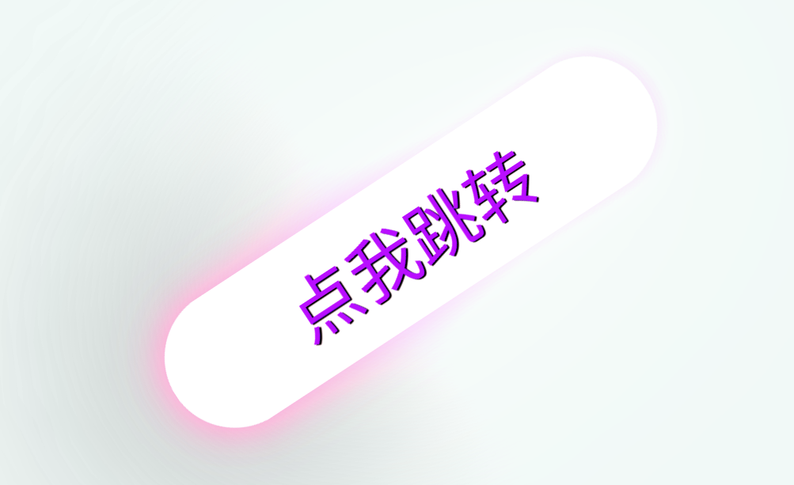

## 登录实战

- 先写好html

```html
<!DOCTYPE html>
<html lang="en">

<head>
    <meta charset="UTF-8">
    <meta name="viewport" content="width=device-width, initial-scale=1.0">
    <title>欢迎登录</title>
</head>

<body>
    <form action="">
        <h1>欢迎登录</h1>
        <input type="text" placeholder="用户名">
        <input type="password" placeholder="密码">
        <input type="submit" value="登录">
    </form>

</body>

</html>
```

- input 获取用户的输入

  - type类型决定用户的输入形式
  - type="text"    单行文本框
  - type="password"    单行文本框，但是不显示输入内容
  - type="submit"    提交按钮

- form 定义提交的行为

  - action  提交到什么地方，如果什么都不写，默认提交到当前的url

- 美化一下

  ```HTML
  <!DOCTYPE html>
  <html lang="en">
  
  <head>
      <meta charset="UTF-8">
      <meta name="viewport" content="width=device-width, initial-scale=1.0">
      <title>欢迎登录</title>
      <style>
          * {
              margin: 0;
              padding: 0;
          }
  
          body {
              background: #34495e;
          }
  
          #box {
              width: 300px;
              position: absolute;
              top: 50%;
              left: 50%;
              transform: translate(-50%, -50%);
              background: #191919;
              padding: 40px;
              text-align: center;
              border-radius: 20px;
              color: white;
          }
  
          .input_text {
              background: none;
              display: block;
              margin: 20px auto;
              text-align: center;
              border: 2px solid #3498db;
              padding: 14px 10px;
              width: 200px;
              outline: none;
              transition-duration: .5s;
              border-radius: 20px;
              color: white;
          }
  
          .input_text:focus {
              width: 280px;
              border-color: #2ecc71;
              box-shadow: 0px 0px 10px #2ecc71;
          }
  
          .input_text::placeholder {
              color: #3498db;
          }
  
          .btn {
              background: none;
              margin: 20px auto;
              padding: 14px 40px;
              color: white;
              border: 2px solid #2ecc71;
              border-radius: 20px;
              transition-duration: .5s;
              cursor: pointer;
          }
  
         .btn:hover {
              background: #2ecc71;
              color: white;
              box-shadow: 0px 0px 20px #2ecc71;
              transform: rotate(360deg);
         }
      </style>
  </head>
  
  <body>
      <form id="box" action="">
          <h1>欢迎登录</h1>
          <input class="input_text" type="text" placeholder="用户名">
          <input class="input_text" type="password" placeholder="密码">
          <input class="btn" type="submit" value="登录">
          <input class="btn" type="submit" value="注册">
      </form>
  
  </body>
  
  </html>
  ```

  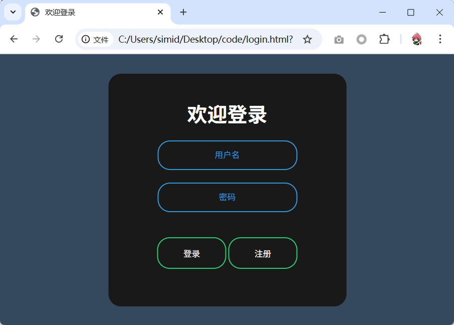

结果：

```html
<!DOCTYPE html>
<html lang="en">
<head>
    <meta charset="UTF-8">
    <meta name="viewport" content="width=device-width, initial-scale=1.0">
    <title>欢迎pro登录</title>
    <style>
        *{
            margin: 0;
            padding: 0;
        }

        body{
            background: #d7c4cf;
        }
        
        #box{
            width: 300px;
            position: absolute;
            top: 50%;
            left: 50%;
            transform: translate(-50%,-50%);
            background: #fff;
            padding: 40px;
            text-align: center;
            border-radius: 20px;
            box-shadow: 0 0 10px rgba(0,0,0,0.3);
            color: #d7c4cf;
        }

        .input_text{
            background: none;
            display: block;
            margin: 20px auto;
            text-align: center;
            border: 2px solid #d7c4cf;
            padding: 14px 10px;
            width: 200px;
            outline: none;
            border-radius: 24px;
            color: green;
            transition-duration: .5s;
        }

        .input_text:focus{
            border-color: #2ecc71;
            width: 280px;
        }

        .input_text::placeholder{
            color: #d7c4cf;
        }

        .btn{
            background: none;
            margin: 20px auto;
            text-align: center;
            border: 2px solid #d7c4cf;
            padding: 14px 40px;
            outline: none;
            border-radius: 24px;
            color: #d7c4cf;
            transition-duration: .5s;
            cursor: pointer;
        }

        .btn:hover{
            background: #d7c4cf;
            color: #fff;
            box-shadow:  0px 0px 20px #d7c4cf;
            transform: rotate(360deg);
        }
    </style>
</head>
<body>
    <form id="box" action="">
        <h1>欢迎pro登录</h1>
        <input class="input_text" type="text" placeholder="用户名">
        <input class="input_text" type="password" placeholder="密码">
        <input class="btn" type="submit" value="登录">
        <input class="btn" type="submit" value="注册">
    </form>
</body>
</html>
```

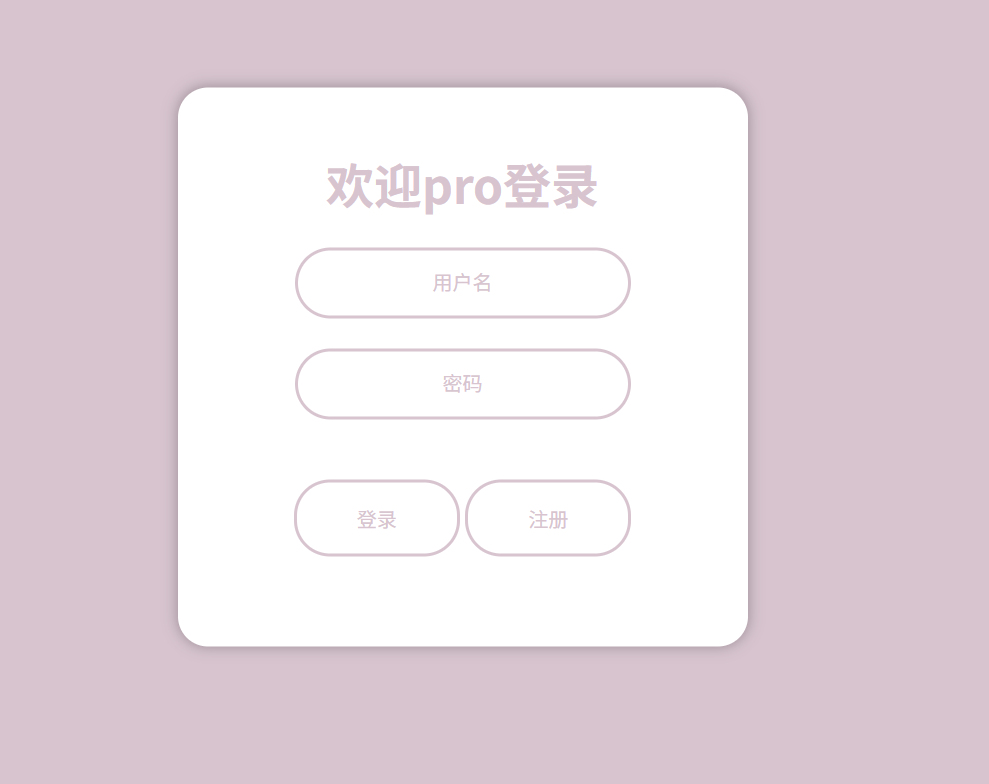