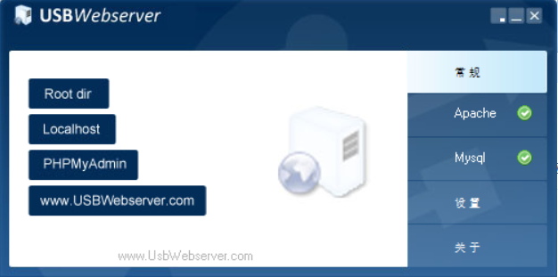
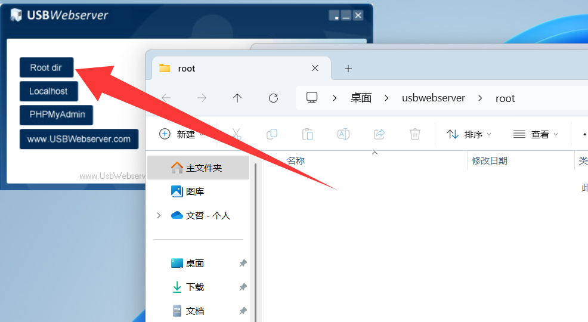
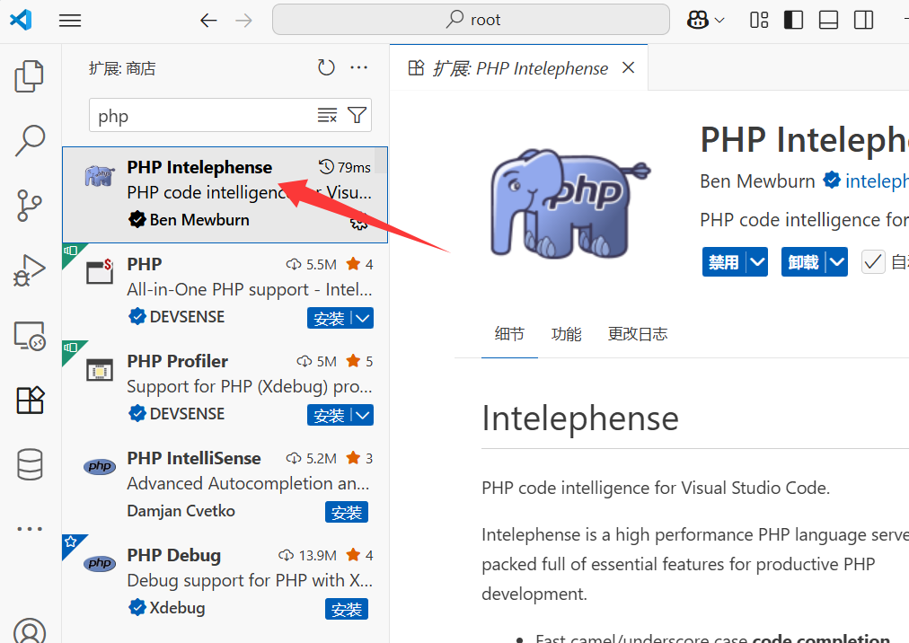
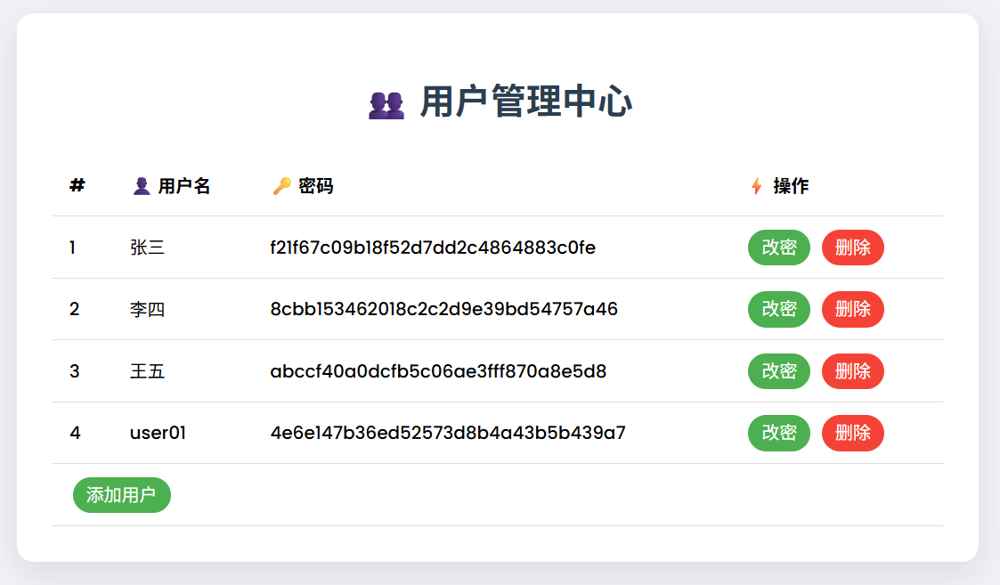
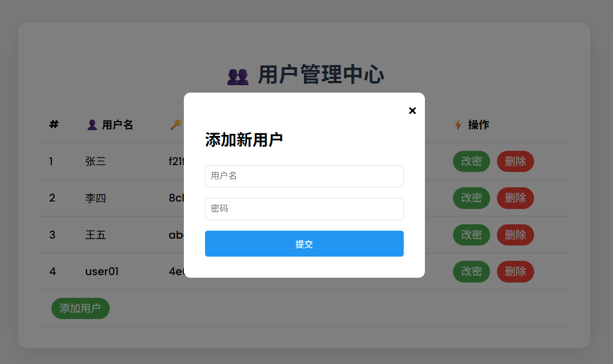
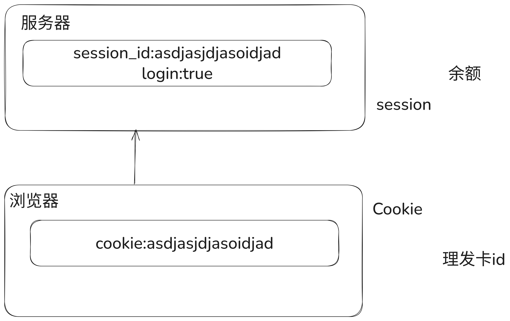
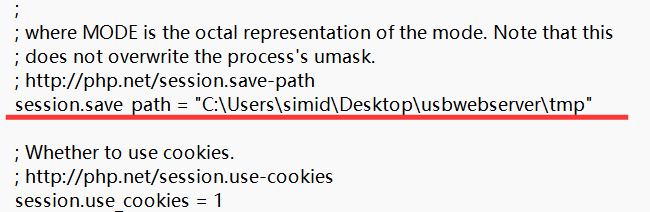

# WAMP环境

- W windows
- A  apache
- M  mysql
- P   php
- 使用usbwebserver可以一键搭建wamp环境

## usbwebserver介绍

- 需要解压到一个不包含中文路径的文件夹
  - `D:\笔记\tmp` 不符合要求
  - `C:\Users\用户名\Desktop` 桌面，用户名是中文，那桌面不可以，用户名是英文就可以
  - `D:\software\usbwebserver` 可以使用
- 运行`usbwebserver.exe`程序



- Root dir    存放程序源码的位置
- Localhost   访问网站程序，如果不是从此处进入，后端代码无法执行
- PHPMyAdmin    图形化数据库管理工具
- 使用vscode打开如下文件夹



- 安装php插件



# PHP基础语法

- 新建一个demo01.php文件

```PHP
<meta http-equiv="Content-Type" content="text/html;charset=UTF-8">
<?php
// 我是注释
/* 我
是多行
注释 
*/

$a = 10;
$a = "hello world";
// php中变量名前面会加上$符号
// php是动态类型编程语言，在定义变量的时候，不需要指定数据类型，并且变量的类型是可以随便变化的

echo $a;
// echo 打印字符串，显示到浏览器上

$array = [1,2,3,4];
print_r($array);
// 打印数组，使用print_r
// PHP数组是key => value，如果不指定key，默认key是下标编号
echo $array[1];
// 数组[key] 可以获得对应的value

// 数据类型
// 布尔值、整型、字符串、数组、对象、浮点数

// 流程控制
if(20 < 10){
    echo "20 小于 10";
}else{
    echo "10 小于 20";
}

$sum = 0;
$i = 100;
while($i){
    if($i % 2 == 0){
        $i--;
        continue;
    }
    $sum += $i;
    $i--;
}
echo "<br>计算总和为：" . $sum;

$sum = 0;
for($i=0;$i<=100;$i++){
    $sum += $i;
}
echo "<br>1+2+3+...+100=" . $sum;

?>
```

## php与前端交互

- php中存在常量，用于接受前端传递过来的参数
  - `$_REQUEST`  键值对数组，存放前端传递过来的任意方法的参数
  - `$_POST` 键值对数组，存放前端通过post传递过来的参数
  - `$_GET` 键值对数组，存放前端通过get传递过来的参数
- 前端需要修改form提交到对应的demo02.php文件中

```HTML
.................
<form id="box" action="demo02.php" method="post">
        <h1>欢迎登录</h1>
        <input class="input_text" type="text" name="username" placeholder="用户名">
        <input class="input_text" type="password" name="password" placeholder="密码">
        <input class="btn" type="submit" name="submit" value="登录">
        <input class="btn" type="submit" value="注册">
    </form>
............
```

- $_REQUEST示例

```PHP
<meta http-equiv="Content-Type" content="text/html;charset=UTF-8">
<?php
print_r($_REQUEST);
// 打印前端传递过来的所有内容
// 前端如果是form提交，只会提交input中有name属性的value
// get和post提交的参数都会被$_REQUEST接受到
```

- 登录示例

```PHP
<meta http-equiv="Content-Type" content="text/html;charset=UTF-8">
<?php
$username = $_POST["username"];
$password = $_POST["password"];

if($username == "张三" and $password == "123456"){
    echo "登录成功！";
}else{
    echo "用户名或密码错误！";
}
```

## 数组相关

- 数组是一个能在单个变量中存储多个值的特殊变量
  - 数值数组：key是数值
  - 关联数组：key是指定的名字
  - 多维数组：包含一个或多个数组的数组

```php
<?php
// 数值数组
$cars = array("volvo", "BMW", "volkswagen");
$cars = ["volvo", "BMW", "volkswagen"];
echo $cars[0];

// 关联数组
$users = array("张三" => "123456", "李四" => "123123");
echo $users["张三"];

// 遍历数组
foreach($users as $username => $password){
    echo $username;
    echo $password;
}
```

### 优化登录案例

- 编写一个注册的页面`register.html`
  - 登录按钮，把类型改为了button，防止点击后被提交
  - 登录按钮加入js点击事件触发跳转到`login.html`
  - 注册按钮，添加name属性为register，这样后端收到请求的时候，就可以知道是注册按钮的提交了

```HTML
<!DOCTYPE html>
<html lang="en">
    

<head>
    <meta charset="UTF-8">
    <meta name="viewport" content="width=device-width, initial-scale=1.0">
    <title>欢迎注册</title>
    <style>
        * {
            margin: 0;
            padding: 0;
        }

        body {
            background: #34495e;
        }

        #box {
            width: 300px;
            position: absolute;
            top: 50%;
            left: 50%;
            transform: translate(-50%, -50%);
            background: #191919;
            padding: 40px;
            text-align: center;
            border-radius: 20px;
            color: white;
        }

        .input_text {
            background: none;
            display: block;
            margin: 20px auto;
            text-align: center;
            border: 2px solid #3498db;
            padding: 14px 10px;
            width: 200px;
            outline: none;
            transition-duration: .5s;
            border-radius: 20px;
            color: white;
        }

        .input_text:focus {
            width: 280px;
            border-color: #2ecc71;
            box-shadow: 0px 0px 10px #2ecc71;
        }

        .input_text::placeholder {
            color: #3498db;
        }

        .btn {
            background: none;
            margin: 20px auto;
            padding: 14px 40px;
            color: white;
            border: 2px solid #2ecc71;
            border-radius: 20px;
            transition-duration: .5s;
            cursor: pointer;
        }

       .btn:hover {
            background: #2ecc71;
            color: white;
            box-shadow: 0px 0px 20px #2ecc71;
            transform: rotate(360deg);
       }
    </style>
</head>

<body>
    <form id="box" action="demo02.php" method="post">
        <h1>欢迎注册</h1>
        <input class="input_text" type="text" name="username" placeholder="用户名">
        <input class="input_text" type="password" name="password" placeholder="密码">
        <input class="input_text" type="password" name="repassword" placeholder="确认密码">
        <input class="btn" type="submit" name="register" value="注册">
        <input class="btn" type="button" onclick="window.location.href='login.html'" value="登录">
    </form>

</body>

</html>
```

- 调整`login.html` 文件

```HTML
<!DOCTYPE html>
<html lang="en">
    

<head>
    <meta charset="UTF-8">
    <meta name="viewport" content="width=device-width, initial-scale=1.0">
    <title>欢迎登录</title>
    <style>
        * {
            margin: 0;
            padding: 0;
        }

        body {
            background: #34495e;
        }

        #box {
            width: 300px;
            position: absolute;
            top: 50%;
            left: 50%;
            transform: translate(-50%, -50%);
            background: #191919;
            padding: 40px;
            text-align: center;
            border-radius: 20px;
            color: white;
        }

        .input_text {
            background: none;
            display: block;
            margin: 20px auto;
            text-align: center;
            border: 2px solid #3498db;
            padding: 14px 10px;
            width: 200px;
            outline: none;
            transition-duration: .5s;
            border-radius: 20px;
            color: white;
        }

        .input_text:focus {
            width: 280px;
            border-color: #2ecc71;
            box-shadow: 0px 0px 10px #2ecc71;
        }

        .input_text::placeholder {
            color: #3498db;
        }

        .btn {
            background: none;
            margin: 20px auto;
            padding: 14px 40px;
            color: white;
            border: 2px solid #2ecc71;
            border-radius: 20px;
            transition-duration: .5s;
            cursor: pointer;
        }

       .btn:hover {
            background: #2ecc71;
            color: white;
            box-shadow: 0px 0px 20px #2ecc71;
            transform: rotate(360deg);
       }
    </style>
</head>

<body>
    <form id="box" action="demo02.php" method="post">
        <h1>欢迎登录</h1>
        <input class="input_text" type="text" name="username" placeholder="用户名">
        <input class="input_text" type="password" name="password" placeholder="密码">
        <input class="btn" type="submit" name="login" value="登录">
        <input class="btn" type="button" onclick="window.location.href='register.html'" value="注册">
    </form>

</body>

</html>
```

- 当点击注册的时候，提交给demo02.php，demo02.php的逻辑如下
  - 判断`$_POST`数组中存在`login`就交给login去处理，存在`register`就交给register处理
  - 注册的时候，将用户名和密码存入`$db`数组中，但是发现PHP每次请求都会重新执行，内存不会保留。所以注册的用户无法被加入到下次执行的数组中。

```php
<meta http-equiv="Content-Type" content="text/html;charset=UTF-8">
<?php

// 登录的逻辑
function login(){
    $username = $_POST["username"];
    $password = $_POST["password"];
    
    global $db;
    
    $flag = false;
    foreach($db as $u => $p){
        if($username == $u and $password == $p){
            $flag = true;
        }
    }

    if ($flag) {
        return "登录成功！";
    } else {
        return "用户名或密码错误！";
    }
}

// 注册的逻辑
function register(){
    $username = $_POST["username"];
    $password = $_POST["password"];
    $repassword = $_POST["repassword"];

    // 两次密码是否一致
    if($password != $repassword){
        return "两次密码输入不一样！";
    }
    
    // 声明一下，此处使用的$db是全局的
    global $db;

    $db[$username] = $password;
    return "注册成功！";
}

// 数组充当数据库，存储用户的信息
$db = [];
$db["admin"] = "123456";

// 判断需要进行的操作，登录 or 注册
if (array_key_exists("login", $_POST)) {
    // 登录的逻辑
    echo login();
} elseif (array_key_exists("register", $_POST)) {
    // 注册的逻辑
    echo register();
}
```

## 文件处理相关

- php支持文件的处理，可以创建编辑文件
  - 支持文本文件
  - 支持二进制文件

```php
<meta http-equiv="Content-Type" content="text/html;charset=UTF-8">
<?php
// 通过操作文件句柄来对文件进行操作
// fopen(文件名，操作模式)
// r  只读，文件不存在就报错
// w  覆盖写入，文件不存在就创建
// a  追加写入，文件不存在就创建
// 在php函数前加上@，可以抑制报错警告信息
$file = @fopen("test.txt", "r") or exit("文件不存在！");

// 读取文件，读取完了之后，文件句柄会记录下最后的文件光标位置
// fread(文件句柄, 读取大小)
// 读取大小超过文件长度，就读取完整的文件内容
echo fread($file, 2);
echo fread($file, 6);

// 移动文件光标的位置，从头开始偏移字节数
fseek($file, 0);
echo fread($file, 200);

// 完整的读完
if(feof($file)){
    echo "文件已经读完！";
}else{
    echo "文件没有读完！";
}

fseek($file, 0);
// 推荐分块读取文件
while(!feof($file)){
    echo fread($file, 1024);
}
```

- 如果遇到中文

```php
<meta http-equiv="Content-Type" content="text/html;charset=UTF-8">
<?php
$file = @fopen("test.txt", "r") or exit("文件不存在！");

// 在utf-8编码中，一个汉字占用3个字节，所以fread读取的字节数，必须是3的倍数
$n = 3;
echo fread($file, $n * 3);
```

- 写入文件
- w模式，覆盖写入

```php
<meta http-equiv="Content-Type" content="text/html;charset=UTF-8">
<?php
// w 覆盖写入, 之前的内容会被删除
$file = @fopen("test.txt", "w") or exit("文件不存在！");

$data = "hello world";
fwrite($file, $data);

```

- a模式，追加写入

```php
<meta http-equiv="Content-Type" content="text/html;charset=UTF-8">
<?php
// a 追加写入, 之前的内容会被保留
$file = @fopen("test.txt", "a") or exit("文件不存在！");

$data = "hello world\n";
fwrite($file, $data);
```

- \+ 模式
  - r\+ 可读可写，如果文件不存在，就报错
  - w\+ 可写可读，如果文件不存在，就新建，如果存在，就新建，旧的文件没了
  - a+   可追加可读， 如果文件不存在，就新建，如果存在，就追加

```php
<meta http-equiv="Content-Type" content="text/html;charset=UTF-8">
<?php
$file = @fopen("test.txt", "r+") or exit("文件不存在！");
echo fread($file, 2);
// 从光标所在处，直接往后覆盖
fwrite($file, "lalala");


<meta http-equiv="Content-Type" content="text/html;charset=UTF-8">
<?php
$file = @fopen("test.txt", "w+") or exit("文件不存在！");

fwrite($file, "lalala");
fseek($file, 0);
echo fread($file, 10);


<meta http-equiv="Content-Type" content="text/html;charset=UTF-8">
<?php
$file = @fopen("test.txt", "a+") or exit("文件不存在！");

fwrite($file, "lalala\n");
fseek($file, 0);
echo fread($file, 10);
```

### 优化登录框案例

- 将用户名和密码保存到db文件中
  - load_db函数，加载db文件，db文件中保存着往期注册的用户信息，并且加入内存的$db数组中
  - updata_db函数，将内存中的$db数组，按照对应的格式写入到db文件中
  - 在使用$db数组之前，将文件加载到内存中， 在注册之后，将$db保存到db文件中

```PHP
<meta http-equiv="Content-Type" content="text/html;charset=UTF-8">
<?php

// 登录的逻辑
function login(){
    $username = $_POST["username"];
    $password = $_POST["password"];
    
    global $db;
    
    $flag = false;
    foreach($db as $u => $p){
        if($username == $u and md5($password . $username . "xlsyyds") == $p){
            $flag = true;
        }
    }

    if ($flag) {
        return "登录成功！";
    } else {
        return "用户名或密码错误！";
    }
}

// 注册的逻辑
function register(){
    $username = $_POST["username"];
    $password = $_POST["password"];
    $repassword = $_POST["repassword"];

    // 判断用户名是否携带不合规的符号
    if(strpos($username, "|")){
        return "用户名不合法！";
    }

    // 两次密码是否一致
    if($password != $repassword){
        return "两次密码输入不一样！";
    }
    
    // 声明一下，此处使用的$db是全局的
    global $db;

    // 判断用户是否已经存在
    if(array_key_exists($username, $db)){
        return "用户名已存在！";
    }

    $db[$username] = md5($password . $username . "xlsyyds");
    return "注册成功！";
}

// 更新db文件的逻辑
function update_db(){
    global $db;
    $file = fopen("db", "w") or exit("没有权限读取db文件");
    foreach($db as $u => $p){
        // 将用户名和密码拼接一下，张三|123456
        $data = $u . "|" . $p . "\n";
        // 写入到文件中
        fwrite($file, $data);
    }
}

// 载入db文件的逻辑
function load_db(){
    global $db;
    // 使用a+，不影响读取，不担心文件不存在
    $file = fopen("db", "a+");
    // 移动文件光标到开头，不然影响读取
    fseek($file, 0);
    while(!feof($file)){
        // 逐行读取, fgets是读取一行，到换行符就停止，fgetc是读取一个字节
        // trim()删除字符串前后的空字符，或者换行符
        $data = trim(fgets($file));
        // 如果没读取到数据，就退出
        // strlen()获取字符串长度
        if(strlen($data) == 0){
            // 跳过本次循环
            continue;
        }
        // explode函数，使用一个字符将另一个字符串分割开，变成一个数组
        // 分割完成后，变成["张三", "123456"]
        $temp_arr = explode("|", $data);
        // $db["张三"] = "123456";
        $db[$temp_arr[0]] = $temp_arr[1];
    }
}

// 数组充当数据库，存储用户的信息
// 使用前读取一下之前保存的数据
$db = [];
load_db();

// 判断需要进行的操作，登录 or 注册
if (array_key_exists("login", $_POST)) {
    // 登录的逻辑
    echo login();
} elseif (array_key_exists("register", $_POST)) {
    // 注册的逻辑
    echo register();
    update_db();
}

```

## 字符串相关

- 字符串存储字符

```PHP
<meta http-equiv="Content-Type" content="text/html;charset=UTF-8">
<?php
$name = "张三";

$a = "hello";
$b = "world";

// . 可以拼接字符串
echo $a . $b;

// 双引号字符串会解析$开头的变量
echo "$a $b";
echo '$a $b';

// 字符串长度
$c = "$a $b";
echo strlen($c);

// 查找字符串
echo "l在字符串中第一出现的位置是：" . strpos($c, "l") . "<br>";
echo "<hr>";
echo strpos($c, "l");
echo "<hr>";

// 去除前后空字符
$str = "    xls  yyds   \n\n";
echo trim($str);

// md5
$str = "hello world";
echo md5($str);

// 替换字符串
$str = "hello world";
echo str_replace(" ", "_", $str);

// 截获字符串，根据编码来调整
$str = "Hello 你好世界";
$substring = mb_substr($str, 0, 5, 'UTF-8'); // 截取前5个字符（包含中英文）
echo $substring; // 输出 "Hello 你"

// 使用特定符号来分割字符串
$str = "张三|f21f67c09b18f52d7dd2c4864883c0fe";
print_r(explode("|", $str));
```

## 用户管理

- 前端界面如下



- 读取现有用户
  - 将`load_db()`和`update_db()`复制到公共函数库`func.php`中，注意原本登录的逻辑此处需要`include("func.php");`
  - 在main.php中，需要载入`$db`
  - 使用`foreach`循环打印显示用户信息的哪一行

```php
<?php
include "func.php";
$db = [];
load_db();
$i = 1;
foreach ($db as $username => $password) {
?>
    <tr>
        <td><?php echo $i; ?></td>
        <td><?php echo $username; ?></td>
        <td><?php echo $password; ?></td>
        <td>
            <a href="#" class="action-btn edit-btn" onclick="showEditModal()">改密</a>
            <a href="#" class="action-btn delete-btn" onclick="confirmDelete()">删除</a>
        </td>
    </tr>
<?php
    $i++;
}
?>
```

- 添加用户
  - 此处使用模态框，模态框是前端中的一种弹窗形式，弹出一个页面覆盖在原页面上，此处弹出一个添加用户的操作
  - 修改代码，使得`$db`在添加用户后，会新加一条，并且刷新页面



```PHP
 <?php
include "func.php";
$db = [];
load_db();
if(array_key_exists("addUser", $_POST)){
    $username = $_POST["username"];
    $password = $_POST["password"];
    $db[$username] = md5($password. $username. "xlsyyds");
    update_db();
    // 刷新页面
    header("Location: main.php");
}
?>
```

- 删除用户
  - 删除按钮被点击的时候，会触发js代码的`confirmDelete` 函数，为了能够知道是删除哪个用户，传递用户名作为参数
  - 点击确认删除用户之后，使用`get`方式提交给`main.php` 页面，传递参数`delete=用户名`
  - 后端判断`GET` 提交存在`delete` 参数，就从`$db` 中删除对应的元素

```PHP
.......
<a href="#" class="action-btn delete-btn" onclick="confirmDelete('<?php echo $username; ?>')">删除</a>
.....


// 删除确认弹窗
function confirmDelete(username) {
    if (confirm('确定要删除' + username + '用户吗？🐾')) {
        window.location.href = 'main.php?delete=' + username;
    }
}
......

// 删除用户的功能
if (array_key_exists("delete", $_GET)) {
    $username = $_GET["delete"];
    // unset()函数用于删除数组中的指定元素
    unset($db[$username]);
    update_db();
    // 刷新页面
    header("Location: main.php");
}
```

- 修改用户密码
  - 点击改密按钮后，会出发js代码的`showEditModal`函数，为了知道改什么用户的密码，需要将username作为参数传递到这个函数中
  - 为了安全，用户名和密码应该使用post的方式传递到服务端，`window.location.href=网址`这种方式，只能修改url，也就是GET提交，所以需要使用浏览器支持的fetch()函数，来异步提交
  - 后端如果收到的POST数据中携带有`change_password`就修改`$db`中对应的用户名和密码，并且刷新页面

```PHP
......
<a href="#" class="action-btn edit-btn" onclick="showEditModal('<?php echo $username; ?>')">改密</a>
......

// 修改弹窗
function showEditModal(username) {
    const newpasswd = prompt('请输入新密码：');
    if (newpasswd) {
        // fetch可以用来提交post数据
        response = fetch('main.php', {
            method: 'POST',
            headers: {
                'Content-Type': 'application/x-www-form-urlencoded'
            },
            body: 'username=' + username + '&password=' + newpasswd + '&change_password=true'
        })

        response => {
            if (response.ok) {
                response.json().then(data => {
                    if (data.status == 1) {
                        alert('密码修改成功！');
                        // 刷新页面
                        window.location.reload();
                    } else {
                        alert('密码修改失败，请重试！');
                    }
                });
            } else {
                alert('密码修改失败，请重试！');
            }
        };
    }
}

.....
// 改密码的逻辑
// isset就是此变量已经被赋值，在此处等同于array_key_exists("change_passsword", $_POST)
if (isset($_POST["change_password"])) {
    $username = $_POST["username"];
    $password = $_POST["password"];
    $db[$username] = md5($password . $username . "xlsyyds");
    update_db();
    exit('{"status": 1, "msg": "修改成功！"}');
}
......
```

- 完整代码：http://file.inmind-lab.com:30006/#s/_zsCQR-w

## session与cookie

- 服务器为了记住每个浏览器，默认是不记住的，服务器会为每个请求会话生成会话id，并且发送给浏览器
  - 浏览器端记住的会话ID，叫做Cookie，每次登录的时候都会携带
  - 服务端记住的会话ID，叫做Session，服务器会为Session保存一个文件，用于持久化存储



- 默认情况下php的session是存在内存中的，可以根据需要，保存到文件中
  - 打开usbwebserver的目录，找到`settings` 文件夹，编辑`php.ini` 文件
  - 查找`session.save_path` 修改如下，路径选择一个空文件夹，并且需要删除前面的分号，记得保存
  - 重启`usbwebserver`



- session常用函数
  - 开启了session之后，刷新页面，可以观察到tmp目录下产生和浏览器cookie值差不多的文件

```PHP
<?php
// 开启会话，只有开启了，后端才会给前端做session的记录
session_start();

// 在服务器的session中记录键值对
$_SESSION["money"] = 100; // 给用户设置100元
```

- Tony老师开了个理发店，办卡服务，需要用户带着卡才能消费
  - 当用户新开卡，也就是页面被访问，服务器就会生成session id发给客户端，相当于开卡，默认余额为100块
  - 当用户再次访问此页面的时候，由于会携带cookie，所以服务器知道当前用户已经有卡，所以显示余额
  - 每当消费或者充值，服务器都会修改对应session的内容
  - 如果用户cookie被清空，相当于丢失了不记名卡，余额就没有了

```PHP
<!DOCTYPE html>
<html lang="en">
<head>
    <meta charset="UTF-8">
    <meta name="viewport" content="width=device-width, initial-scale=1.0">
    <title>Tony老师理发店</title>
    <style>
        body {
            background: linear-gradient(45deg, #FF6B6B, #4ECDC4);
            min-height: 100vh;
            display: flex;
            flex-direction: column;
            align-items: center;
            font-family: 'Comic Sans MS', cursive;
        }
        
        h1 {
            font-size: 3em;
            color: #fff;
            text-shadow: 3px 3px 0 #000;
            animation: float 3s ease-in-out infinite;
        }

        p {
            background: rgba(255,255,255,0.9);
            padding: 20px;
            border-radius: 15px;
            box-shadow: 5px 5px 15px rgba(0,0,0,0.3);
        }

        h2 {
            color: #ffd700;
            font-size: 2.5em;
            text-shadow: 2px 2px 0 #000;
            transition: transform 0.3s;
        }

        button {
            margin: 15px;
            padding: 15px 30px;
            font-size: 1.2em;
            border: none;
            border-radius: 50px;
            background: #2ecc71;
            color: white;
            cursor: pointer;
            transition: 0.5s;
            transform-style: preserve-3d;
        }

        button:hover {
            transform: rotate(360deg) scale(1.1);
            background: #27ae60;
            box-shadow: 0 0 25px #2ecc71;
        }

        @keyframes float {
            0%, 100% { transform: translateY(0); }
            50% { transform: translateY(-20px); }
        }
    </style>
</head>
<body>
    <?php
    // 开启会话，只有开启了，后端才会给前端做session的记录
    session_start();

    // 检查用户是否已经有余额
    if (!isset($_SESSION["money"])) {
        $_SESSION["money"] = 100; // 如果没有，新手给100元
    }

    // 充值
    if (isset($_GET["give"])) {
        $money = intval($_GET["give"]); // 转换为整数
        $_SESSION["money"] += $money; // 增加余额
        header("Location: demo05.php"); // 重定向回首页
    }

    // 支付
    if (isset($_GET["pay"])) {
        $price = intval($_GET["pay"]); // 转换为整数
        if ($_SESSION["money"] >= $price) { // 检查余额
            $_SESSION["money"] -= $price; // 减少余额
            header("Location: demo05.php"); // 重定向回首页
        } else {
            echo "<script>alert('余额不足！');</script>";
        }
    }

    ?>
    <h1>✂️ 欢迎来剃头 💈</h1>
    <p>我们提供专业的理发服务，让您的头发更加美丽！</p>
    <h2 id="balance">余额：<?php echo $_SESSION["money"];?></h2>
    <button onclick="window.location.href='?give=100'">💰 充值100块</button>
    <button onclick="window.location.href='?pay=488'">💇♂️ 马杀鸡</button>
</body>
</html>
```

## 优化用户登录

- 增加session判断
  - 当登录成功的时候，将用户名记录到session中
  - 当用户没有登录，直接访问main.php，页面直接跳回到login.html
- 在`func.php` 中加上session开启，与退出登录功能

```PHP
<?php
// 开起session
session_start();

// 退出登录
if(array_key_exists("logout", $_GET)){
    // 销毁session
    session_destroy();
    // 跳转到登录页面
    header("Location: login.html");
    exit;
}
.....
```

- 在demo02.php中，登录成功部分，加上session的会话记录

```PHP
// 登录的逻辑
function login(){
    .....

    if ($flag) {
        // 登录成功，设置session
        $_SESSION["username"] = $username; // 设置用户名
        return "<script>alert('登录成功！'); window.location.href='main.php';</script>";
    } else {
        return "<script>alert('用户名或密码错误！'); window.location.href='login.html';</script>";
    }
}
```

- 在main.php中加上判断，当用户没有登录，也就是$_SESSION没有记录username，就跳转到login.html

```PHP
<?php
.....

// 检测是否登录
if (!isset($_SESSION["username"])) {
    $user = $_SESSION["username"];
    header("Location: login.html");
    exit;
}
```