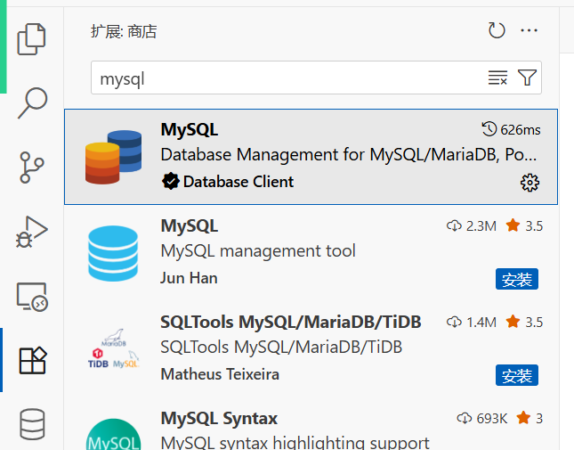
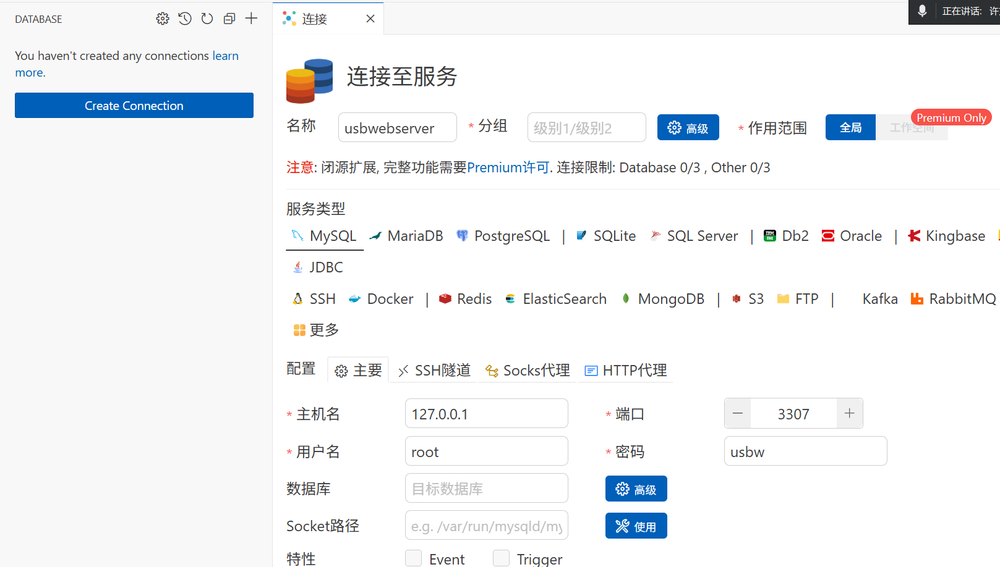
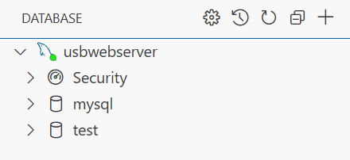
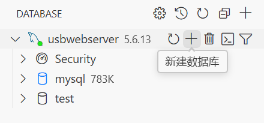
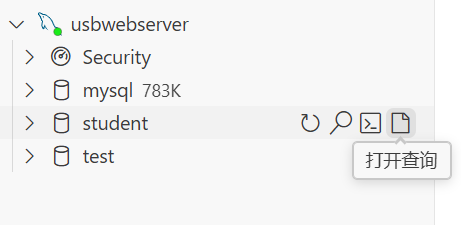
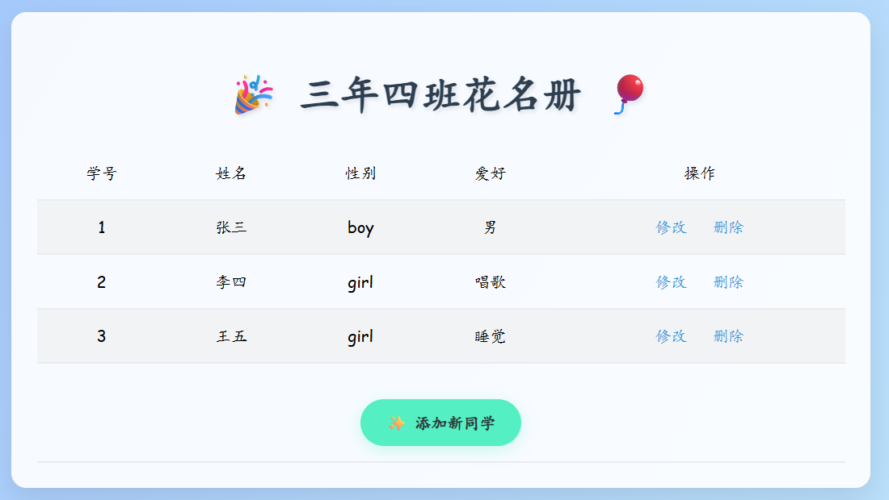
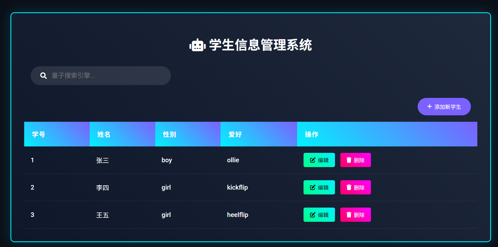

# Mysql数据库

- 数据库是用来管理数据的，主要提供数据的增删改查
- DBMS就是数据库管理系统
- 数据库分类
  - 关系型数据库
    - 以二维表来管理数据，比如excel表格
  - 非关系型数据库
    - 没有固定的格式，比如使用json来管理数据库
- Mysql全球使用人最多的数据库
- 数据库名词
  - 数据库， 可以理解为一个文件夹，可以装很多表文件
  - 表，可以理解为一个表文件，装在数据库中
  - 字段名，可以理解为表头，也就是列名，比如姓名，性别
  - 字段，数据的内容
- vscode中的数据库插件



- 创建数据库连接
  - usbwebserver中的mysql一定要启动



- 连接完成
  - 默认有两个库，一个是mysql，一个test
  - mysql数据库是系统自带的，里面会存储一些和数据库系统相关的设置



# SQL语句

- SQL是结构化查询语句，可以被编程语言用来与数据库沟通
- SQL的种类
  - DDL：数据定义语句
  - DCL：数据控制语句
  - DML：数据操作语句
  - DQL：数据查询语句

## DDL

- 对库或者表进行操作的语句
- 创建数据库



```SQL
# 创建数据库student,默认字符集为utf8mb4
CREATE DATABASE student
    DEFAULT CHARACTER SET = 'utf8mb4';

# 删除数据库
drop database student;

# 修改字符集
alter database student charset utf8;

# 查看数据库
show databases;

```

- 创建表
  - 表是存在于数据库中的，需要先进入要创建表的数据库
  - 创建表的时候，必须要将每一列的名字定义清楚
    - 列名 数据类型（数据长度）
      - int  整数
      - varchar  字符串
      - enum  枚举，可以理解为几选一
    - auto_increment   自增，当添加数据的时候，如果没有指定，就会自动+1
    - not null  不允许为空
    - unique  不允许重复
    - comment  描述
    - default char set utf8  设置默认的字符集为utf8，不然默认为latin也就是ascii编码



```SQL
# 进入student数据库
use student;

# 创建一个表
create table users(
    sid int not null unique auto_increment comment "学号",
    sname varchar(200) not null comment "姓名",
    sgender enum('boy', 'girl') not null default 'girl' comment "性别",
    shobby varchar(200) not null comment "爱好"
)default char set utf8;

# 查看表
show tables;

# 查看表结构，也就是表由哪些列组成
desc users;

# 删除表
drop table users;

# 改表名
alter table users rename student01;


```

## DCL

- 对权限进行操作

```mysql
# 给于root@localhost用户提供student库的student01表的all权限
grant all on student.student01 to root@'localhost' identified by "usbw";

# 给于root@localhost用户提供所有库所有表的all权限
grant all on *.* to root@'localhost' identified by "usbw";

# 去除某个用户的drop权限
revoke drop on *.* from root@'localhost';

# 查看某个用户的权限
show grants for root@localhost;
```

## DML

- 操作表中的数据
- 插入数据

```sql
# 插入用户
insert into users(sname, shobby) values("张三", "抽烟喝酒烫头");

# 添加多行数据
insert into users(sname, shobby) values("李四","唱歌"),("王五","睡觉");

# 清空表内容
truncate users;
```

- 更新数据

```sql
# 更新数据，选项中没有的默认为空
update users set sgender="boy", shobby="抽烟喝酒烫头" where sid=1;
```

- 删除数据

```sql
# 删除指定行数据
delete from users where sid=2;

# 删除所有数据
delete from users where 1=1;
```

## DQL

- 查询表中的数据

```sql
# 查询表中所有数据
select * from users;

# 查询表中的性别和爱好
select sgender,shobby from users;

# 加上条件查询
select * from users where sid=4;

# 加上多个条件查询
select * from users where sid=4 and sgender="girl";
```

## php连接数据库

- php可以使用`mysqli_connect()` 函数连接数据库，并且让数据库执行SQL，获取结果

```PHP
<?php
// 连接数据库
$dbhost = "127.0.0.1";
$dbusername = "root";
$dbpasswd = "usbw";
$db = "student";
$conn = mysqli_connect($dbhost, $dbusername, $dbpasswd, $db) or exit("db connection faild...");

// 设置连接使用的字符集
mysqli_query($conn, "set names utf8");

// 读取users表中的所有数据
$sql = "select * from users";
$result = mysqli_query($conn, $sql);
?><!DOCTYPE html>
<html lang="en">
<head>
    <meta charset="UTF-8">
    <meta name="viewport" content="width=device-width, initial-scale=1.0">
    <title>班级花名册</title>
    <style>
        body {
            background: linear-gradient(120deg, #a1c4fd 0%, #c2e9fb 100%);
            font-family: 'Comic Sans MS', cursive;
            min-height: 100vh;
            padding: 20px;
        }
        .box {
            background: rgba(255, 255, 255, 0.9);
            border-radius: 15px;
            box-shadow: 0 10px 30px rgba(0,0,0,0.1);
            padding: 25px;
            max-width: 800px;
            margin: 0 auto;
        }
        h1 {
            color: #2c3e50;
            text-align: center;
            text-shadow: 2px 2px 4px rgba(0,0,0,0.1);
            font-size: 2.5em;
            margin-bottom: 25px;
        }
        table {
            width: 100%;
            border-collapse: collapse;
            transition: all 0.3s;
        }
        tr {
            transition: all 0.2s;
        }
        tr:hover {
            transform: scale(1.02);
            background: #f8f9fa !important;
        }
        td, th {
            padding: 15px;
            border-bottom: 2px solid #e9ecef;
            text-align: center;
        }
        th {
            background: #74b9ff;
            color: white;
            font-weight: bold;
        }
        tr:nth-child(even) {
            background: #f1f3f5;
        }
        a {
            color: #3498db;
            padding: 5px 10px;
            border-radius: 8px;
            transition: all 0.3s;
            text-decoration: none;
        }
        a:hover {
            background: #3498db;
            color: white !important;
            box-shadow: 0 2px 8px rgba(52,152,219,0.4);
        }
        .add-btn {
            display: inline-block;
            margin-top: 20px;
            padding: 12px 25px;
            background: #55efc4;
            color: #2d3436 !important;
            border-radius: 25px;
            font-weight: bold;
            box-shadow: 0 4px 15px rgba(85,239,196,0.3);
        }
        .add-btn:hover {
            transform: translateY(-2px);
            box-shadow: 0 6px 20px rgba(85,239,196,0.5);
        }
    </style>
</head>
<body>
    <div class="box">
        <h1>🎉 三年四班花名册 🎈</h1>
        <table>
            <tr>
                <td>学号</td>
                <td>姓名</td>
                <td>性别</td>
                <td>爱好</td>
                <td>操作</td>
            </tr>
            <?php
            while($rows = mysqli_fetch_assoc($result)){
            ?>
            <tr>
                <td><?php echo $rows['sid'];?></td>
                <td><?php echo $rows['sname'];?></td>
                <td><?php echo $rows['sgender'];?></td>
                <td><?php echo $rows['shobby'];?></td>
                <td>
                    <a href="">修改</a>
                    <a href="">删除</a>
                </td>
            </tr>
            <?php
            }
            ?>
            <tr>
                <td colspan="5">
                    <a href="#" class="add-btn" onclick="addStudent()">✨ 添加新同学</a>
                </td>
            </tr>
        </table>
    </div>

    <script>
        // 添加点击动画效果
        document.querySelectorAll('tr').forEach(row => {
            row.addEventListener('click', () => {
                row.style.transform = 'scale(0.98)';
                setTimeout(() => row.style.transform = '', 200);
            });
        });

        function addStudent() {
            const confetti = document.createElement('div');
            confetti.style = 'position:fixed; width:10px; height:10px; background:red; border-radius:50%;';
            document.body.appendChild(confetti);
            
            // 简单庆祝动画
            setTimeout(() => {
                confetti.remove();
                alert('🎈 准备添加新同学啦！');
            }, 500);
        }
    </script>
</body>
</html>
```

- 最终可以显示出数据库中所有的用户信息





效果如上：

- 添加新同学
  - 将连接数据库的部分代码，剪切到`func.php` ，作为共享代码，因为很多地方都需要连接数据库
  - 创建`addstudent.php` ，用于编写新加用户的功能

```PHP
<?php
// 此文件为func.php
// 连接数据库
$dbhost = "127.0.0.1";
$dbusername = "root";
$dbpasswd = "usbw";
$db = "student";
$conn = mysqli_connect($dbhost, $dbusername, $dbpasswd, $db) or exit("db connection faild...");

// 设置连接使用的字符集
mysqli_query($conn, "set names utf8");
<?php
// 此代码为addstudent.php
include "func.php";

// 当点击提交之后
if(array_key_exists("submit", $_POST)){
    $username = $_POST["name"];
    $gender = $_POST["gender"];
    $hobby = $_POST["hobby"];
    // 拼接sql语句
    $sql = "insert into users(sname,sgender,shobby) value('$username','$gender','$hobby')";
    // 执行sql语句
    $result = mysqli_query($conn, $sql);
    if($result){
        echo "<script>alert('添加成功！');window.location.href='demo06.php';</script>";
    }else{
        echo "<script>alert('添加失败！');</script>";
    }
}

?>
<!DOCTYPE html>
<html lang="en">
<head>
    <meta charset="UTF-8">
    <meta name="viewport" content="width=device-width, initial-scale=1.0">
    <title>添加新同学</title>
    <!-- 新增样式 -->
    <script src="https://cdn.tailwindcss.com"></script>
    <script src="//unpkg.com/sweetalert/dist/sweetalert.min.js"></script>
</head>
<body class="bg-gradient-to-r from-pink-100 to-blue-100 min-h-screen">
    <!-- 新增表单容器 -->
    <div class="container mx-auto px-4 py-12 max-w-md">
        <form action="" method="post" 
              class="bg-white rounded-lg shadow-2xl p-8 transition-all hover:shadow-xl"
              onsubmit="showConfetti(event)">
            <h1 class="text-3xl font-bold text-purple-600 mb-6 text-center animate-bounce">
                🎉 添加新同学
            </h1>
            
            <!-- 输入框样式美化 -->
            <input name="name" type="text" placeholder="姓名" 
                   class="w-full mb-4 p-3 rounded-lg border-2 border-dashed border-purple-200 
                          focus:border-purple-500 focus:ring-2 focus:ring-purple-200 transition">

            <!-- 下拉菜单美化 -->
            <select name="gender" class="w-full mb-4 p-3 rounded-lg bg-purple-50 border-2 border-purple-200 
                         focus:border-purple-500 cursor-pointer transition appearance-none">
                <option value="girl" selected>👧 女生</option>
                <option value="boy">👦 男生</option>
            </select>

            <!-- 文本域美化 -->
            <textarea name="hobby" placeholder="爱好" 
                     class="w-full mb-6 p-3 rounded-lg border-2 border-purple-200 
                            focus:border-purple-500 resize-none transition h-32"
                     rows="4"></textarea>

            <!-- 提交按钮动画 -->
            <input type="submit" name="submit" value="提交" 
                   class="w-full bg-gradient-to-r from-purple-400 to-blue-400 text-white p-3 
                          rounded-lg font-bold uppercase tracking-wide hover:scale-105 
                          transition-transform duration-200 cursor-pointer">
        </form>
    </div>
</body>
</html>
```

- 修改同学
  - 在花名册点击修改的时候，需要跳转到`changestudent.php?id=对应的id` 
  - `changestudent.php` 需要先根据id去读取数据库中现有的用户信息，并且呈现到对应的input框中
  - `changestudent.php` 在提交新的数据时候，需要使用`update` 的sql语句，来更新现有的条目

```PHP
// 下面的修改是在demo06.php中，也就是花名册表格中
<a href="changestudent.php?id=<?php echo $rows['sid'];?>">修改</a>
<?php
// 此代码在changestudent.php文件中
include "func.php";

// 接受id，并且将此id的数据库中的数据读取出来
if (array_key_exists("id", $_GET)) {
    $id = $_GET["id"];
    $sql = "select * from users where sid = $id";
    $result = mysqli_query($conn, $sql);
    // 获取查询结果
    $row = mysqli_fetch_assoc($result);
    $old_name = $row["sname"];
    $old_gender = $row["sgender"];
    $old_hobby = $row["shobby"];
}

// 当点击提交之后
if (array_key_exists("submit", $_POST)) {
    $username = $_POST["name"];
    $gender = $_POST["gender"];
    $hobby = $_POST["hobby"];
    // 拼接sql语句
    $sql = "update users set sname = '$username' , sgender='$gender', shobby = '$hobby' where sid=$id";
    // 执行sql语句
    $result = mysqli_query($conn, $sql);
    if ($result) {
        echo "<script>alert('修改成功！');window.location.href='demo06.php';</script>";
    } else {
        echo "<script>alert('修改失败！');</script>";
    }
}

?>
<!DOCTYPE html>
<html lang="en">

<head>
    <meta charset="UTF-8">
    <meta name="viewport" content="width=device-width, initial-scale=1.0">
    <title>修改信息</title>
    <!-- 新增样式 -->
    <script src="https://cdn.tailwindcss.com"></script>
    <script src="//unpkg.com/sweetalert/dist/sweetalert.min.js"></script>
</head>

<body class="bg-gradient-to-r from-pink-100 to-blue-100 min-h-screen">
    <!-- 新增表单容器 -->
    <div class="container mx-auto px-4 py-12 max-w-md">
        <form action="" method="post"
            class="bg-white rounded-lg shadow-2xl p-8 transition-all hover:shadow-xl"
            onsubmit="showConfetti(event)">
            <h1 class="text-3xl font-bold text-purple-600 mb-6 text-center animate-bounce">
                🎉 修改信息
            </h1>

            <!-- 输入框样式美化 -->
            <input name="name" value="<?php echo $old_name;?>" type="text" placeholder="姓名"
                class="w-full mb-4 p-3 rounded-lg border-2 border-dashed border-purple-200 
                          focus:border-purple-500 focus:ring-2 focus:ring-purple-200 transition">

            <!-- 下拉菜单美化 -->
            <select name="gender" class="w-full mb-4 p-3 rounded-lg bg-purple-50 border-2 border-purple-200 
                         focus:border-purple-500 cursor-pointer transition appearance-none">
                <?php 
                $girl_selected = "";
                $boy_selected = "";
                if($old_gender == "girl"){
                    $girl_selected = "selected";
                }else{
                    $boy_selected = "selected";
                }
                ?>
                <option value="girl" <?php echo $girl_selected;?>>👧 女生</option>
                <option value="boy" <?php echo $boy_selected;?>>👦 男生</option>
            </select>

            <!-- 文本域美化 -->
            <textarea name="hobby" placeholder="爱好"
                class="w-full mb-6 p-3 rounded-lg border-2 border-purple-200 
                            focus:border-purple-500 resize-none transition h-32"
                rows="4"><?php echo $old_hobby;?></textarea>

            <!-- 提交按钮动画 -->
            <input type="submit" name="submit" value="提交"
                class="w-full bg-gradient-to-r from-purple-400 to-blue-400 text-white p-3 
                          rounded-lg font-bold uppercase tracking-wide hover:scale-105 
                          transition-transform duration-200 cursor-pointer">
        </form>
    </div>
</body>

</html>
```

- 删除信息
  - 在`demo06.php` 删除用户的按钮，跳转到`?delete=用户id` ,
  - `demo06.php` 判断如果get收到了delete，就执行对应的sql语句，删除此id的数据

```PHP
<?php
// 此代码在demo06.php中
include "func.php";

// 删除功能
if(array_key_exists("delete", $_GET)){
    $id = $_GET["delete"];
    $sql = "delete from users where sid=$id";
    $result = mysqli_query($conn, $sql);
    if($result){
        echo "<script>alert('删除成功！');window.location.href='demo06.php';</script>";
    }else{
        echo "<script>alert('删除失败！');window.location.href='demo06.php';</script>";
    }
}

.......


<a href="?delete=<?php echo $rows['sid'];?>">删除</a>
```