# 计算机组成

## 核心组件

- 处理器CPU  
  + 负责计算
- 内存 RAM
  - 负责临时存放正在运行的程序数据
  - 断电就丢失所有数据
- 硬盘
  - 负责持久化存储数据
  - 机械硬盘，磁盘
    - 便宜
    - 数据存储时间比较长
  - 固态硬盘，浮栅晶体管
    - 速度快

## 其他组件

- 显卡
  - 游戏
  - AI
  - 图形处理
- 输入输出
  - 键盘鼠标
  - 显示器
  - 喇叭
  - 麦克风

# 计算机处理的核心内容：数据

## 二进制

计算机中所有的数据，都必须变为二进制才可以进行存储或者传输。

### 文本

通过文字编码，可以将文字变为二进制

文字编码本质是一个有序号的表格，把文字全部放进去，根据序号的二进制来识别文字

文字  -> 二进制

ASCII编码  只支持 英文和特殊字符

 纯英文系统比较常见

UTF-8编码 支持所有的文字

GBK编码 支持简体繁体中文，不支持生僻字

 windows系统默认

### 图片

通过图片格式来定义二进制如何表达像素显示

jpg.jpeg   照片（不能透明）

png          允许透明

gif            多张图+时间轴

### 视频

视频的本质是多张图片+时间抽

mp4

m3u8   分段传输

### 音频

本质上就是记录电频

mp3

# 数据的传输

数据网络提供数据的传输，本质上传递的是二进制

# 什么是网络

给各个节点之间提供数据信息交换的就是数据网络

两个节点之间连接一根网线，就可以组成最简单的网络

# 数据通信的类型

## 单播

一对一

## 广播

一对所有

## 组播

一对特定的组

# 常见网络设备

## 集线器

主要是将各个节点之间物理连接在一起，会冲突

## 交换机

将各个节点之间连接在一起，通过MAC地址精准的交换彼此的数据

交换机组成了局域网，一个局域网中共享一个广播域

## 路由器

连接各个局域网，并且隔绝广播域

## 互联网

互联网是由无数个局域网组成，局域网之间通过路由器连接

# OSI七层模型

## 应用层

各种应用程序的协议

- http
- https

## 表示层

数据的格式化、数据加密解密、数据的压缩解压缩

## 会话层

负责会话的管理，建立、终止、区分不同的会话（网站历史会话记录，下次登陆会进行识别）

session

## 传输层

数据分段和重组，提供数据传输方式，提供数据的发送和接收端口

### 端口port

端口提供应用的区分，使用端口号，可以让操作系统将发送或者接收到的数据和进程之间关联

端口号范围0~65535

- 固定端口号
  - 一些约定的端口号，让用户访问的时候不用去加上端口，自动添加
  - 系统会记录这些端口号在一个文件中：`C:\Windows\System32\drivers\etc\services`
  - 常见端口
    - http    80/tcp
    - https   443/tcp、udp
    - dns     53/tcp、udp
    - ftp      21/tcp   20/tcp
    - ssh      22/tcp
    - rdp      3389/tcp、udp
- 随机端口号
  - 一般用于接受数据，当网络应用发起请求的时候，都会带上本机随机端口号，临时接收一下数据，数据接收完就关闭

### TCP

- 可靠的传输，发送的每一个数据都需要被确认，才会发下一个数据
- 占用更多的资源，并且容易出现DDOS安全问题

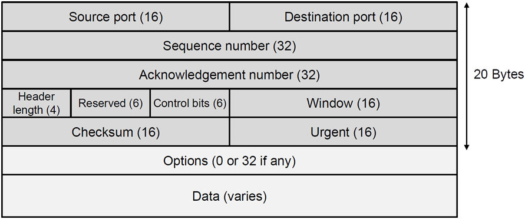

- 三次握手
  - 当TCP建立连接时候，需要发送三个数据包来确保连接的可靠建立

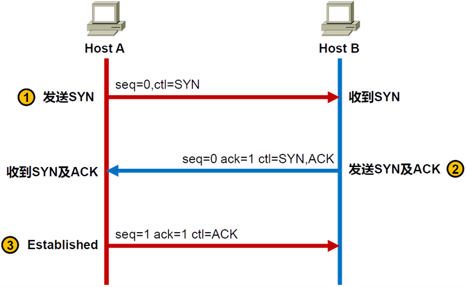

- HostA 发送的第一个TCP包里面的序列号是随机的，确认号是0，HostB 发送的第一个TCP回应序列号是随机的，确认号是收到的HostA的序列号+1
- 四次挥手

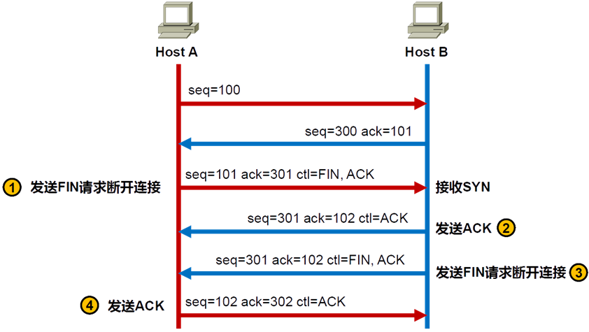

- tcp的有限状态机制

https://iproute.cn/2020/03/06/tcp-you-xian-zhuang-tai-ji/

### UDP

- 尽力而为的传输

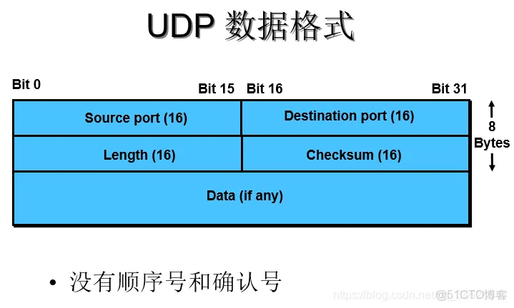


## 网络层

提供了IP地址，IP地址是设备的逻辑地址，相当于快递收件地址

如何查看自己电脑的IP地址

- 查看内网的IP地址

  比如1903，这个地址仅在某幢楼内有效

- 查看公网的IP地址

 	浏览器访问https://cip.cc/

​	 浏览器访问http://whatismyipaddress.com/

### IP地址的组成

IP地址是32位二进制组成，使用点分十进制

比如，192.168.22.56，变成二进制就是11000000 10101000 00010110 00111000

手机号码是靠前7位来判断归属地和运行商，IP地址也有类似的设计，通过网络位来判断是哪个局域网，通过主机位在局域网中详细的划分

IP地址网络位长度不固定，根据需要可以调整

192.168.22.56/24 ，表示前24位是网络位

192.168.22.56/255.255.255.0 ，子网掩码和IP地址二进制一一对应，子网掩码位是1，表示对应的IP位是网络位

### 实战

  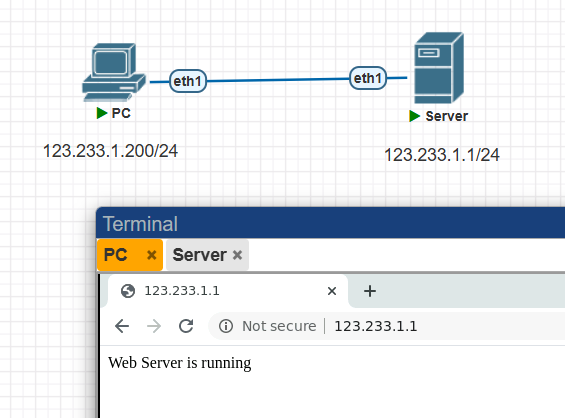


必须要网络位一样，才可以互相之间直接访问


### IP地址配置

- windows
  - 运行`ncpa.cpl`
  - 双击对应的网卡，点击属性，点击Internet协议版本4，就可以配置IP信息
- Linux
  - 输入`nmtui`

### IP地址分类

早期为了方便IP地址的使用，对IP地址进行分类

A 8位网络位 /8  255.0.0.0

B 16位网络位 /16  255.255.0.0

C 24位网络位 /24  255.255.255.0

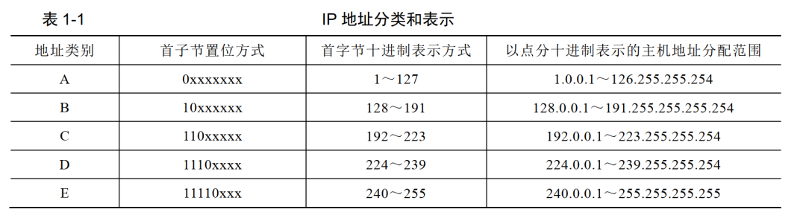

### 私有IP地址

公网IP地址都是由https://www.iana.org/给出

私有IP地址可以自行在内部随意使用，为了防止与公网IP地址冲突，私有IP地址有这几个段：

10.0.0.0~10.255.255.255

172.16.0.0~172.31.255.255

192.168.0.0~192.168.255.255

127.0.0.0~127.255.255.255 (计算机保留作为本地地址) 

169.254.0.0~169.254.255.255（计算机无法得到IP时，自己给自己发一个IP使用，无法连接网络）

### 广播地址与网络编号

- 广播地址
  - 规定一个网段，主机位如果全为1，那这个地址就是这个局域网的最后一个地址，也就是广播地址
- 网络编号
  - 一个网段，主机位全是0，这个地址保留下来代指整个局域网的编号
  - 192.168.1.0/24    表示这个局域网的地址段

### 网络测试工具

- ping
  - 用于测试到目的IP地址的连通性
- tracert
  - 网络数据包存在一个属性叫TTL，生存时间，每经过一台设备，就会-1，当为0的时候，就被丢弃，并且丢弃的那台设备会回复一个超时。
  - tracert 使用TTL减一的方式，可以探测出数据经过的每一个节点

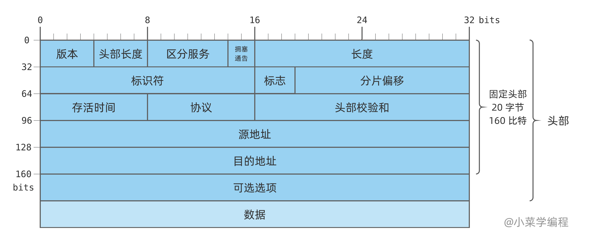

### IP配置实验

- R1

```c
no     # 不需要进行配置向导

R1>enable     # 进入到特权模式，在此模式下，才具备设备完整的权限
R1#configure terminal       # 进入到全局配置模式，在这个模式下可以配置系统的各项参数
Router(config)#hostname R1        # 修改主机名字
R1(config)#no ip domain lookup        # 关闭域名解析(防止敲错命令，卡住)
R1(config)#interface ethernet 0/0    # 进入到e0/0接口配置模式，在这个模式下，可以配置与此接口相关配置
R1(config-if)#ip address 192.168.123.1 255.255.255.0        # 配置接口IP地址
R1(config-if)#no shutdown        # 开启接口
R1(config-if)#end                # 回到特权模式
R1#show ip interface brief        # 查看接口的状态
```

- R2

```c
no     # 不需要进行配置向导

Router>enable     # 进入到特权模式，在此模式下，才具备设备完整的权限
Router#configure terminal       # 进入到全局配置模式，在这个模式下可以配置系统的各项参数
Router(config)#hostname R2        # 修改主机名字
R2(config)#no ip domain lookup
R2(config)#interface ethernet 0/0    # 进入到e0/0接口配置模式，在这个模式下，可以配置与此接口相关配置
R2(config-if)#ip address 192.168.123.2 255.255.255.0        # 配置接口IP地址
R2(config-if)#no shutdown        # 开启接口
R2(config-if)#end                # 回到特权模式
R2#show ip interface brief        # 查看接口的状态a
```

- R3

```c
no     # 不需要进行配置向导

Router>enable     # 进入到特权模式，在此模式下，才具备设备完整的权限
Router#configure terminal       # 进入到全局配置模式，在这个模式下可以配置系统的各项参数
Router(config)#hostname R3        # 修改主机名字
R3(config)#no ip domain lookup
R3(config)#interface ethernet 0/0    # 进入到e0/0接口配置模式，在这个模式下，可以配置与此接口相关配置
R3(config-if)#ip address 192.168.123.3 255.255.255.0        # 配置接口IP地址
R3(config-if)#no shutdown        # 开启接口
R3(config-if)#end                # 回到特权模式
R3#show ip interface brief        # 查看接口的状态
```

- 检查

```c
R1#ping 192.168.123.2
Type escape sequence to abort.
Sending 5, 100-byte ICMP Echos to 192.168.123.2, timeout is 2 seconds:
!!!!!        # 点代表超时，!表示通了
Success rate is 100 percent (5/5), round-trip min/avg/max = 2/2/3 ms
R1#ping 192.168.123.3
Type escape sequence to abort.
Sending 5, 100-byte ICMP Echos to 192.168.123.3, timeout is 2 seconds:
!!!!!
Success rate is 100 percent (5/5), round-trip min/avg/max = 1/1/4 ms
```


## 数据链路层

数据链路层主要是维护局域网，MAC地址是跟着设备接口走

将数据封装成帧，实现两个相邻节点之间的通信 

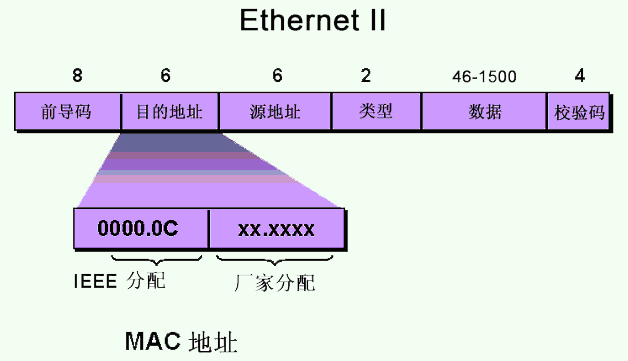


### mac地址

媒体访问控制，是网卡固件中烧录的地址，有厂家提供，全球唯一*，无法轻易改变，类似于身份证号码

在实际通信中，有效范围仅限于局域网

在硬件中以48位二进制表示，为了人类方便记忆，使用16进制表示

windows查看mac地址的方式

方式一：

1. `win+r` 打开运行
2. 输入`cmd` 然后回车
3. 输入`ipconfig ``/``all`  然后回车

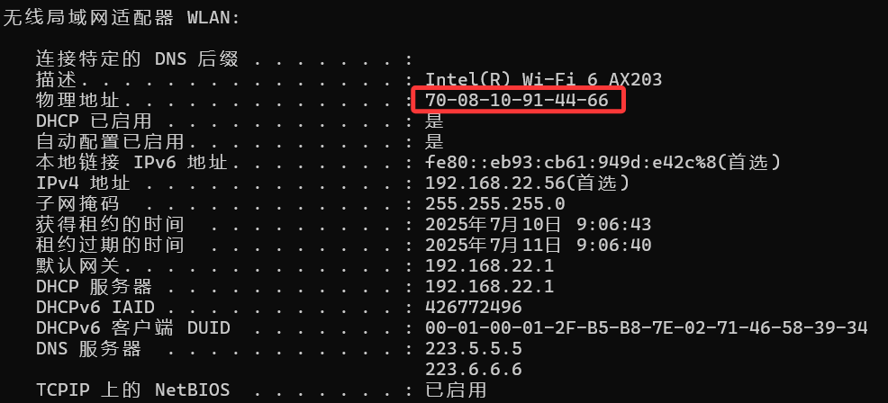


方法二：

1. `win+r` 打开运行
2. 输入`ncpa.cpl` 然后回车
3. 找到对应的网卡，双击之后，点开详细信息就可以看到mac地址

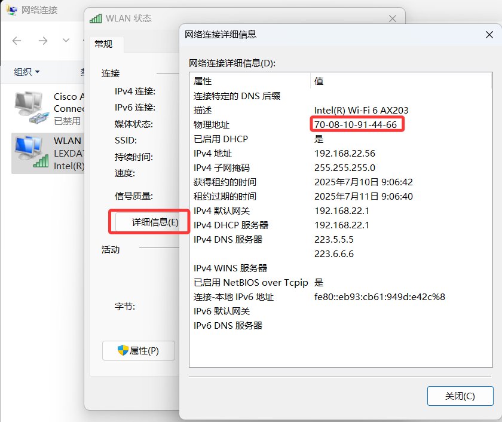


### 目的地址

1. 如果是交换机收到了帧，就会查找目的地址的位置接口
2. 如果是终端，就会查看目的地址是否给自己，如果不是给自己的，就丢弃*，如果是给自己的，就会拆开这一层，丢给网络层

### 源地址

1. 发送者自己的mac地址，但是不鉴别

### 效验码

1. 帧尾效验，使用CRC算法得到的二进制，可以确保数据不破损

### ARP地址解析协议

1. 知道对方的IP地址，但是不知道对方的mac地址，就会向局域网发起广播，进行查询，如果收到回复，就会记下来

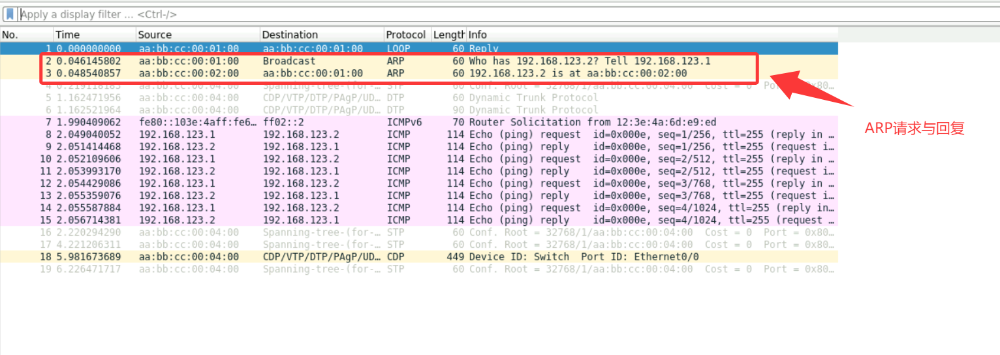


## 物理层

定义各种物理传输介质的电气标准

主要是为了传递二进制

网线

- 电
  - RJ45
  - RJ11

- 光
  - SC
    - 单根芯
  - LC
    - 双根芯
- 无线
  - wifi


