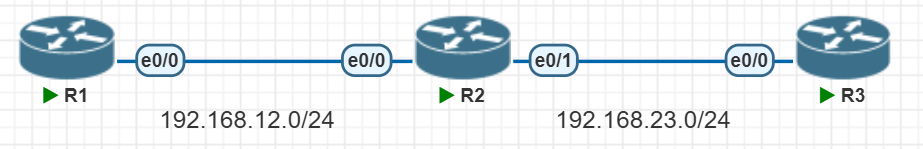
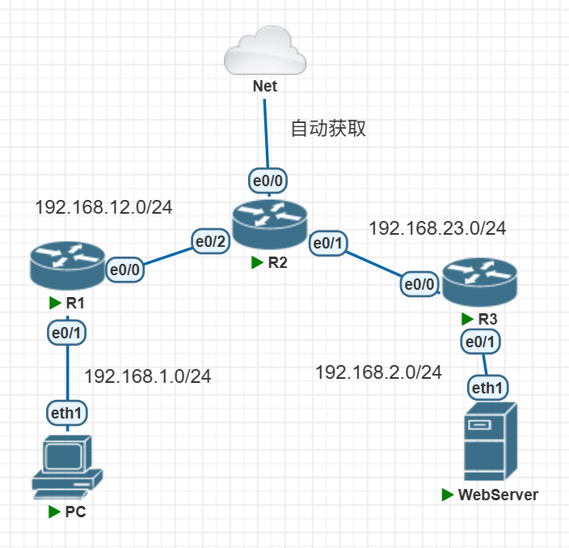
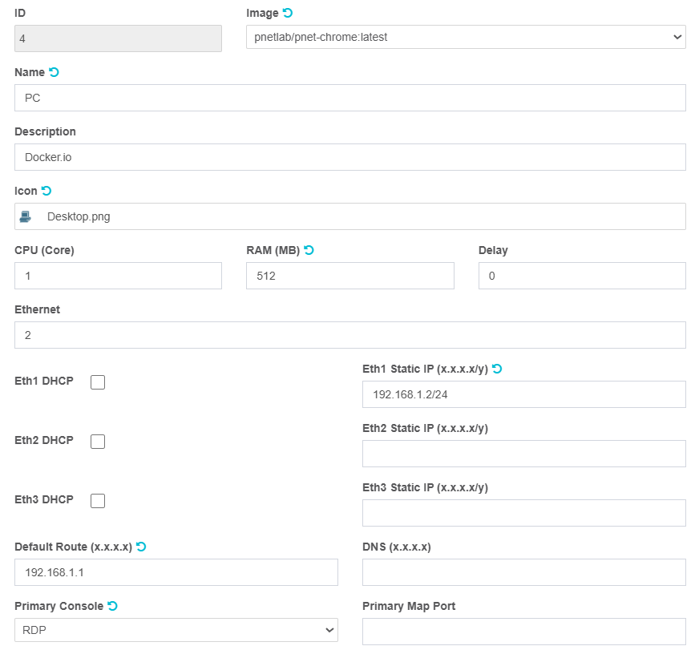
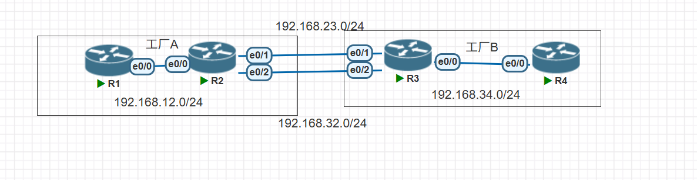
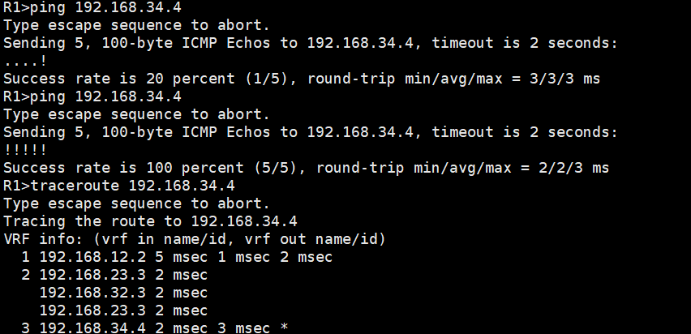
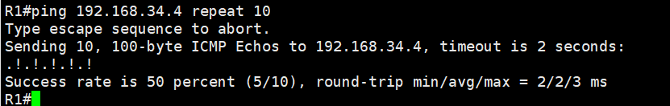

# 路由原理

1. 路由器收到一个数据之后，会查看IP包头中的目的IP地址
2. 在路由表中查找是否有匹配项
   1. 有，根据路由表记录，转发到指定的接口
   2. 无，丢弃
3. 查看路由表
   1. 路由器，输入命令`show ip route`
   2. Windows，输入命令`route print`
   3. Linux，输入命令`ip route`

## 静态路由

手动指定一个目的地应该如何去往

```SQL
R1(config)#ip route 192.168.23.0 255.255.255.0 e0/0  # 增加一个静态路由
R1(config)#end
R1#sh ip route
Codes: L - local, C - connected, S - static, R - RIP, M - mobile, B - BGP
       D - EIGRP, EX - EIGRP external, O - OSPF, IA - OSPF inter area 
       N1 - OSPF NSSA external type 1, N2 - OSPF NSSA external type 2
       E1 - OSPF external type 1, E2 - OSPF external type 2
       i - IS-IS, su - IS-IS summary, L1 - IS-IS level-1, L2 - IS-IS level-2
       ia - IS-IS inter area, * - candidate default, U - per-user static route
       o - ODR, P - periodic downloaded static route, H - NHRP, l - LISP
       a - application route
       + - replicated route, % - next hop override, p - overrides from PfR

Gateway of last resort is not set

      192.168.12.0/24 is variably subnetted, 2 subnets, 2 masks
C        192.168.12.0/24 is directly connected, Ethernet0/0
L        192.168.12.1/32 is directly connected, Ethernet0/0
S     192.168.23.0/24 is directly connected, Ethernet0/0
```

## 实战



- 命令

```c
===============R1==============
no
en
conf t
int e0/0
ip add 192.168.12.1 255.255.255.0
no shutdown

ip route 192.168.23.0 255.255.255.0 e0/0


===============R2==============
no
en
conf t
int e0/0
ip add 192.168.12.2 255.255.255.0
no shutdown

int e0/1
ip add 192.168.23.2 255.255.255.0
no sh

===============R3==============
no
en
conf t
int e0/0
ip add 192.168.23.3 255.255.255.0
no sh

ip route 192.168.12.0 255.255.255.0 e0/0


=============检查===========
show ip route # 查看路由表
ping 192.168.23.3
```

## 默认路由

当路由表中所有的条目都没有被匹配上，就从默认路由的出口走，`0.0.0.0/0`

最长匹配原则，有限匹配条件更精准的

### 实践



```C
============R1================
hostname R1
interface Ethernet0/0
 ip address 192.168.12.1 255.255.255.0
 no shutdown
interface Ethernet0/1
 ip address 192.168.1.1 255.255.255.0
 no shutdown

ip route 0.0.0.0 0.0.0.0 192.168.12.2        # 默认路由，指向R2，当R1无法匹配目的地IP的时候，就转发给192.168.12.2
ip route 192.168.23.0 255.255.255.0 192.168.12.2

==========R2================
hostname R2
interface Ethernet0/0
 ip address dhcp
 no shutdown
interface Ethernet0/1
 ip address 192.168.23.2 255.255.255.0
 no shutdown
interface Ethernet0/2
 ip address 192.168.12.2 255.255.255.0
 no shutdown

ip route 192.168.1.0 255.255.255.0 192.168.12.1
ip route 192.168.2.0 255.255.255.0 192.168.23.3

==========R3================
hostname R3
interface Ethernet0/0
 ip address 192.168.23.3 255.255.255.0
 no shutdown
interface Ethernet0/1
 ip address 192.168.2.1 255.255.255.0
 no shutdown
 
ip route 0.0.0.0 0.0.0.0 192.168.23.2
ip route 192.168.12.0 255.255.255.0 192.168.23.2

==========检查命令===============
show ip route # 查看路由表
ping x.x.x.x  # 检查是否可以访问x.x.x.x地址
```

```c
show running configure #展示历史配置
```


- pc的设置



- webserver的配置


- 实现效果

访问webserver


访问任意网站


## 负载均衡

多条线路同时比使用来首发流量




### 实验描述

- 工厂A和工厂B之间需要专线，为了稳定安全连接了两根线路，现在两根线路都要用上

### 实验配置

- R1

```c
interface Ethernet0/0
 ip address 192.168.12.1 255.255.255.0
 no shutdown
 
ip route 0.0.0.0 0.0.0.0 192.168.12.2
```

- R4

```c
interface Ethernet0/0
 ip address 192.168.34.4 255.255.255.0
 no shutdown
 
ip route 0.0.0.0 0.0.0.0 192.168.34.3
```

- R2

```C
no ip cef    # 关闭思科特快转发，因为会导致负载均衡的缓存，为了实验现象更加明显

interface Ethernet0/0
 ip address 192.168.12.2 255.255.255.0
 no shutdown
interface Ethernet0/1
 ip address 192.168.23.2 255.255.255.0
 no shutdown
interface Ethernet0/2
 ip address 192.168.32.2 255.255.255.0
 no shutdown
 
ip route 0.0.0.0 0.0.0.0 192.168.23.3
ip route 0.0.0.0 0.0.0.0 192.168.32.3
```

- R3

```C
no ip cef

interface Ethernet0/0
 ip address 192.168.34.3 255.255.255.0
 no shutdown
interface Ethernet0/1
 ip address 192.168.23.3 255.255.255.0
 no shutdown
interface Ethernet0/2
 ip address 192.168.32.3 255.255.255.0
 no shutdown
 
ip route 0.0.0.0 0.0.0.0 192.168.23.2
ip route 0.0.0.0 0.0.0.0 192.168.32.2
```

### 验证

- 在R1上去测试`192.168.34.4` 的连通性

```Python
R1#ping 192.168.34.4
Type escape sequence to abort.
Sending 5, 100-byte ICMP Echos to 192.168.34.4, timeout is 2 seconds:
!!!!!
Success rate is 100 percent (5/5), round-trip min/avg/max = 2/2/4 ms
```

- 在R1上使用traceroute命令测试线路是否负载均衡

```C
R1#traceroute 192.168.34.4
Type escape sequence to abort.
Tracing the route to 192.168.34.4
VRF info: (vrf in name/id, vrf out name/id)
  1 192.168.12.2 2 msec 1 msec 1 msec
  2 192.168.23.3 1 msec                # 在第二跳这里，出现了两条线路有可以经过
    192.168.32.3 1 msec
    192.168.23.3 2 msec
  3 192.168.34.4 2 msec *  4 msec
```




### 扩展

- 在R3上`shutdown` 其中一条线路，观察到负载均衡出现了问题

```C
R3(config)#int e0/1
R3(config-if)#shutdown         # 关闭R3的一个接口


R1#ping 192.168.34.4 repeat 10
Type escape sequence to abort.
Sending 10, 100-byte ICMP Echos to 192.168.34.4, timeout is 2 seconds:
!.!.!.!.!.            # 出现了50%丢包率
Success rate is 50 percent (5/10), round-trip min/avg/max = 4/5/7 ms
```




- 因为静态路由无法动态感知到线路的状态，所以无法自动切换