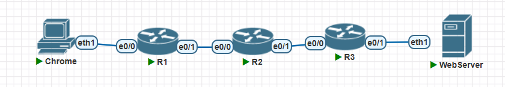
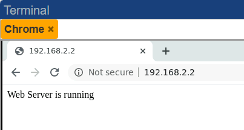
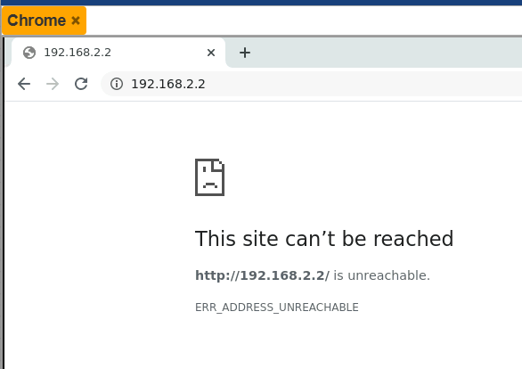
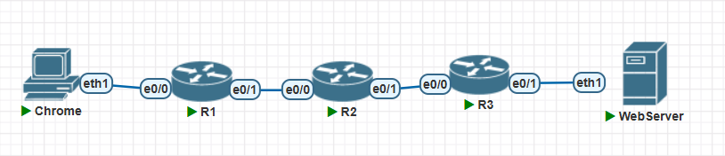
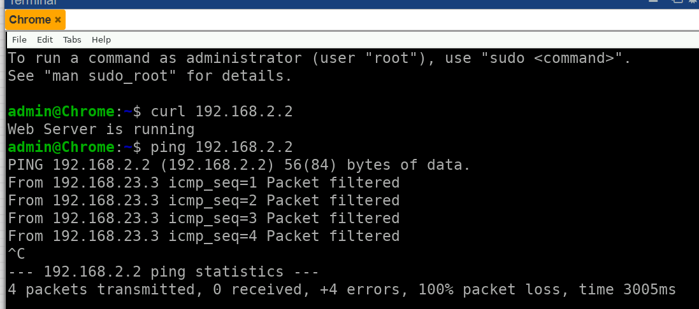

# ACL(Access Control List)

1. 对流量进行过滤
2. 对路由条目进行过滤

## 类型

1. 标准访问控制列表(列表编号1-99)
2. 扩展访问控制列表(列表编号100-199)

## 标准访问控制列表

1. 只能对流量的源IP地址进行匹配
2. 默认情况下acl没有匹配上的行为是deny
3. 由于只能匹配源IP，影响较大，所以尽量靠近目的地



- 命令配置

```C
=============R1=============
hostname R1

interface Ethernet0/0
 ip address 192.168.1.1 255.255.255.0
 no shutdown
interface Ethernet0/1
 ip address 192.168.12.1 255.255.255.0
 no shutdown
 
router rip            # 动态路由协议
 network 192.168.1.0        # 参与动态路由协议的条目
 network 192.168.12.0
 
=============R2==============
hostname R2

interface Ethernet0/0
 ip address 192.168.12.2 255.255.255.0
 no shutdown
interface Ethernet0/1
 ip address 192.168.23.2 255.255.255.0
 no shutdown

router rip
 network 192.168.12.0
 network 192.168.23.0

============R3===========
hostname R3

interface Ethernet0/0
 ip address 192.168.23.3 255.255.255.0
 no shutdown
interface Ethernet0/1
 ip address 192.168.2.1 255.255.255.0
 no shutdown

router rip
 network 192.168.2.0
 network 192.168.23.0
```

- 测试
  - 在没有任何策略之前，PC是可以访问webserver



- 在R3上加上拦截策略

```C
access-list 1 deny 192.168.1.0 /24
access-list 1 permit any

interface Ethernet0/1
 ip access-group 1 out
```

- 再次测试



## 扩展访问控制列表

1. 可以匹配源或者目的地的流量
2. 可以匹配TCP或者UDP的具体端口
3. 没有被匹配上的会被deny



- 禁止所有人ping通webserver，但是不影响网站访问，在R3上配置

```C
access-list 100 deny icmp any host 192.168.2.2 echo   # icmp就是ping使用的协议，echo是ping的请求
access-list 100 permit ip any any

interface Ethernet0/1
 ip access-group 100 out
```

- 测试



- 允许除了`192.168.1.2`以外的IP地址访问`webserver`，在R3上配置
- 如果直接配置

```C
R3(config)#access-list 100 deny tcp host 192.168.1.2 host 192.168.2.2 eq 80    # 直接过滤80端口的访问

# 查看acl的匹配顺序
R3#sh ip access-lists 100
Extended IP access list 100
    10 deny icmp any host 192.168.2.2 echo (4 matches)
    20 permit ip any any (40 matches)                        # 此处已将所有的流量全部都放行了，所以下面一条的拦截无效
    30 deny tcp host 192.168.1.2 host 192.168.2.2 eq www
```

- 调整顺序

```C
R3(config)#ip access-list extended 100
R3(config-ext-nacl)#no 30                # 删掉30的规则
R3(config-ext-nacl)#15 deny tcp host 192.168.1.2 host 192.168.2.2 eq www        # 加一个15的规则

R3#show ip access-lists 100
Extended IP access list 100
    10 deny icmp any host 192.168.2.2 echo (4 matches)
    15 deny tcp host 192.168.1.2 host 192.168.2.2 eq www (14 matches)
    20 permit ip any any (50 matches)        # 只有前面都匹配不上的，才会被放行
```

- 测试
  - 使用192.168.1.2的地址，无法ping也无法访问网站
  - 换一个192.168.1.233的地址，就可以访问