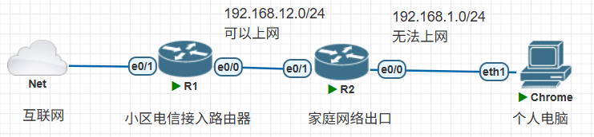
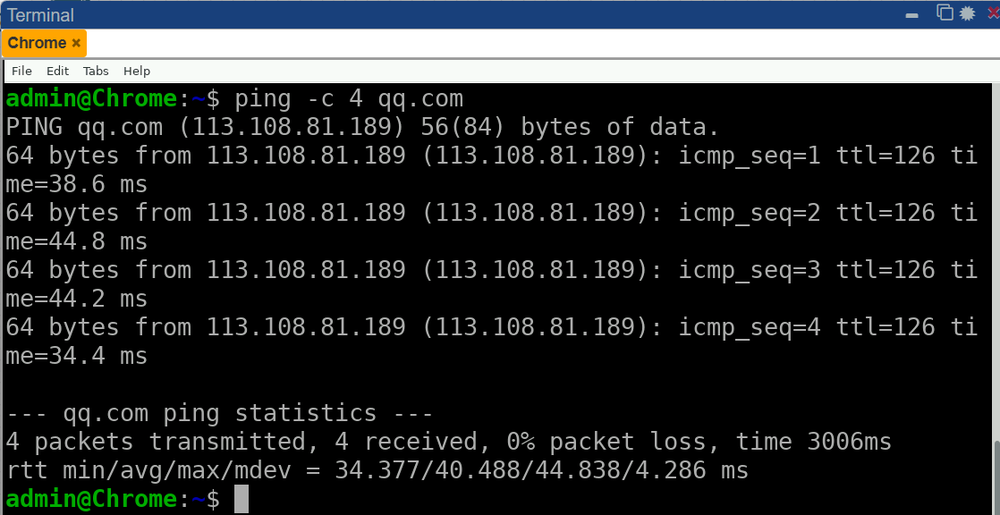
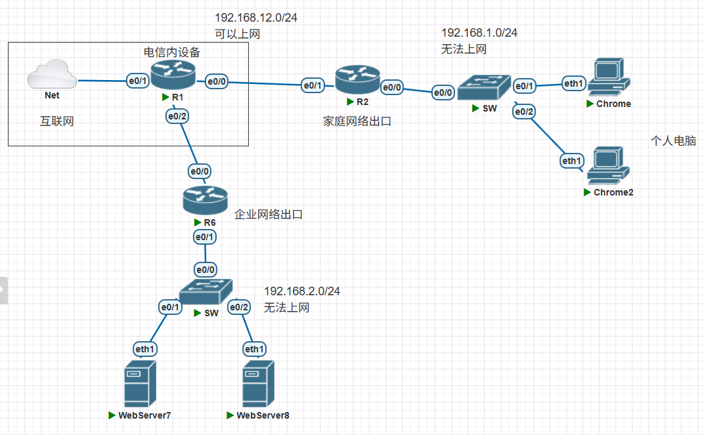
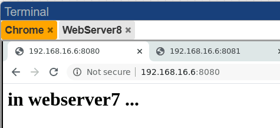
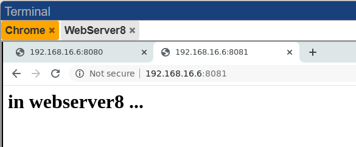
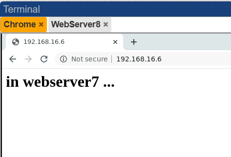
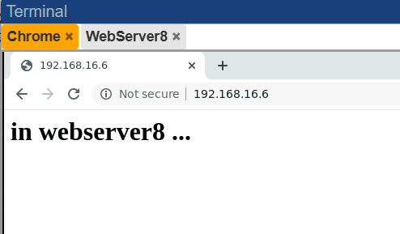

# NAT( Network Address Translation )

1. ipv4资源已经枯竭，现在个人网络通信使用的都是私有IP地址，并且通过NAT技术复用一个公网IP
2. NAT设备可以充当防火墙，保护内网的安全，公共网络无法直接访问内部的地址
3. 解决地址冲突
4. 发布内网的服务
5. 负载均衡

## SNAT(源地址NAT)



- 其中R2的e0/0接口连接的时候家庭内网，内网IP无法上网
- R2的e0/1是连接运营商(移动、联通、电信)，得到地址可以上网
- 为了保障家庭内网也可以上网，R2需要配置NAT

```C
========R1============
ho R1
int e0/0
ip add 192.168.12.1 255.255.255.0
no sh
```

- 配置家庭网关

```C
========R2=========
ho R2

int e0/0
ip add 192.168.1.1 255.255.255.0
ip nat inside
no sh
int e0/1
ip add 192.168.12.2 255.255.255.0
ip nat outside
ip route 0.0.0.0 0.0.0.0 192.168.12.1   ##配置默认网关
no sh


access-list 1 permit 192.168.1.0 /24
ip nat inside source list 1 int e0/1 overload
```

- 检查是否成功



- 抓包检查，确认去往外部网络的原地址，已经被替换为R2的e0/1接口
- 为了实现多台电脑共享一个IP地址对外上网，使用不同的端口号进行区分

## DNAT(目的地址NAT)



- R6作为企业的网关，需要承担一下几个任务
  - 为内网设备提供SNAT(给内网的设备提供上外网的能力)
  - 为内网的服务器提供DNAT(为服务器提供端口映射，将内部某个地址的端口映射到公网可以被访问的IP上)

```C
==========R1==========
interface Ethernet0/2
 ip address 192.168.16.1 255.255.255.0
 no shutdown


=============R6===================
hostname R6

interface Ethernet0/0
 ip address 192.168.16.6 255.255.255.0
 ip nat outside
 no shutdown
interface Ethernet0/1
 ip address 192.168.2.1 255.255.255.0
 ip nat inside
 no shutdown
 
ip route 0.0.0.0 0.0.0.0 192.168.16.1

====下面是SNAT，保障内部可以上网======
access-list 1 permit 192.168.2.0 0.0.0.255
ip nat inside source list 1 interface Ethernet0/0 overload

====下面是DNAT，提供服务器的端口映射======
ip nat inside source static tcp 192.168.2.2 80 interface Ethernet0/0 8080
ip nat inside source static tcp 192.168.2.3 80 interface Ethernet0/0 8081
```

- 检验效果





如果想改变webserver的网页内容，可以点开webserver输入下面的命令

```Bash
echo "<h1>in webserver7 ...</h1>" > /var/www/html/index.html
```

## TCP负载均衡(扩展)

- 复用DNAT的一个端口，将请求分摊到多个设备上来处理
- 在R6上配置

```C
==========删除旧的DNAT配置==========
R6#clear ip nat translation *
R6#conf t
Enter configuration commands, one per line.  End with CNTL/Z.
R6(config)#no ip nat inside source static tcp 192.168.2.2 80 interface Ethernet0/0 8080
R6(config)#no ip nat inside source static tcp 192.168.2.3 80 interface Ethernet0/0 8081

! 创建服务器轮询池（命名为 WEB_POOL）
R6(config)# ip nat pool WEB_POOL 192.168.2.2 192.168.2.3 prefix-length 24 type rotary
! 定义访问控制列表（匹配外部访问流量）
R6(config)# access-list 100 permit tcp any host 192.168.16.6 eq 80
! 将ACL与轮询池绑定，启用目标地址转换
R6(config)# ip nat inside destination list 100 pool WEB_POOL
```

- 测试，多次访问`192.168.16.6` 可以看到回应的服务器不一样





