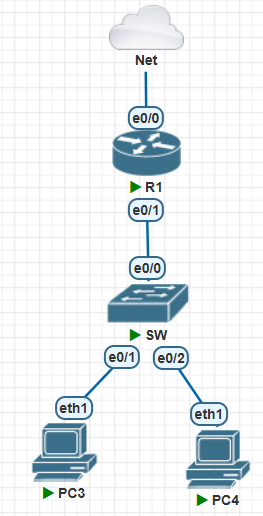
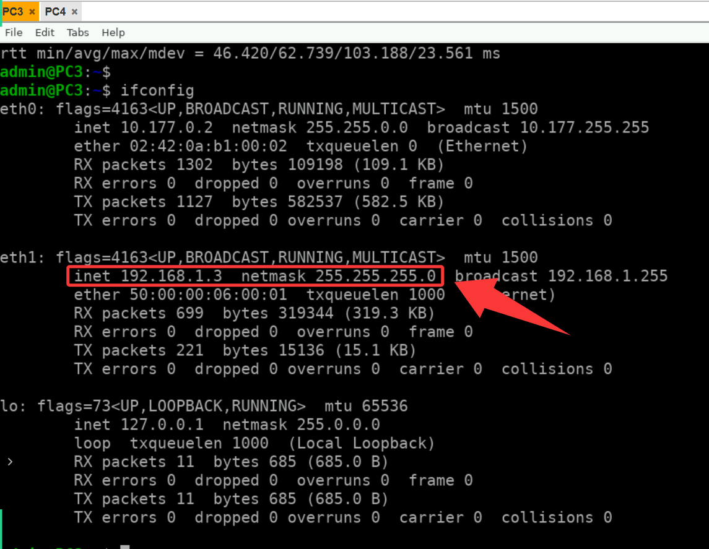
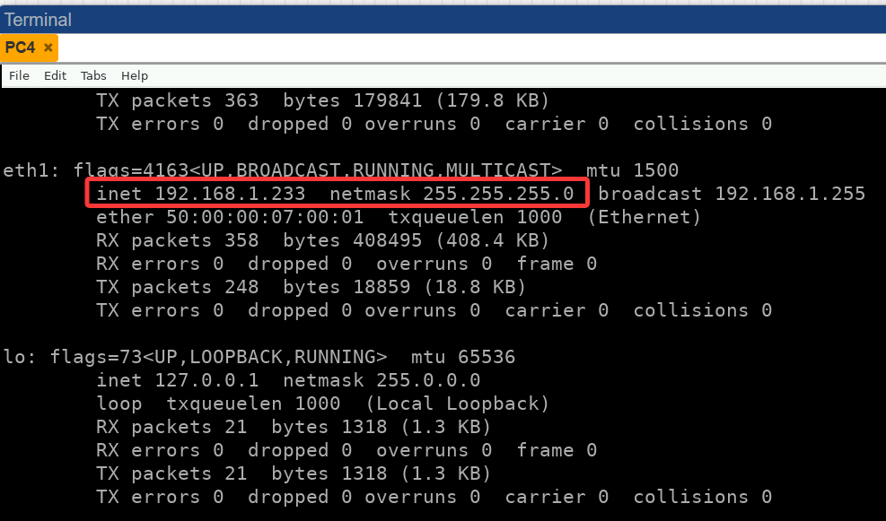

# DHCP (Dynamic Host configuration Protocol,动态主机配置协议 )

- 工作在局域网中，使用UDP协议工作

两个用途：

- 为内部网络自动分配IP地址相关信息
- 作为管理内部主机的一种技术手段



- R1作为网关设备，由于模拟器的特点，NAT已经自动实现，不需要额外配置
- R1的e0/1配置`192.168.1.1/24`，并且向此网络开启DHCP

```c
no cdp run            # 关闭思科发现协议，此协议会自动发现接口半双工状态，并且不停的提示


interface Ethernet0/1
 ip address 192.168.1.1 255.255.255.0
 duplex full            # 开启接口全双工，保持与交换机一致
 no shutdown

ip dhcp pool inmind            # 配置一个dhcp地址池
 network 192.168.1.0 /24        # 在地址池中放入一些IP，如果此设备上存在此IP范围的地址，就会自动在那个接口上开启DHCP
 default-router 192.168.1.1     # 网关是192.168.1.1
 dns-server 114.114.114.114 114.114.115.115        # 加上域名解析服务地址
 exit

ip dhcp excluded-address 192.168.1.1    # 排除地址，避免网关地址被分配出去
```

- 查看地址分配情况

```c
R1#show ip dhcp binding 
Bindings from all pools not associated with VRF:
IP address          Client-ID/                     Lease expiration        Type
                    Hardware address/
                    User name
192.168.1.2         5000.0007.0001          Jul 15 2025 02:05 AM    Automatic
192.168.1.3         5000.0006.0001          Jul 15 2025 02:06 AM    Automatic
```



- 如果PC没有得到IP地址，尝试重启PC

# DHCP静态地址绑定

- 如果内网存在一些设备的IP地址需要进行固定，比如网络打印机
- 可以通过MAC地址进行绑定

```C
R1#clear ip dhcp binding *   # 绑定之前建议清空旧的绑定
R1#sh ip dhcp binding        # 先查看对应的设备使用什么信息得到的IP，可能有MAC地址，Client-ID，或者Username


ip dhcp pool printer            # 单独为此设备创建一个地址池
 host 192.168.1.233 255.255.255.0
 hardware-address 5000.0007.0001    # 使用设备得到IP的信息，进行绑定
 ip address dhcp
```

- 重启设备的网卡

