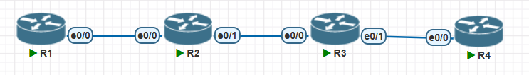
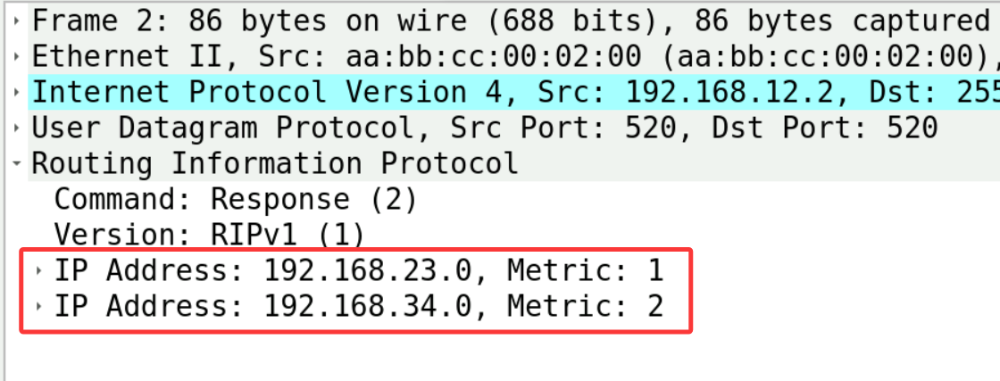
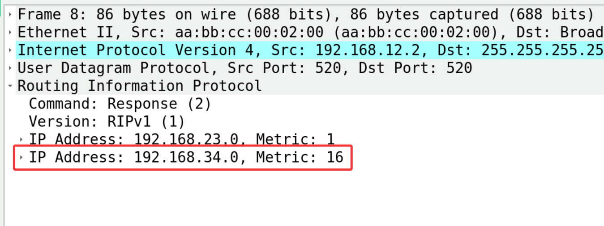
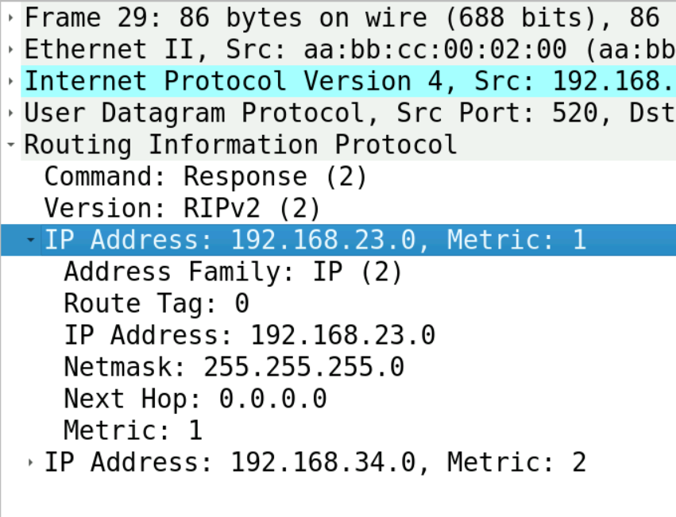
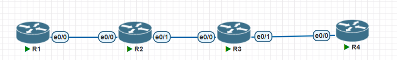
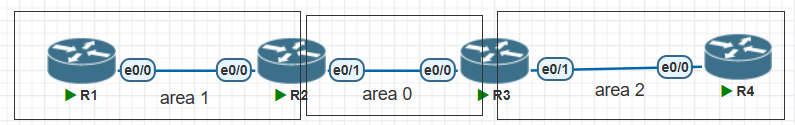
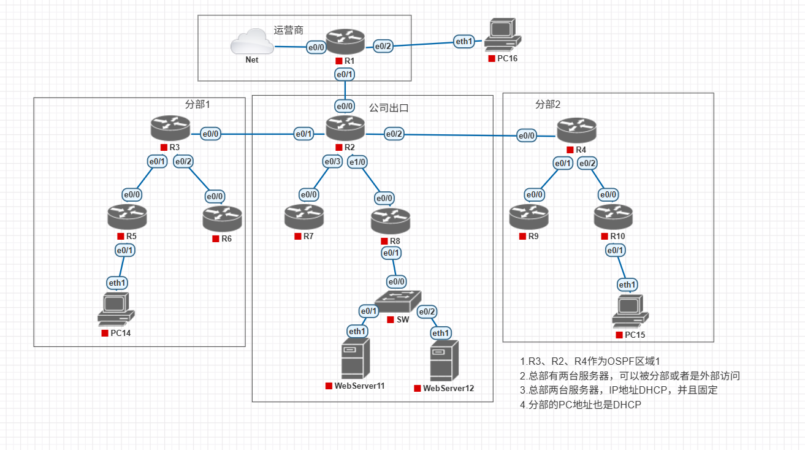

# 动态路由协议

- 让路由器可以自动学习到网络中的路由条目
- RIP
  - 距离矢量路由协议
- OSPF
  - 链路状态路由协议

# RIP



- 配置

```SQL
=========R1============
no

en
conf t
ho R1
no ip do lo
int e0/0
ip add 192.168.12.1 255.255.255.0
no sh
router rip
network 192.168.12.0


=========R2============
no

en
conf t
ho R2
no ip do lo
int e0/0
ip add 192.168.12.2 255.255.255.0
no sh
int e0/1
ip add 192.168.23.2 255.255.255.0
no sh
router rip
network 192.168.12.0
network 192.168.23.0


=========R3============
no

en
conf t
ho R3
no ip do lo
int e0/0
ip add 192.168.23.3 255.255.255.0
no sh
int e0/1
ip add 192.168.34.3 255.255.255.0
no sh
router rip
network 192.168.34.0
network 192.168.23.0


=========R4============
no

en
conf t
ho R4
no ip do lo
int e0/0
ip add 192.168.34.4 255.255.255.0
no sh
router rip
network 192.168.34.0
```

- 检查

```SQL
R1#sh ip route
      192.168.12.0/24 is variably subnetted, 2 subnets, 2 masks
C        192.168.12.0/24 is directly connected, Ethernet0/0
L        192.168.12.1/32 is directly connected, Ethernet0/0
R     192.168.23.0/24 [120/1] via 192.168.12.2, 00:00:23, Ethernet0/0
R     192.168.34.0/24 [120/2] via 192.168.12.2, 00:00:23, Ethernet0/0
```

- 抓包，每隔30秒，就收到一次RIP信息、路由表中关于此条路由的计时就会归0
- RIP会将自己路由表中所有学习到的RIP条目，发送给被network匹配上的网络
- RIP为了能知道目的局域网离自己有多远，路由条目每经过一个路由器转发，Metric就会+1，初始是0
- Metric叫做度量值，用于衡量同一条路由不同路径学到的好坏，如果Metric是一样的，就会负载均衡
- 在RIP中，为了防止路由环路，规定当Metric到达16跳的时候，就认为不可达，立即把这个条目删除



- 当RIP路由器的某一个路由消失了，为了防止下游路由器依旧认为这个条目存在，会立即发出此路由的更新，但是Metric是16跳，意思是立即删除此条路由



- 模拟路由器故障

- 在R2上，配置访问控制列表，阻止接收RIP的消息
  - 可以看到没有再收到更新消息的路由计时就不会清零
  - 180秒左右，路由状态变为`is possibly down`
  - 240秒左右，路由就会从路由表中消失

```C
access-list 100 deny udp any eq rip any eq rip
access-list 100 permit ip any any
int e0/1
ip access-group 100 in        # R2无法从e0/1再收到RIP的更新消息


R2#sh ip route
...
R     192.168.34.0/24 [120/1] via 192.168.23.3, 00:03:02, Ethernet0/1    # 计时超过了30秒
```

## RIPv2

- RIPv2和v1并不兼容
- RIPv2发送路由信息的时候，会携带子网掩码



- 配置命令

```C
router rip
version 2
no auto-summary        # 关闭自动汇总，不然RIP会根据IP地址ABC类，将子网掩码自动合并为/8,/16,/24
```

# 环回接口

环回接口是网络一种重要的逻辑接口

## 定义

- 纯软件实现的逻辑接口，不依赖物理硬件
- 接口状态始终可以保持up，除非设备故障
- 可以创建很多个
- 通常配置为32位子网掩码

## 作用

- 用于测试，可以用来模拟网络中的设备
- 用于路由器的标识，很多协议(比如OSPF，BGP等等)会使用IP地址来表示某台设备，如果使用物理接口不稳定
- 用于设备的管理接口，为了稳定

```C
interface loopback 0       # 环回接口启用后就是up的状态
```

# OSPF

- 距离矢量路由协议，比如RIP，特点是更新是传递路由表，路由表在每台路由器上都可以被二次处理，路由信息就会越来越失真。
- 距离矢量协议所有条目都是道听途说来的，很容易因为篡改，导致丢失信息
- RIP的网络规模不能大，不然会产生环路等一系列问题，RIP的网络收敛速度非常慢。



```SQL
=========R1============
no

en
conf t
ho R1
no ip do lo
int lo0                                    # 环回接口，用于给OSPF提供稳定的Router-ID
ip add 1.1.1.1 255.255.255.255
int e0/0
ip add 192.168.12.1 255.255.255.0
no sh
router ospf 1                                # 启动ospf实例1
network 192.168.12.0 0.0.0.255 area 0        # 将192.168.12.0/24加入OSPF区域0中
network 1.1.1.1 0.0.0.0 area 0
end
show ip protocols                            # 查看路由协议的运行状态


=========R2============
no

en
conf t
ho R2
no ip do lo
int lo0
ip add 2.2.2.2 255.255.255.255
int e0/0
ip add 192.168.12.2 255.255.255.0
no sh
int e0/1
ip add 192.168.23.2 255.255.255.0
no sh
router ospf 1
network 2.2.2.2 0.0.0.0 area 0
network 192.168.12.0 0.0.0.255 area 0
network 192.168.23.0 0.0.0.255 area 0
end
show ip protocols


=========R3============
no

en
conf t
ho R3
no ip do lo
int lo0
ip add 3.3.3.3 255.255.255.255
int e0/0
ip add 192.168.23.3 255.255.255.0
no sh
int e0/1
ip add 192.168.34.3 255.255.255.0
no sh
router ospf 1
network 3.3.3.3 0.0.0.0 area 0
network 192.168.23.0 0.0.0.255 area 0
network 192.168.34.0 0.0.0.255 area 0
end
show ip protocols


=========R4============
no

en
conf t
ho R4
no ip do lo
int lo0
ip add 4.4.4.4 255.255.255.255
int e0/0
ip add 192.168.34.4 255.255.255.0
no sh
router ospf 1
network 4.4.4.4 0.0.0.0 area 0
network 192.168.34.0 0.0.0.255 area 0
end
show ip protocols
```

- 检查

```SQL
R1#sh ip route
......
      1.0.0.0/32 is subnetted, 1 subnets
C        1.1.1.1 is directly connected, Loopback0
      2.0.0.0/32 is subnetted, 1 subnets
O        2.2.2.2 [110/11] via 192.168.12.2, 00:04:15, Ethernet0/0
      3.0.0.0/32 is subnetted, 1 subnets
O        3.3.3.3 [110/21] via 192.168.12.2, 00:03:21, Ethernet0/0
      4.0.0.0/32 is subnetted, 1 subnets
O        4.4.4.4 [110/31] via 192.168.12.2, 00:02:40, Ethernet0/0
      192.168.12.0/24 is variably subnetted, 2 subnets, 2 masks
C        192.168.12.0/24 is directly connected, Ethernet0/0
L        192.168.12.1/32 is directly connected, Ethernet0/0
O     192.168.23.0/24 [110/20] via 192.168.12.2, 00:04:15, Ethernet0/0
O     192.168.34.0/24 [110/30] via 192.168.12.2, 00:03:21, Ethernet0/0
```

## 链路状态路由原理

- 每台路由器都会发布链路状态信息
  - 链路状态信息包含每个接口的IP地址以及带宽的度量值
- 链路状态信息最终会扩散到整个区域
- 根据链路状态信息，每台路由器都可以计算得到整个区域的拓扑图
- 使用SPF算法，可以计算出到达每个节点的最短路径

```C
R4#sh ip ospf database             # 查看路由器记录的链路状态数据库

            OSPF Router with ID (4.4.4.4) (Process ID 1)

                Router Link States (Area 0)

Link ID         ADV Router      Age         Seq#       Checksum Link count
1.1.1.1         1.1.1.1         451         0x80000003 0x005BC1 2
2.2.2.2         2.2.2.2         349         0x80000009 0x00A744 3
3.3.3.3         3.3.3.3         289         0x80000007 0x00D8D9 3
4.4.4.4         4.4.4.4         215         0x80000005 0x003591 2

R4#sh ip ospf database router 2.2.2.2        # 查看某个路由器具体的链路状态

            OSPF Router with ID (4.4.4.4) (Process ID 1)

                Router Link States (Area 0)

  LS age: 385
  Options: (No TOS-capability, DC)
  LS Type: Router Links
  Link State ID: 2.2.2.2                # 链路状态的ID
  Advertising Router: 2.2.2.2            # 通告的路由器ID
  LS Seq Number: 80000009
  Checksum: 0xA744
  Length: 60
  Number of Links: 3                # 通告有3条链路状态

    Link connected to: a Stub Network
     (Link ID) Network/subnet number: 2.2.2.2
     (Link Data) Network Mask: 255.255.255.255
      Number of MTID metrics: 0
       TOS 0 Metrics: 1            # 带宽度量值，速率越小，数值越大

    Link connected to: a Transit Network
     (Link ID) Designated Router address: 192.168.23.2
     (Link Data) Router Interface address: 192.168.23.2
      Number of MTID metrics: 0
       TOS 0 Metrics: 10

    Link connected to: a Transit Network
     (Link ID) Designated Router address: 192.168.12.2
     (Link Data) Router Interface address: 192.168.12.2
      Number of MTID metrics: 0
       TOS 0 Metrics: 10
```

- 更加推荐的配置方法

```c
R1(config)#no router ospf 1
R1(config)#int lo0
R1(config-if)#ip ospf 1 area 0    # 将此接口加入ospf
R1(config-if)#int e0/0
R1(config-if)#ip ospf 1 area 0
R1(config-if)#end


R2(config)#int range lo0, e0/0 - 1        # 同时配置三个接口
R2(config-if-range)#ip ospf 1 area 0
R2(config-if-range)#end
```


## OSPF多区域

- 由于SPF算法会消耗一定的资源，如果OSPF网络过于庞大，会导致OSPF运行性能不佳。
- 解决SPF算法的最好方案是规划好区域
- OSPF规定区域0是骨干区域，其他非0区域必须要和骨干区域直接相连



```C
=====R1=======
no router ospf 1
int range lo0, e0/0
ip ospf 1 area 1

======R2========
no router ospf 1
int range lo0, e0/1
ip ospf 1 area 0
int e0/0
ip ospf 1 area 1

=======R3======
no router ospf 1
int range lo0 , e0/0
ip ospf 1 area 0
int e0/1
ip ospf 1 area 2

========R4=======
no router ospf 1
int range e0/0 , lo0
ip ospf 1 area 2
```

- 检查

```SQL
R1#sh ip route
.......
      1.0.0.0/32 is subnetted, 1 subnets
C        1.1.1.1 is directly connected, Loopback0
      2.0.0.0/32 is subnetted, 1 subnets
O IA     2.2.2.2 [110/11] via 192.168.12.2, 00:01:34, Ethernet0/0
      3.0.0.0/32 is subnetted, 1 subnets
O IA     3.3.3.3 [110/21] via 192.168.12.2, 00:01:15, Ethernet0/0
      4.0.0.0/32 is subnetted, 1 subnets
O IA     4.4.4.4 [110/31] via 192.168.12.2, 00:00:12, Ethernet0/0
      192.168.12.0/24 is variably subnetted, 2 subnets, 2 masks
C        192.168.12.0/24 is directly connected, Ethernet0/0
L        192.168.12.1/32 is directly connected, Ethernet0/0
O IA  192.168.23.0/24 [110/20] via 192.168.12.2, 00:01:15, Ethernet0/0
O IA  192.168.34.0/24 [110/30] via 192.168.12.2, 00:01:05, Ethernet0/0
```

- 查看ospf的链路状态数据库

```C
R1#sh ip ospf database 

            OSPF Router with ID (1.1.1.1) (Process ID 1)

                Router Link States (Area 1)            # 每台路由器都会产生描述链路状态，仅限本区域

Link ID         ADV Router      Age         Seq#       Checksum Link count
1.1.1.1         1.1.1.1         296         0x80000002 0x0047D7 2
2.2.2.2         2.2.2.2         289         0x80000002 0x00E049 1

                Net Link States (Area 1)            # 每个局域网都会有一个，仅限本区域

Link ID         ADV Router      Age         Seq#       Checksum
192.168.12.1    1.1.1.1         296         0x80000001 0x00C7EB

                Summary Net Link States (Area 1)    # 由区域边界路由器，汇总其他区域的路由条目

Link ID         ADV Router      Age         Seq#       Checksum
2.2.2.2         2.2.2.2         297         0x80000001 0x00FA31
3.3.3.3         2.2.2.2         272         0x80000003 0x002DEE
4.4.4.4         2.2.2.2         210         0x80000001 0x0067A8
192.168.23.0    2.2.2.2         272         0x80000003 0x00FDAA
192.168.34.0    2.2.2.2         262         0x80000001 0x00ECA8
```

- 非骨干区域是否可以使用一个区域号
  - 非骨干区域的区域号重复，不影响

```C
=========R3=========
int e0/1
ip ospf 1 area 1

====R4======
int range lo0 , e0/0
ip ospf 1 area 1

====检查R1路由条目======
R1#sh ip route 
...............
      1.0.0.0/32 is subnetted, 1 subnets
C        1.1.1.1 is directly connected, Loopback0
      2.0.0.0/32 is subnetted, 1 subnets
O IA     2.2.2.2 [110/11] via 192.168.12.2, 00:09:50, Ethernet0/0
      3.0.0.0/32 is subnetted, 1 subnets
O IA     3.3.3.3 [110/21] via 192.168.12.2, 00:09:31, Ethernet0/0
      4.0.0.0/32 is subnetted, 1 subnets
O IA     4.4.4.4 [110/31] via 192.168.12.2, 00:00:02, Ethernet0/0
      192.168.12.0/24 is variably subnetted, 2 subnets, 2 masks
C        192.168.12.0/24 is directly connected, Ethernet0/0
L        192.168.12.1/32 is directly connected, Ethernet0/0
O IA  192.168.23.0/24 [110/20] via 192.168.12.2, 00:09:31, Ethernet0/0
O IA  192.168.34.0/24 [110/30] via 192.168.12.2, 00:00:47, Ethernet0/0
```

- 非骨干区域，如果不与骨干区域相连的后果
  - 只有区域边界路由器可以汇总其他区域的路由进行通告
  - 区域边界路由器，至少有一个接口属于骨干区域，才可以汇总路由

```C
==========R1==========
int range e0/0 , lo0
ip ospf 1 area 0

=======R2========
int range lo0, e0/0
ip ospf 1 area 0
int e0/1
ip ospf 1 area 1

=======R3========
int range lo0, e0/0
ip ospf 1 area 1
int e0/1
ip ospf 1 area 2

======R4=======
int range lo0, e0/0
ip ospf 1 area 2
```

# 综合实验



- 配置

```C
=============R1=============
en
conf t
ho R1
no ip do lo
int e0/2
ip add 192.168.116.1 255.255.255.0
no sh
int e0/1
ip add 192.168.12.1 255.255.255.0
no sh

ip dhcp pool PC16
network 192.168.116.0 /24
default-router 192.168.116.1
dns-server 223.5.5.5 223.6.6.6

ip dhcp pool PC2
network 192.168.12.0 /24
default-router 192.168.12.1
dns-server 223.5.5.5 223.6.6.6
end

show ip int br

=============R2=============
en
conf t
no ip do lo
ho R2
int e0/0
ip add dhcp
ip nat outside
no sh

int lo0
ip add 2.2.2.2 255.255.255.255
ip ospf 1 area 0

int e0/1
ip add 192.168.23.2 255.255.255.0
ip ospf 1 area 0
ip nat inside
no sh

int e0/2
ip add 192.168.24.2 255.255.255.0
ip ospf 1 area 0
ip nat inside
no sh

int e0/3
ip add 192.168.27.2 255.255.255.0
ip ospf 1 area 0
ip nat inside
no sh

int e1/0
ip add 192.168.28.2 255.255.255.0
ip ospf 1 area 0
ip nat inside
no sh

access-list 1 permit 192.168.5.0 /24
access-list 1 permit 192.168.8.0 /24
access-list 1 permit 192.168.10.0 /24

ip nat inside source list 1 int e0/0 overload

ip dhcp pool PC15
network 192.168.10.0 /24
default-router 192.168.10.1
dns-server 223.5.5.5 223.6.6.6

router ospf 1
default-information originate always

access-list 2 permit 192.168.12.5 /32
ip nat pool WebServer 192.168.8.11 192.168.8.12 netmask 255.255.255.0 type rotary
ip nat inside destination list 2 pool WebServer

end
sh ip int br


=============R3=============
no

en
conf t
ho R3
no ip do lo
int lo0
ip add 3.3.3.3 255.255.255.255
ip ospf 1 area 0
no sh

int e0/0
ip add 192.168.23.3 255.255.255.0
ip ospf 1 area 0
no sh

int e0/1
ip add 192.168.35.3 255.255.255.0
ip ospf 1 area 1
no sh

int e0/2
ip add 192.168.36.3 255.255.255.0
ip ospf 1 area 1
no sh

end
sh ip int br
=============R4=============
no

en
conf t
ho R4
no ip do lo
int lo0
ip add 4.4.4.4 255.255.255.255
ip ospf 1 area 0
no sh

int e0/0
ip add 192.168.24.4 255.255.255.0
ip ospf 1 area 0
no sh

int e0/1
ip add 192.168.49.4 255.255.255.0
ip ospf 1 area 2
no sh

int e0/2
ip add 192.168.104.4 255.255.255.0
ip ospf 1 area 2
no sh

end
sh ip int br
=============R5=============
en
conf t
no ip do lo
ho R5
int lo0
ip add 5.5.5.5 255.255.255.255
ip ospf 1 area 1

int e0/0
ip add 192.168.35.5 255.255.255.0
no sh
ip ospf 1 area 1

int e0/1
ip add 192.168.5.1 255.255.255.0
ip ospf 1 area 1
no sh

ip dhcp pool PC14
network 192.168.5.0 /24
default-router 192.168.5.1
dns-server 223.5.5.5 223.6.6.6

end

sh ip int br
=============R6=============
no

en
conf t
ho R6
no ip do lo
int lo0
ip add 6.6.6.6 255.255.255.255
ip ospf 1 area 1
int e0/0
ip add 192.168.36.6 255.255.255.0
no sh
ip ospf 1 area 1
end

sh ip int br
=============R7=============
no

en
conf t
ho R7
no ip do lo
int lo0
ip add 7.7.7.7 255.255.255.255
ip ospf 1 area 0
int e0/0
ip add 192.168.27.7 255.255.255.0
no sh
ip ospf 1 area 0
end
=============R8=============
no

en
conf t
no ip do lo
ho R8
int lo0
ip add 8.8.8.8 255.255.255.255
ip ospf 1 area 0

int e0/0
ip add 192.168.28.8 255.255.255.0
no sh
ip ospf 1 area 0

int e0/1
ip add 192.168.8.1 255.255.255.0
ip ospf 1 area 0
no sh

ip dhcp pool webserver
network 192.168.8.0 /24
default-router 192.168.8.1
dns-server 223.5.5.5 223.6.6.6

ip dhcp pool WebServer11
 host 192.168.8.11 255.255.255.0
 hardware-address 5000.000e.0001
ip dhcp pool WebServer12
 host 192.168.8.12 255.255.255.0
 hardware-address 5000.000f.0001

end

sh ip int br

=============R9=============
no

en
conf t
ho R9
no ip do lo
int lo0
ip add 9.9.9.9 255.255.255.255
ip ospf 1 area 2
int e0/0
ip add 192.168.49.9 255.255.255.0
no sh
ip ospf 1 area 2
end

sh ip int br
=============R10=============
en
conf t
no ip do lo
ho R10
int lo0
ip add 10.10.10.10 255.255.255.255
ip ospf 1 area 2

int e0/0
ip add 192.168.104.10 255.255.255.0
no sh
ip ospf 1 area 2

int e0/1
ip add 192.168.10.1 255.255.255.0
ip ospf 1 area 2
no sh
ip helper-address 2.2.2.2

end

sh ip int br
```