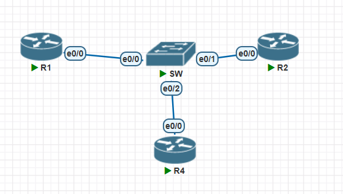
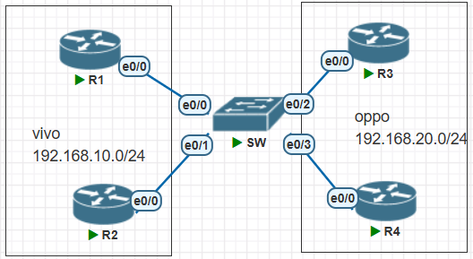
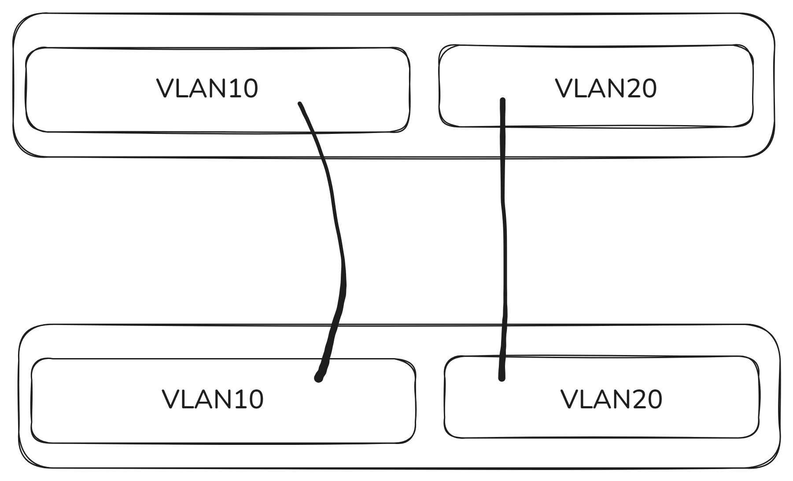
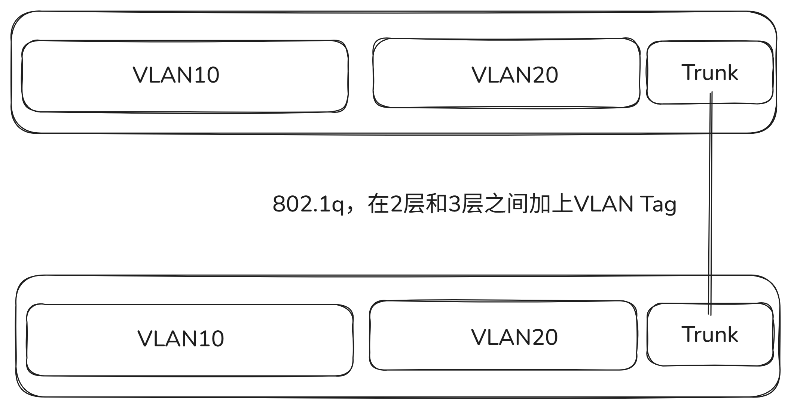
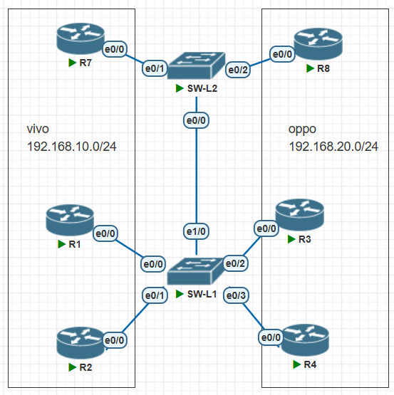
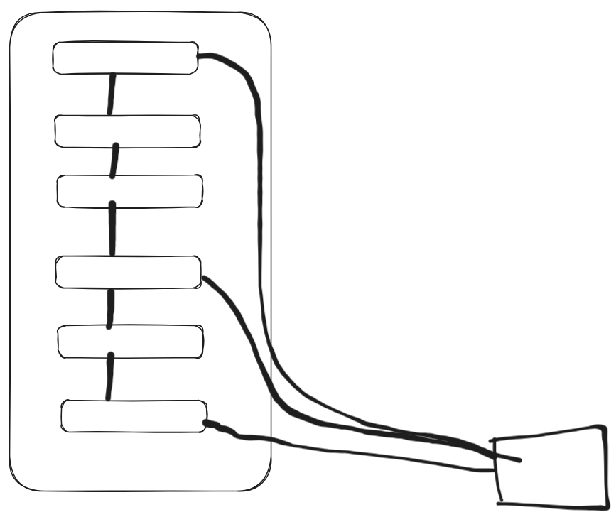
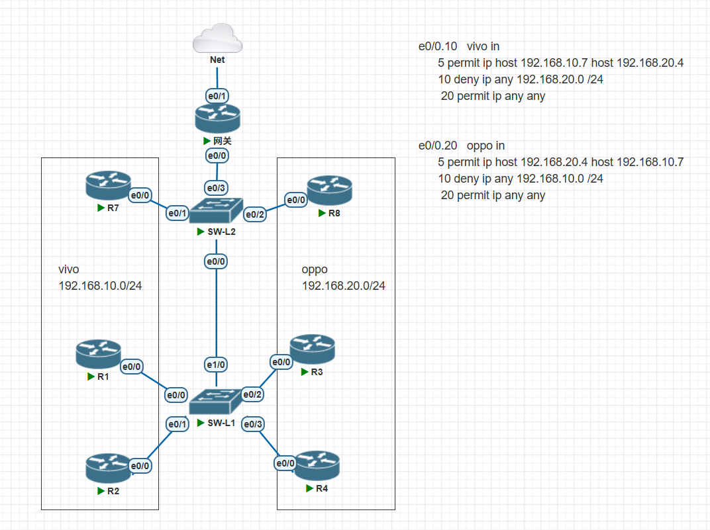
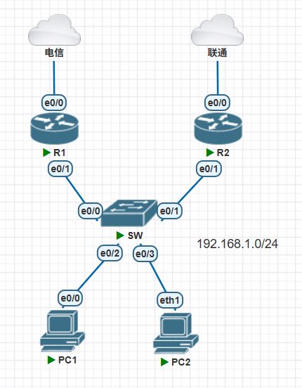

# 交换机工作原理

## 广播域

- 广播有效的传播范围，就是广播域，路由器默认情况下是不会帮助局域网转发广播
- 交换机收到广播，会将广播数据进行复制，并且从收到的接口以外的所有接口发出*

## MAC地址表

- 网络设备的接口都有一个硬件地址，就是MAC地址，在通信的时候会在数据链路层进行封装
- 交换机会将接口收到的数据包的源MAC地址和接口信息记录到MAC地址表中
  - `show mac address-table`
  - `clear mac address-table dynamic`
- 交换机收到数据包后，就会查看目的MAC地址是什么，在MAC地址表中是否存在，如果存在，就准确的转发，如果不存在，就每个接口来一份



- 交换机默认不配置
- R1、R2、R4都正常配置IP地址
- 交换机会自动学习到每个路由器的MAC地址

```C
Switch#show mac address-table 
          Mac Address Table
-------------------------------------------

Vlan    Mac Address       Type        Ports
----    -----------       --------    -----
   1    aabb.cc00.0100    DYNAMIC     Et0/0
   1    aabb.cc00.0200    DYNAMIC     Et0/1
   1    aabb.cc00.0400    DYNAMIC     Et0/2
Total Mac Addresses for this criterion: 3
```

- 如果ping广播地址，会得到局域网内所有设备的回应

```C
R1#ping 192.168.12.255
Type escape sequence to abort.
Sending 5, 100-byte ICMP Echos to 192.168.12.255, timeout is 2 seconds:

Reply to request 0 from 192.168.12.4, 2 ms
Reply to request 0 from 192.168.12.2, 2 ms
Reply to request 1 from 192.168.12.4, 3 ms
Reply to request 1 from 192.168.12.2, 27 ms
Reply to request 2 from 192.168.12.4, 3 ms
Reply to request 2 from 192.168.12.2, 3 ms
Reply to request 3 from 192.168.12.4, 5 ms
Reply to request 3 from 192.168.12.2, 5 ms
Reply to request 4 from 192.168.12.2, 3 ms
Reply to request 4 from 192.168.12.4, 3 ms
```

- 交换机的mac地址表是有上限的，一般为4096，可以具体查看

```C
Switch#show mac address-table count 

Mac Entries for Vlan 1:
---------------------------
Dynamic Address Count  : 5
Static  Address Count  : 0
Total Mac Addresses    : 5

Total Mac Address Space Available: 4096
```

- 如果遭到黑客攻击，将MAC地址表填满，无法再多学习MAC，那么，那么再次受到数据的时候，由于目的MAC地址无法被查找，黑客就可以抓包，窃取到数据
- 使用kali Linux，可以在命令行输入`macof`短时间内产生大量垃圾数据，每个数据都是随机MAC地址，快速填满MAC地址表

# VLAN

- LAN本地区域网络，一般是一个广播域
- 不同的LAN往往是隔离的，如果有通信需要，就必须经过一台三层的设备，比如防火墙、路由器、网关设备
- 在企业中，存在不同部门，或者不同的业务需求，需要多个不同的LAN
- VLAN虚拟本地区域网络，使用逻辑的方式将网络给隔离开
  - 默认情况下，所有的接口都属于VLAN1，所以可以直接通信
  - 每个VLAN都会维护一个独立的MAC地址表



- R1和R2属于一个部门，R3和R4属于一个部门，需要划分VLAN进行隔离
- 在交换机上配置

```C
en
conf t
vlan 10
name vivo
vlan 20
name oppo
int range e0/0 - 1
switchport access vlan 10
int range e0/2 - 3
sw ac vl 20
end

sh mac address-table vlan 10
```

- 隔离开了以后，就算R1234都是一个网段的IP地址，12和34也无法直接通信
- 测试

```C
R4
int e0/0
ip add 192.168.10.4 255.255.255.0
end
ping 192.168.10.1   # 在没有VLAN隔离的情况下，流量是通的，VLAN隔离之后就不能通了
```

# Trunk

- 在交换机一层 连接一层的情况下，也叫做级联，多个交换机想要打通 相同的VLAN，可能需要多根线



- 但是这样做，在VLAN数量上去后，就无法实现了，就算VLAN数量不多，也浪费接口
- Trunk不属于任何VLAN，当流量经过Trunk链路的时候会被加上标签用于识别不同VLAN的流量





```C
===========SW-L2==========
ho SW-L2
vlan 10
name vivo
vlan 20
name oppo

int e0/1
sw ac vl 10

int e0/2
sw ac vl 20

int e0/0
switchport trunk encapsulation dot1q        # 设置trunk的封装模式，大家都用802.1q
switchport mode trunk                        # 设置trunk接口

=========SW-L1==========
int e1/0
switchport trunk encapsulation dot1q
switchport mode trunk
```

- 检验配置

```C
SW-L2#show interfaces trunk 

Port        Mode             Encapsulation  Status        Native vlan
Et0/0       on               802.1q         trunking      1

Port        Vlans allowed on trunk
Et0/0       1-4094

Port        Vlans allowed and active in management domain
Et0/0       1,10,20

Port        Vlans in spanning tree forwarding state and not pruned
Et0/0       1,10,20
```

# 本帧VLAN（Native vlan）

- 在Trunk上约定好不打标签的流量VLAN是多少
  - 两边必须一直，如果配置不一样，就会造成网络不通，或者流量串错局域网

```C
SW-L2(config)#int e1/0
SW-L2(config-if)#switchport trunk native vlan 10
```

- 交换机会检测Native vlan号是否一样，如果不一样，就会报错，并且阻塞接口

# 交换机级联

交换机一台串一台，全部使用Trunk连接叫做级联，需要考虑网络瓶颈问题



# VLAN之间的通信

- 根据企业的业务需要，VLAN之间的通信是必须的
- VLAN之间的通信往往是在策略控制下进行的
- 路由器支持划分子接口，并且可以把子接口接入到不同的VLAN



- 某公司有两部门，VLAN10和VLAN20已经划分好
- 两个部门都需要通过网关进行上网
  - 网关需要和交换机之间启用Trunk
  - 网关路由器启用两个子接口，e0/0.10接入vlan10，e0/0.20接入vlan20
- 两个部门之前网络不能通，通过ACL策略实现
- R7和R4有项目需要协作，需要能够互通

```C
======网关=========
interface Ethernet0/0
 no shutdown
interface Ethernet0/0.10
 encapsulation dot1Q 10
 ip address 192.168.10.254 255.255.255.0
 ip access-group vivo in            # 加上策略

interface Ethernet0/0.20
 encapsulation dot1Q 20
 ip address 192.168.20.254 255.255.255.0
 ip access-group oppo in

ip access-list extended oppo
 permit ip host 192.168.20.4 host 192.168.10.7        # 允许R4访问R7
 deny   ip any 192.168.10.0 0.0.0.255                # 拒绝对VLAN10访问
 permit ip any any
ip access-list extended vivo
 permit ip host 192.168.10.7 host 192.168.20.4        # 允许R7访问R
 deny   ip any 192.168.20.0 0.0.0.255                # 拒绝VLAN20访问
 permit ip any any
 
======SW-L1=======
en
conf t
vlan 10
name vivo
vlan 20
name oppo
int range e0/0 - 1
switchport access vlan 10
int range e0/2 - 3
sw ac vl 20
int e1/0
switchport trunk encapsulation dot1q
switchport mode trunk
 
======SW-L2=========
ho SW-L2
vlan 10
name vivo
vlan 20
name oppo

int e0/1
sw ac vl 10

int e0/2
sw ac vl 20

int e0/0
switchport trunk encapsulation dot1q        # 设置trunk的封装模式，大家都用802.1q
switchport mode trunk                        # 设置trunk接口

int e0/3
switchport trunk encapsulation dot1q        # 设置trunk的封装模式，大家都用802.1q
switchport mode trunk                        # 设置trunk接口

====每台装作用户的路由器配置========
no

en
conf t
ho Rxxxx                    # 每台路由器的设备名
no ip do lo
int e0/0
ip add 192.168.x0.x 255.255.255.0        # 每台路由器IP地址
no sh
ip route 0.0.0.0 0.0.0.0 192.168.x0.254        # 各自VLAN的网关
```

- 检验

```C
R7#ping 223.5.5.5            # 到公网是可以联通的
Type escape sequence to abort.
Sending 5, 100-byte ICMP Echos to 223.5.5.5, timeout is 2 seconds:
!!!!!
Success rate is 100 percent (5/5), round-trip min/avg/max = 15/19/24 ms
R7#ping 192.168.20.4            # 到R4是可以访问的
Type escape sequence to abort.
Sending 5, 100-byte ICMP Echos to 192.168.20.4, timeout is 2 seconds:
!!!!!
Success rate is 100 percent (5/5), round-trip min/avg/max = 4/6/9 ms
R7#ping 192.168.20.3            # 到其他的vlan20地址是不可以的
Type escape sequence to abort.
Sending 5, 100-byte ICMP Echos to 192.168.20.3, timeout is 2 seconds:
U.U.U
Success rate is 0 percent (0/5)
```

# VRRP

- 在一个局域网中只能由一个网关地址作为网络的出口，一旦网关出现了故障，就无法访问外网
- 使用VRRP可以虚拟出一个网关IP地址，这个地址可以由多台设备通过协议决定谁来充当临时网关



- R1和R2分别连接不同的运营商，对内网充当网关
- 使用VRRP来虚拟出网关IP地址`192.168.1.254`

```C
========R1===========
en
conf t
ho R1
int e0/1
ip add 192.168.1.1 255.255.255.0
vrrp 1 ip 192.168.1.254
no sh

=======R2=========
en
conf t
ho R2
int e0/1
ip add 192.168.1.2 255.255.255.0
vrrp 1 ip 192.168.1.254
no sh

=====PC1========
no

en
conf t
ho PC1
int e0/0
ip add 192.168.1.3 255.255.255.0
no sh
ip route 0.0.0.0 0.0.0.0 192.168.1.254
```

- 查看vrrp的信息
  - 优先级Pri默认是100，优先级最大的作为Master
  - 如果优先级一样，那么IP地址数值大的作为Master
  - Pre表示是否开启抢占，开启抢占可能导致网络的不稳定
  - Group addr表示的是虚拟IP地址

```C
R1#show vrrp brief 
Interface          Grp Pri Time  Own Pre State   Master addr     Group addr
Et0/1              1   100 3609       Y  Backup  192.168.1.2     192.168.1.254

R2#show vrrp brief 
Interface          Grp Pri Time  Own Pre State   Master addr     Group addr
Et0/1              1   100 3609       Y  Master  192.168.1.2     192.168.1.254
```

- 查看vrrp的详情
  - 每1秒vrrp设备都会发送存活通告，当3秒都没有收到master的通告，就会重新选举Master

```C
R1#show vrrp
Ethernet0/1 - Group 1  
  State is Backup  
  Virtual IP address is 192.168.1.254
  Virtual MAC address is 0000.5e00.0101        # vrrp专属的mac地址，0000.5e00.01组号
  Advertisement interval is 1.000 sec            # 每隔1s就发送一次存活通告
  Preemption enabled                            # 抢占开启
  Priority is 100                                 # 优先级
  Master Router is 192.168.1.2, priority is 100         # Master的信息
  Master Advertisement interval is 1.000 sec
  Master Down interval is 3.609 sec (expires in 3.257 sec)        # Master的死亡时间3秒倒计时
```

- 修改优先级

```C
======R1=======
interface Ethernet0/1
 ip address 192.168.1.1 255.255.255.0
 vrrp 1 ip 192.168.1.254
 vrrp 1 priority 110        # 修改优先级

R1#sh vrrp brief 
Interface          Grp Pri Time  Own Pre State   Master addr     Group addr
Et0/1              1   110 3570       Y  Master  192.168.1.1     192.168.1.254
```

- 如果网关的上连断开了，由于存活通告是靠下连发送的，就会出现无法切换，导致断网
  - 可以使用track去监督某个接口的状态
  - 当接口down了，就会增加优先级的处罚值，让优先级降下来，从而不做Master

```C
========R2==========
track 1 interface Ethernet0/0 line-protocol        # 追踪e0/0的接口协议状态

interface Ethernet0/1
 vrrp 1 track 1 decrement 50                # 当track 1跟踪接口状态down，就把优先级降低50
```