- 这里是一个AI生成的前端代码，最重要的是`form表单`里面提交到的**后端地址**，这是前后端交互的"链条"

```html
<!DOCTYPE html>
<html lang="zh-CN">
<head>
    <meta charset="UTF-8">
    <meta name="viewport" content="width=device-width, initial-scale=1.0">
    <title>登录</title>
    <style>
        @import url('https://fonts.googleapis.com/css2?family=Noto+Serif+SC:wght@400;700&display=swap');

        * { margin: 0; padding: 0; box-sizing: border-box; }

        :root {
            --bg: #0f0f0f;
            --card: #1a1a1a;
            --fg: #e8e4df;
            --muted: #6b6560;
            --accent: #c8553d;
            --border: #2a2725;
        }

        body {
            font-family: 'Noto Serif SC', serif;
            min-height: 100vh;
            background: var(--bg);
            color: var(--fg);
            display: flex;
            overflow: hidden;
        }

        /* 左侧品牌区 */
        .brand {
            flex: 1;
            display: flex;
            flex-direction: column;
            justify-content: center;
            padding: 60px;
            position: relative;
        }

        .brand::after {
            content: '';
            position: absolute;
            right: 0;
            top: 15%;
            height: 70%;
            width: 1px;
            background: var(--border);
        }

        .brand .line {
            width: 48px;
            height: 2px;
            background: var(--accent);
            margin-bottom: 32px;
        }

        .brand h2 {
            font-size: 42px;
            font-weight: 700;
            line-height: 1.3;
            letter-spacing: 2px;
            margin-bottom: 20px;
        }

        .brand h2 span {
            color: var(--accent);
        }

        .brand p {
            color: var(--muted);
            font-size: 15px;
            line-height: 1.8;
            max-width: 360px;
        }

        .brand .hint {
            margin-top: 60px;
            color: #3d3935;
            font-size: 12px;
            letter-spacing: 4px;
            text-transform: uppercase;
        }

        /* 右侧登录区 */
        .login {
            width: 480px;
            display: flex;
            flex-direction: column;
            justify-content: center;
            padding: 60px;
            position: relative;
        }

        .login .greeting {
            font-size: 13px;
            color: var(--muted);
            letter-spacing: 6px;
            margin-bottom: 12px;
        }

        .login h1 {
            font-size: 30px;
            font-weight: 700;
            margin-bottom: 48px;
        }

        .field {
            margin-bottom: 28px;
            position: relative;
        }

        .field label {
            display: block;
            font-size: 12px;
            color: var(--muted);
            letter-spacing: 2px;
            margin-bottom: 10px;
        }

        .field input {
            width: 100%;
            padding: 12px 0;
            background: transparent;
            border: none;
            border-bottom: 1px solid var(--border);
            color: var(--fg);
            font-size: 16px;
            font-family: inherit;
            outline: none;
            transition: border-color 0.3s;
        }

        .field input:focus {
            border-bottom-color: var(--accent);
        }

        .field input::placeholder {
            color: #3d3935;
        }

        .actions {
            display: flex;
            justify-content: space-between;
            align-items: center;
            margin-bottom: 40px;
        }

        .actions label {
            display: flex;
            align-items: center;
            gap: 8px;
            font-size: 13px;
            color: var(--muted);
            cursor: pointer;
        }

        .actions label input {
            accent-color: var(--accent);
        }

        .actions a {
            font-size: 13px;
            color: var(--muted);
            text-decoration: none;
            transition: color 0.3s;
        }

        .actions a:hover {
            color: var(--accent);
        }

        .submit {
            width: 100%;
            padding: 14px;
            background: var(--accent);
            border: none;
            color: #fff;
            font-size: 15px;
            font-family: inherit;
            letter-spacing: 4px;
            cursor: pointer;
            transition: opacity 0.3s;
        }

        .submit:hover {
            opacity: 0.85;
        }

        .bottom {
            margin-top: 40px;
            font-size: 13px;
            color: var(--muted);
        }

        .bottom a {
            color: var(--fg);
            text-decoration: none;
        }

        .bottom a:hover {
            color: var(--accent);
        }

        /* 装饰性角标 */
        .corner {
            position: fixed;
            font-size: 11px;
            color: #2a2725;
            letter-spacing: 2px;
        }
        .corner.tl { top: 24px; left: 28px; }
        .corner.br { bottom: 24px; right: 28px; }

        /* 右侧微妙的噪点纹理 */
        .login::before {
            content: '';
            position: absolute;
            inset: 0;
            background: repeating-conic-gradient(#1a1a1a 0% 25%, transparent 0% 50%) 0 0 / 3px 3px;
            opacity: 0.15;
            pointer-events: none;
        }

        @media (max-width: 860px) {
            .brand { display: none; }
            .login { width: 100%; }
            .brand::after { display: none; }
        }
    </style>
</head>
<body>
    <span class="corner tl">v2.0</span>
    <span class="corner br">z.ai</span>

    <div class="brand">
        <div class="line"></div>
        <h2>以简驭繁，<br><span>恰到好处。</span></h2>
        <p>不堆砌，不迎合。<br>好的界面应该安静地待在那里，<br>等你需要的时候，一触即达。</p>
        <div class="hint">DESIGNED WITH INTENTION</div>
    </div>

    <div class="login">
        <div class="greeting">WELCOME BACK</div>
        <h1>登录你的账号</h1>

        <form action="">	# 这里的action应填入后端地址
            <div class="field">
                <label>账号</label>
                <input type="text" name="username" placeholder="邮箱或手机号" required>
            </div>

            <div class="field">
                <label>密码</label>
                <input type="password" name="password" placeholder="输入密码" required>
            </div>

            <button type="submit" class="submit">登 录</button>
        </form>

        <div class="bottom">
            还没有账号？ <a href="#">去注册</a>
        </div>
    </div>
</body>
</html>
```

- 前端页面如下，如果提交内容的话会提交到当前页面且地址栏会看到提交的内容，默认是`GET`提交方法

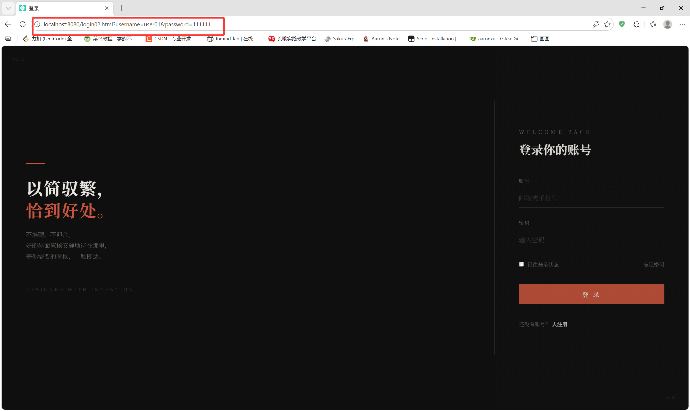

- 当然，需要注意的一点，以下的前后端交互是基于`apache+mysql+php`的服务形式进行的，需要环境才可以实现前后端交互

# 1. php后端接收前端信息

- 后端是用来处理前端提交过来的信息的，在浏览器中的网页源代码里面是看不见的

```php
<?php
$a = "hello world";
echo $a;
?>
```

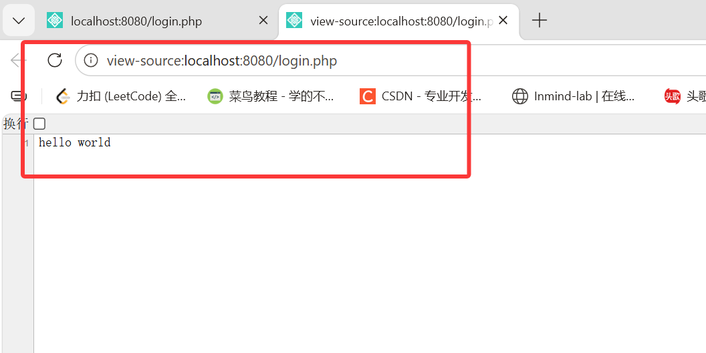

------------

## 1.1 $_REQUEST数组接收前端数据

- php中`$_REQUEST`是全局变量，用来接收用户输入
  - 当网页跳转到此页面的时候，会把用户输入的数据传输给`$_REQUEST`
  - `$_REQUEST`是一个数组，包含了用户输入的所有数据
  - php的数组都是key,value的形式，["name":"张三", "age":"18"]
  - 注意：打印字符串可以使用`echo`，但是打印数组必须使用`print_r`

```php
<?php
$res = $_REQUEST;
print_r($res);
?>
```

- 此时在前端页面提交的数据就可以在这个数组里面得到

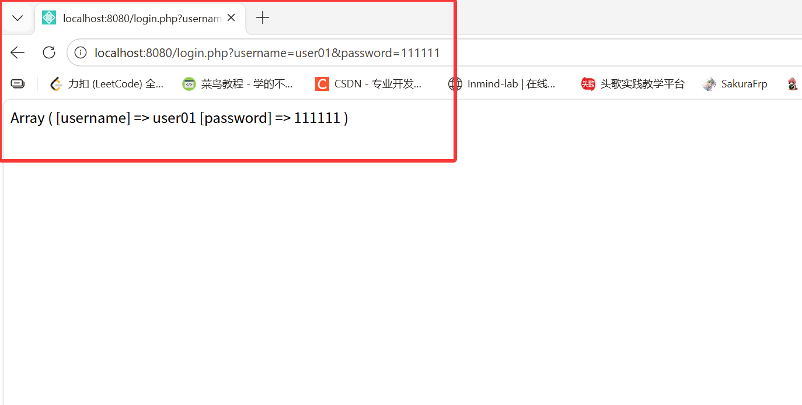

--------------

- 此时就可以基础这个数组使用最简单的if语句判断账号密码是否正确，当然上面使用的是`GET`提交的，地址栏就可以直接看到，很不方便，下面前端使用`POST`提交

- `GET`方式提交那些需要用书签存储下来的，**所有的信息都在网址中**；而`POST`方式用于提交用户密码这些不需要存储下来的，**所有的信息都在请求体中**

  - 后端php里面的`$_REQUEST` 默认包含 `$_GET` + `$_POST` + `$_COOKIE` 的数据。所以无论表单用 GET 还是 POST，`$_REQUEST` 都能拿到值。但**不推荐**用 `$_REQUEST`，因为：

    - 存在变量覆盖的安全风险（COOKIE 同名字段会覆盖 GET/POST）

    - 无法明确数据来源，不利于排查问题

  - 所以后端最好也使用`$_POST`数组来读取数据

```php
<?php
header("Content-Type: text/html; charset=utf-8");
$username = $_POST['username'];
$password = $_POST['password'];

if ($username == "user01" && $password == "11111") {
    echo "登录成功";
} else {
    echo "登录失败";
}
?>
```

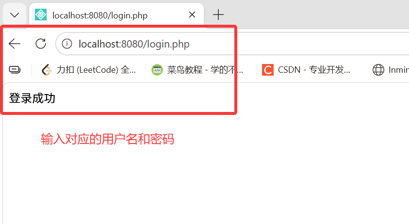

------

# 2. php连接mysql

- mysql设置，库名：`blog`，表名：`users`，后续可以有`articles`等表

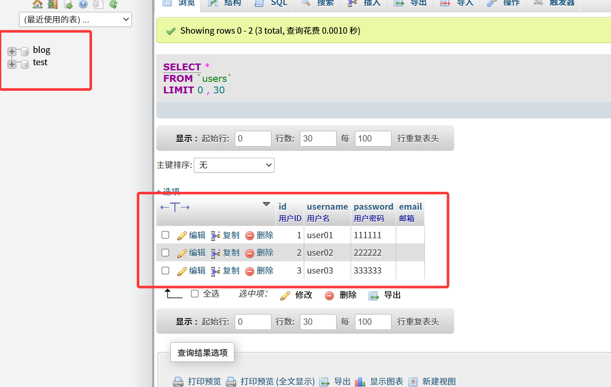

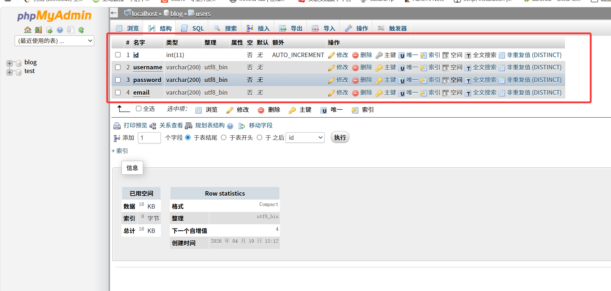

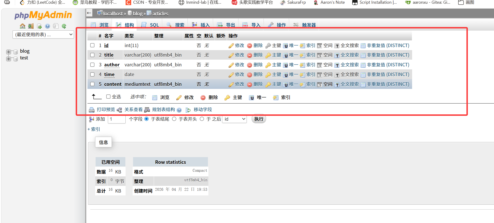

------------

## 2.1 进入mysql数据库

- php连接mysql

```bash
<?php
header("Content-Type: text/html; charset=utf-8");
$username = $_POST['username'];
$password = $_POST['password'];

// 连接mysql数据库
$host = "127.0.0.1";
$user = "root";
$userpassword = "usbw";
$database = "blog";
$port = "3307";
$conn = mysqli_connect($host, $user, $userpassword, $database, $port);
if (!$conn) {
    die("连接失败: " . mysqli_connect_error());
    exit;
}   
?>
```

- 如果密码是错的

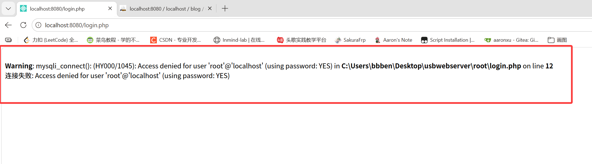

- 如果连接成功就什么都不显示

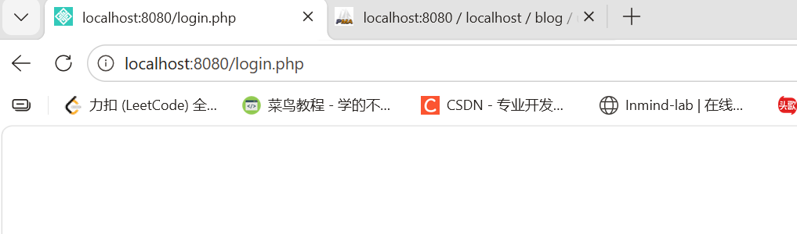

## 2.2 进入mysql数据库后查询是否有对应数据（登录逻辑）

- 查询数据库中的user表，并且将$username和$passwrod作为条件查询

```php
<?php
header("Content-Type: text/html; charset=utf-8");
$username = $_POST['username'];
$password = $_POST['password'];

// 连接mysql数据库
$host = "127.0.0.1";
$user = "root";
$userpassword = "usbw";
$database = "blog";
$port = "3307";
$conn = mysqli_connect($host, $user, $userpassword, $database, $port);
if (!$conn) {
    die("连接失败: " . mysqli_connect_error());
    exit;
}   

// 查询数据库中的user表，并且将$username和$passwrod作为条件查询
$sql = "select * from users where username='$username' and password='$password'";
$result = mysqli_query($conn, $sql);

if (!$result) {
    echo "查询失败: " . mysqli_error($conn);
    exit;
}

// 如果查询结果为空，提示用户名或密码错误
if (mysqli_num_rows($result) == 0) {
    echo "用户名或密码错误";
    exit;
} else {
    echo "登录成功";
}
?>
```

- 此时输入错误的用户名和密码

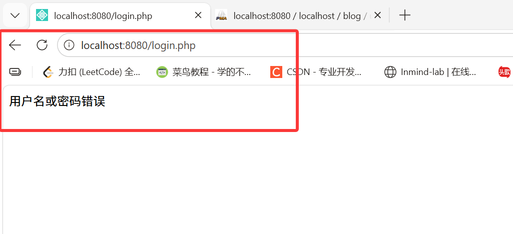

- 正确的用户名和密码的情况

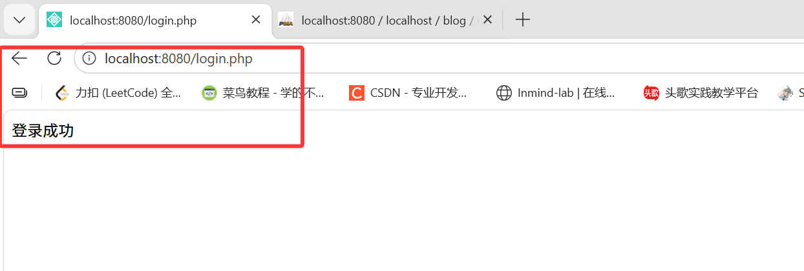

-------------

- 当然这个界面是可以进行sql注入的，账号这里输入`' or 1=1 #`可以直接登录成功

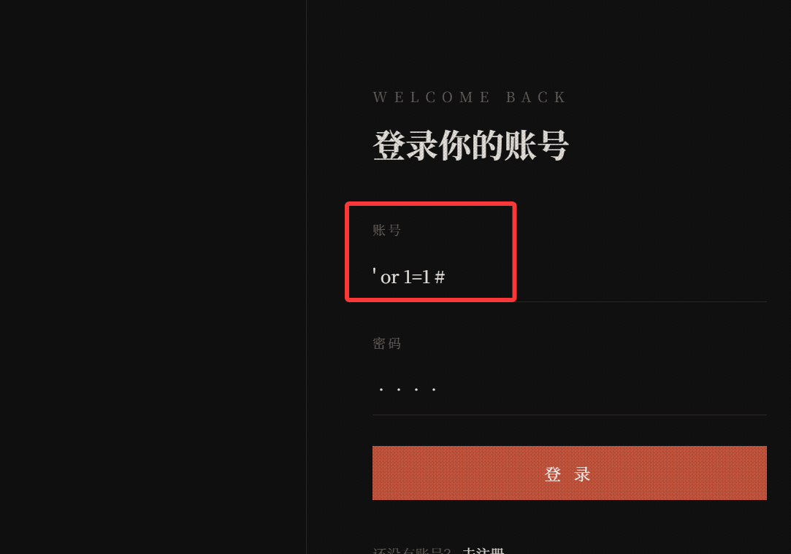

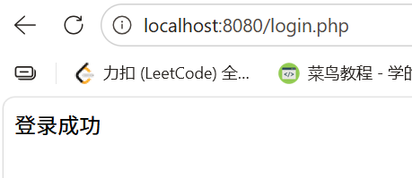

## 2.3 进入mysql数据库并插入一条新数据（注册逻辑）

- 此时再写一个`register.html`登录界面，修改`login.html`对应代码并且将注册的后端处理逻辑与登录放到一起，所以将上面的`login.php`改为`users.php`

-------------

- 此时在`users.php`中就需要明确区分登录的逻辑以及注册的逻辑
  - 不管是**登录逻辑**还是**注册逻辑**都需要**连接数据库**
  - 只有**登录逻辑**需要**从前端获取用户名和密码**
  - 用来**区分前端给后端的数据中是注册逻辑还是登录逻辑的关键点**在前端代码中**最后的登录或者注册`submit`按钮的的`name`**(注意：**前端提交的就是带有name标签的数据**)

-----------

- 注册逻辑：
  - 先从前端获取用户名，以及两次密码输入，邮箱
  - 插入新的用户记录之前先要检查两次密码是否相同以及用户名或邮箱是否已经存在
  - 然后写sql语句，插入一条新的用户记录。插入成功后，返回注册成功信息

```php
<?php
// 处理用户登录和注册相关的代码
// 设置页面编码为utf-8
header("Content-Type: text/html; charset=utf-8");

// 连接mysql数据库
$host = "127.0.0.1";
$user = "root";
$userpassword = "usbw";
$database = "blog";
$port = "3307";
$conn = mysqli_connect($host, $user, $userpassword, $database, $port);
if (!$conn) {
    die("连接失败: " . mysqli_connect_error());
    exit;
}   

// 先判断$_REQUEST中是否存在'login'或者'register'参数，如果存在，则执行对应的操作，否则返回错误信息
if(isset($_REQUEST['login'])) {
    // 从前端获取用户名和密码
    $username = $_POST['username'];
    $password = $_POST['password'];

    // 查询数据库中的user表，并且将$username和$passwrod作为条件查询
    $sql = "select * from users where username='$username' and password='$password'";
    $result = mysqli_query($conn, $sql);

    if (!$result) {
        echo "查询失败: " . mysqli_error($conn);
        exit;
    }

    // 如果查询结果为空，提示用户名或密码错误
    if (mysqli_num_rows($result) == 0) {
        echo "用户名或密码错误 <a href='login.html'>返回登录页面</a>";
        exit;
    } else {
        echo "登录成功";
    }
} elseif(isset($_REQUEST['register'])) {
    // 先从前端获取用户名，以及两次密码输入，邮箱或手机号
    $username = $_POST['username'];
    $password = $_POST['password'];
    $confirm_password = $_POST['confirm_password'];
    $email = $_POST['email'];

    // 判断两次密码输入是否一致
    if($password != $confirm_password) {
        echo "两次密码输入不一致";
        exit;
    }

    // 判断用户名或邮箱是否存在
    $sql = "select * from users where username='$username' or email='$email'";
    $result = mysqli_query($conn, $sql);

    if (mysqli_num_rows($result) > 0) {
        echo "用户名或邮箱已存在";
        exit;
    }

    // 然后写sql语句，插入一条新的用户记录
    $sql = "insert into users (username, password, email) values ('$username', '$password', '$email')";
    $result = mysqli_query($conn, $sql);

    // 插入成功后，返回注册成功信息
    if($result) {
        echo "注册成功";
    } else {
        echo "注册失败: " . mysqli_error($conn);
    }
} else {
    echo "错误：未知操作";
    exit;
}
?>
```

- 注册逻辑里面密码不一样以及重复账号或邮箱

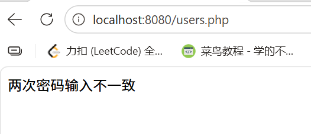

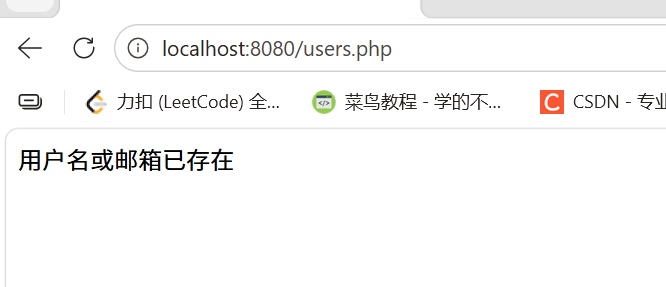

- 正常注册逻辑

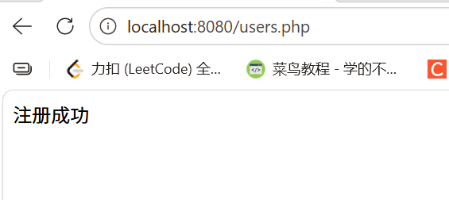

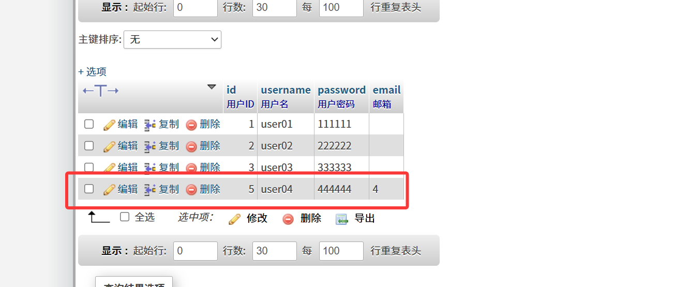

# 3. 用户相关处理逻辑

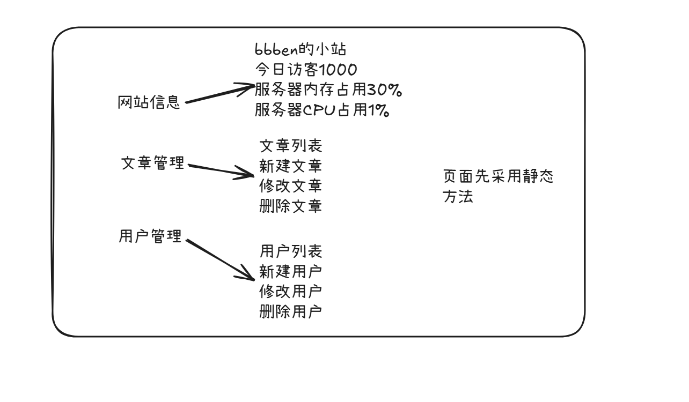

- 新建文件`main.php`主页面内容，`articles_list.php`文章管理，`users.php`用户管理，前端页面都使用AI进行优化，后端逻辑代码手写

## 3.1 用户管理界面users_list.php

- 经过AI美化后如图，需要在数据库中读出所有用户信息

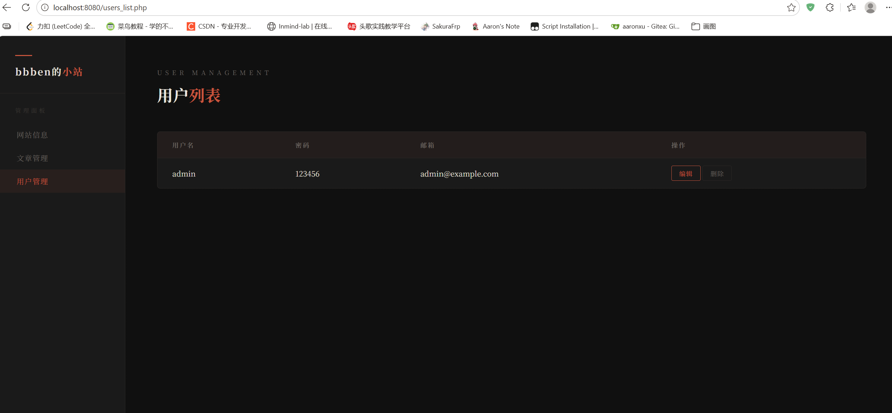

- 主要后端核心代码，主要逻辑还是读取数据库中的用户信息，主要思想是先连接数据库，然后循环读取其中每一行的数据并且关联取出 

```php
body>
    <span class="corner br">z.ai</span>

    <!-- 左侧导航栏 -->
    <aside class="sidebar">
        <div class="sidebar-brand">
            <div class="line"></div>
            <h2>bbben的<span>小站</span></h2>
        </div>

        <nav class="sidebar-nav">
            <div class="nav-label">管理面板</div>
            <a href="main.php" class="nav-item">网站信息</a>
            <a href="articles_list.php" class="nav-item">文章管理</a>
            <a href="users_list.php" class="nav-item active">用户管理</a>
        </nav>

        <div class="sidebar-footer">v2.0 · DASHBOARD</div>
    </aside>

    <!-- 右侧主内容 -->
    <div class="main">
        <div class="page-header">
            <div class="greeting">USER MANAGEMENT</div>
            <h1>用户<span>列表</span></h1>
        </div>

        <div class="table-wrap">
            <table>
                <thead>
                    <tr>
                        <th>ID</th>
                        <th>用户名</th>
                        <th>密码</th>
                        <th>邮箱</th>  
                        <th>操作</th>
                    </tr>
                </thead>
                <tbody>
                    <?php
                    // 连接mysql数据库
                        $host = "127.0.0.1";
                        $user = "root";
                        $userpassword = "usbw";
                        $database = "blog";
                        $port = "3307";
                        $conn = mysqli_connect($host, $user, $userpassword, $database, $port);
                        if (!$conn) {
                            die("连接失败: " . mysqli_connect_error());
                            exit;
                        }   
                        
                        // 查询用户数据
                        $sql = "SELECT * FROM users";
                        $result = mysqli_query($conn, $sql);
                        if (!$result) {
                            die("查询失败: " . mysqli_error($conn));
                            exit;
                        }

                        // 将查询的数据一行行输出
                        // mysql_fetch_assoc函数是将查询的数据以关联数组的形式返回，数组的Key是字段名，Value是字段值
                        while ($row = mysqli_fetch_assoc($result)) {
                        ?>
                            <tr>
                                <td><?php echo $row['id']; ?></td>
                                <td><?php echo $row['username']; ?></td>
                                <td><?php echo $row['password']; ?></td>
                                <td><?php echo $row['email']; ?></td>
                                <td>
                                    <a href="?id=<?php echo $row['id']; ?>" class="edit-btn">编辑</a>
                                    <a href="?option=del&id=<?php echo $row['id']; ?>" class="delete-btn">删除</a>
                                </td>
                            </tr>
                        <?php
                        }
                        ?>
                </tbody>
            </table>
        </div>
    </div>
</body>
```

## 3.2 编辑用户user_edit.php

- 单独新建一个`user_edit.php`文件来进行编辑用户操作 ，这个页面的内容提交给`users.php`（这个页面用来处理登录、注册、修改、退出、删除相关逻辑）

- 先读取对应id的用户相关信息，使用php代码填到表单对应的value值
- 然后将最后的保存按钮的`name标签`设置为`update`提交到`uers.php`用以区分处理逻辑

```php
div class="main">
        <div class="page-header">
            <div class="greeting">USER EDIT</div>
            <h1>编辑<span>用户</span></h1>
        </div>

        <?php
        include("db.php");
        $userid = $_REQUEST['id'];
        $sql = "select * from users where id='$userid'";
        $result = mysqli_query($conn, $sql);
        $user = mysqli_fetch_assoc($result);
        ?>

        <div class="form-card">
            <form action="users.php" method="post">
                <div class="field">
                    <label>用户名</label>
                    <input type="text" name="username" placeholder="用户名" value="<?php echo $user['username']; ?>" required>
                </div>

                <div class="field">
                    <label>密码</label>
                    <input type="password" name="password" placeholder="留空不修改">
                    <div class="hint">密码留空则不修改</div>
                </div>

                <div class="field">
                    <label>确认密码</label>
                    <input type="password" name="confirm_password" placeholder="再次输入密码">
                </div>

                <div class="field">
                    <label>邮箱</label>
                    <input type="email" name="email" placeholder="邮箱" value="<?php echo $user['email']; ?>" required>
                </div>

                <div class="btn-group">
                    <button type="submit" name="update" class="submit">保 存</button>
                    <a href="users_list.php" class="submit">取 消</a>
                </div>
            </form>
        </div>
    </div>
```

- `users.php`中接收`user_edit.php`中`update`标签传递过来的用户数据并进行相应更新操作

```php
elseif (isset($_REQUEST['update'])) {
    // 处理用户更新操作
    $userid = $_REQUEST['id'];
    $username = $_REQUEST['username'];
    $email = $_REQUEST['email'];

    // 判断是否需要修改密码，判断密码的长度
    if (strlen($_REQUEST['password']) > 0) {
        $userid = $_REQUEST['id'];
        $password = $_REQUEST['password'];
        $confirm_password = $_REQUEST['confirm_password'];
        if ($password != $confirm_password) {
            echo "<script>alert('两次密码输入不一致');window.location.href='users_list.php';</script>";
            exit;
        }
        // 更新用户名，密码，邮箱
        // 存在逻辑漏洞，没有判断用户名是否存在，可以修改别人的用户名
        $sql = "update users set username='$username', password='$password', email='$email' where id='$userid'";
        $result = mysqli_query($conn, $sql);
        if ($result) {
            echo "<script>alert('更新成功');window.location.href='users_list.php';</script>";
        } else {
            echo "<script>alert('更新失败: " . mysqli_error($conn) . "');window.location.href='users_list.php';</script>";
        }
    } else {
        // 更新用户名和邮箱，不修改密码
        $sql = "update users set username='$username', email='$email' where id='$userid'";
        $result = mysqli_query($conn, $sql);
        if ($result) {
            echo "<script>alert('更新成功');window.location.href='users_list.php';</script>";
        } else {
            echo "<script>alert('更新失败: " . mysqli_error($conn) . "');window.location.href='users_list.php';</script>";
        }
    }
}
```

- 更新失败以及成功还有密码不一致都有对应的弹窗提示并返回

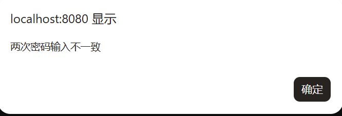

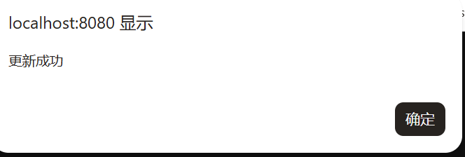

## 3.3 删除用户功能

- 在`users_list.php`中的删除按钮传递`del参数以及id`给`users.php`

```php
<a href="users.php?del&id=<?php echo $row['id']; ?>" class="delete-btn"
                                onclick="return confirm('确定删除此用户吗？')">删除</a>
```

- 在`users.php`接收`del参数以及id值`进行删除逻辑

```php
elseif (isset($_REQUEST['del'])) {
    // 删除用户
    $userid = $_REQUEST['id'];
    $sql = "delete from users where id='$userid'";
    $result = mysqli_query($conn, $sql);
    if ($result) {
        echo "<script>alert('删除成功');window.location.href='users_list.php';</script>";
    } else {
        echo "<script>alert('删除失败: " . mysqli_error($conn) . "');window.location.href='users_list.php';</script>";
    }
}
```

- 删除成功弹窗

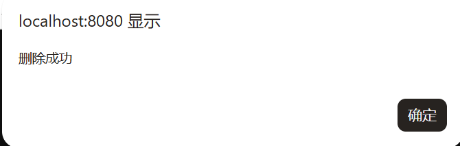

## 3.4 增加用户

- 增加用户`user_add.php`逻辑与编辑的逻辑类似，最后通过`add标签`传递数据给`users.php`

```php
<form action="users.php" method="post">
                <div class="field">
                    <label>用户名</label>
                    <input type="text" name="username" placeholder="输入用户名" required>
                </div>

                <div class="field">
                    <label>密码</label>
                    <input type="password" name="password" placeholder="输入密码" required>
                </div>

                <div class="field">
                    <label>确认密码</label>
                    <input type="password" name="confirm_password" placeholder="再次输入密码" required>
                </div>

                <div class="field">
                    <label>邮箱</label>
                    <input type="email" name="email" placeholder="输入邮箱" required>
                </div>

                <div class="btn-group">
                    <button type="submit" name="add" class="submit">添 加</button>
                    <a href="users_list.php" class="submit">取 消</a>
                </div>
            </form>
```

- 在`users.php`中识别`add标签`并且接收数据并对数据库进行处理，直接在注册逻辑里修改即可，逻辑基本一致

```php
elseif (isset($_REQUEST['register']) or isset($_REQUEST['add'])) {
    // 先从前端获取用户名，以及两次密码输入，邮箱或手机号
    $username = $_POST['username'];
    $password = $_POST['password'];
    $confirm_password = $_POST['confirm_password'];
    $email = $_POST['email'];

    // 判断两次密码输入是否一致
    if ($password != $confirm_password) {
        echo "两次密码输入不一致";
        exit;
    }

    // 判断用户名或邮箱是否存在
    $sql = "select * from users where username='$username' or email='$email'";
    $result = mysqli_query($conn, $sql);

    if (mysqli_num_rows($result) > 0) {
        echo "用户名或邮箱已存在";
        exit;
    }

    // 然后写sql语句，插入一条新的用户记录
    $sql = "insert into users (username, password, email) values ('$username', '$password', '$email')";
    $result = mysqli_query($conn, $sql);

    // 插入成功后，返回注册成功信息
    if ($result) {
        if (isset($_REQUEST['add'])) {
            echo "<script>alert('添加成功');window.location.href='users_list.php';</script>";
        } else {
            echo  "<script>alert('注册成功');window.location.href='login.html';</script>";
        }
    } else {
        if (isset($_REQUEST['add'])) {
            echo "<script>alert('添加失败');window.location.href='users_list.php';</script>";
        } else {
            echo  "<script>alert('注册失败');window.location.href='login.html';</script>";
        }
    }
}
```

- 增加成功弹窗

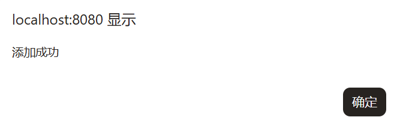

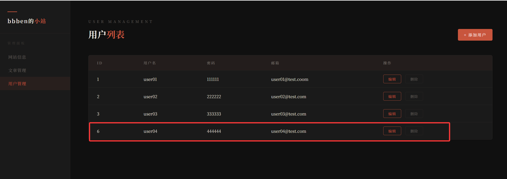

- 然后添加一个前端退出登录按钮

## 3.5 添加session记录登录状态

- 后台登陆需要使用session来记录，这样直接访问`main.php`会被提出来了，每一个用户都有一个对应的`cookie值`

- 所有前端共同的组件都放到了`header.php`当中了，session开始以及判断也放在这个共同的页面
- 这样直接访问`main.php`就会被直接弹出来

```php
// 引入数据库连接和会话初始化
include("db.php");
session_start();

// 检查用户是否已登录
if (!isset($_SESSION['username'])) {
    echo "<script>alert('请先登录'); location.href = 'login.php';</script>";
    exit();
}


// 登录之后的判断逻辑，需要将用户名存入session数组
 // 登录成功，设置会话变量
        $_SESSION['username'] = $username;
        echo "<script>alert('登录成功');window.location.href='main.php';</script>";


// 使用session记录会话还可以得到对应显示哪个用户在线
<div class="info">
                <div class="username"><?php echo htmlspecialchars($_SESSION['username']); ?></div>
                <div class="status">在线</div>
            </div>
```

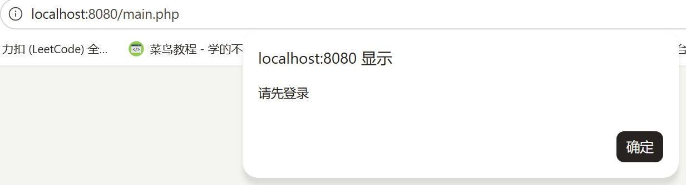

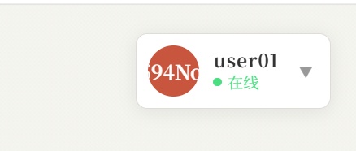

- 然后记得退出登录的逻辑需要删除session，由于删除操作是传递删除参数到`login.php`中的，所以删除会话逻辑放在这里（当然也可以放到`header.php`中进行处理，但是不能传给`login.php`，而是应该传给当前页面）

```php
<?php
// 处理退出登录
session_start();
if (isset($_GET['action']) && $_GET['action'] === 'logout') {
    session_destroy();
    header('Location: login.php');
    exit;
}

// 如果已登录，直接跳转到后台
if (isset($_SESSION['username'])) {
    header('Location: main.php');
    exit;
}
```

## 3.6 用户头像上传功能

- 先要在数据库用户表里加上头像这个字段

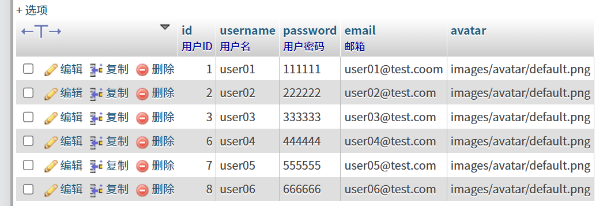

- 在用户管理界面加上一个修改头像的按钮，然后这个按钮传入参数到`user_avatar.php`页面处理修改头像逻辑

```php
<!DOCTYPE html>
<html lang="en">

<head>
    <meta charset="UTF-8">
    <meta name="viewport" content="width=device-width, initial-scale=1.0">
    <title>用户头像</title>
</head>

<body>
    <?php
    include("db.php");
    if (count($_FILES) > 0) {
        // 下载图片
        // 先获取图片的格式
        $ext = pathinfo($_FILES["avatar"]["name"], PATHINFO_EXTENSION);
        $img_path = "images/avatar/" . date("YmdHis") . mt_rand(10000, 99999) . "." . $ext;
        move_uploaded_file($_FILES["avatar"]["tmp_name"], $img_path);

        // 写入数据库

        $id = $_GET["id"];
        $sql = "update users set avatar = '$img_path' where id = " . $_GET["id"];
        mysqli_query($conn, $sql);
        if (mysqli_query($conn, $sql) === TRUE) {
            echo "<script>alert('修改成功');location.href='users_list.php';</script>";
        } else {
            echo "Error: " . $sql . "<br>" . mysqli_error($conn);
        }
    }
    // 获取当前头像
    $sql = "select * from users where id = '" . $_GET["id"] . "'";
    $result = mysqli_query($conn, $sql);
    $row = mysqli_fetch_assoc($result);
    $avatar = $row["avatar"];
    ?>
    <h1>用户头像</h1>
    <p>当前头像</p>
    " width="120" height="100">
    <p>上传新头像</p>
    <form action="" method="post" enctype="multipart/form-data">
        <input type="file" name="avatar" required>
        <input type="submit" value="上传">
    </form>
</body>

</html>
```

- 可以在`user_list.php`页面加上鼠标停在头像上方就可以显示头像的效果

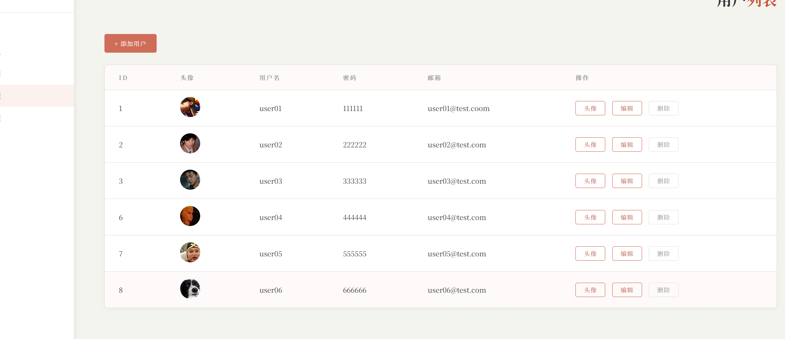

# 4. 文章相关处理逻辑

## 4.1 文章管理界面article_list.php

```php
<!-- 右侧主内容 -->
    <div class="main">
        <div class="page-header">
            <div class="title-wrap">
                <div class="greeting">ARTICLE MANAGEMENT</div>
                <h1>文章<span>列表</span></h1>
            </div>
            <a href="article_add.php" class="add-btn">+ 添加文章</a>
        </div>

        <div class="table-wrap">
            <table>
                <thead>
                    <tr>
                        <th>序号</th>
                        <th>标题</th>
                        <th>作者</th>
                        <th>发布时间</th>
                        <th>操作</th>
                    </tr>
                </thead>
                <tbody>
                    <tr>
                        <td>1</td>
                        <td>滕王阁序</td>
                        <td>王勃</td>
                        <td>2025-06-01 12:00:00</td>
                        <td>
                            <a href="article_edit.php?id=1" class="edit-btn">编辑</a>
                            <a href="article_delete.php?id=1" class="delete-btn">删除</a>
                        </td>
                    </tr>
                </tbody>
            </table>
        </div>
    </div>
```

## 4.2 添加文章界面article_add.php

- 准备要必要的输入界面，其余AI美化

```php
<form action="" method="post">	# 这里提交到当前页面，后端处理逻辑也写在这个文件里面
        <input type="text" name="title" placeholder="请输入文章标题" required>
        <input type="text" name="author" placeholder="请输入文章作者" required>
        <textarea name="content" placeholder="请输入文章内容"></textarea>
        <input type="submit" value="发布">
        <a href="articles_list.php">返回文章列表</a>
    </form>
```

- 后端处理逻辑

```php
<?php
    if (isset($_POST["title"])) {
        // 连接数据库
        include("db.php");

        // 接收标题，作者，正文内容等数据
        $title = $_POST["title"];
        $author = $_POST["author"];
        $content = $_POST["content"];
        $time = date("Y-m-d H:i:s");

        // 插入数据库
        $sql = "INSERT INTO articles (title, author, content, time) VALUES ('$title', '$author', '$content', '$time')";
        if (mysqli_query($conn, $sql) == TRUE) {
            echo "<script>alert('文章添加成功');location.href='articles_list.php'</script";
        } else {
            echo "error:" . mysqli_error($conn);
        }
    }
    ?>
```

- 添加成功，之后在`article_list.php`加上读取数据库显示文章的逻辑

```php
<?php
                    // 连接数据库
                    include("db.php");

                    // 查询所有文章
                    $sql = "select * from articles";
                    $resutlt = mysqli_query($conn, $sql);
                    while ($row = mysqli_fetch_assoc($resutlt)) {
                        // 标题超过10个子字，就加省略号
                        $title = strlen($row["title"]) > 45 ? substr($row["title"], 0, 45) . "..." : $row["title"];

                    ?>
                        <tr>
                            <td><?php echo $row["id"]; ?></td>
                            <td><?php echo $title; ?></td>
                            <td><?php echo $row["author"]; ?></td>
                            <td><?php echo $row["time"]; ?></td>
                            <td>
                                <a href="article_edit.php?id=1" class="edit-btn">编辑</a>
                                <a href="article_delete.php?id=1" class="delete-btn">删除</a>
                            </td>
                        </tr>
                    <?php
                    }
                    ?>
```

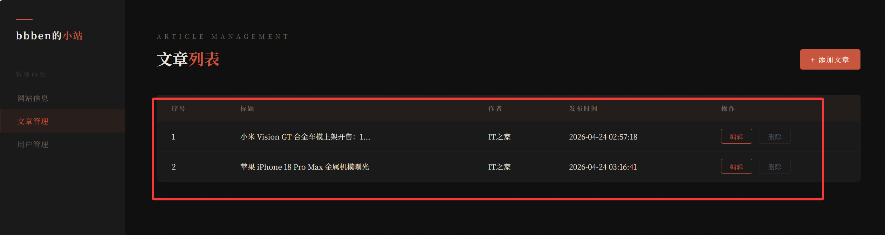

## 4.3 文章编辑功能

- 在文章列表页面编辑选项加入对应的id然后跳转到`article_edit.php`，文章编辑页面和添加基本一致，但要加入一开始读取数据库中文章的功能

```php
 <?php
    // 连接数据库
    include("db.php");

    // 获取文章id
    $id = $_REQUEST["id"];
    if (isset($_POST["title"])) {
        // 接收标题，作者，正文内容等数据
        $title = $_POST["title"];
        $author = $_POST["author"];
        $content = $_POST["content"];
        date_default_timezone_set('PRC');
        $time = date("Y-m-d H:i:s");

        // 插入数据库
        $sql = "update articles set title = '$title', author = '$author', content = '$content', time = '$time' where id = $id";
        if (mysqli_query($conn, $sql) == TRUE) {
            echo "<script>alert('文章更新成功');location.href='articles_list.php'</script>";
        } else {
            echo "error:" . mysqli_error($conn);
        }
    }
    ?>
        
    <?php
        // 获取文章id，以及对应的内容
        
        $sql = "select * from articles where id = $id";
        $result = mysqli_query($conn, $sql);
        $row = mysqli_fetch_assoc($result);
        ?>
        <div class="form-card">
            <form action="" method="post">
                <div class="field">
                    <label>标题</label>
                    <input type="text" name="title" placeholder="输入文章标题" value="<?php echo $row["title"]; ?>"quired>
                </div>

                <div class="field">
                    <label>作者</label>
                    <input type="text" name="author" placeholder="输入文章作者" value="<?php echo $row["author"]; ?>"equired>
                </div>

                <div class="field">
                    <label>内容</label>
                    <textarea name="content" placeholder="输入文章内容" required><?php echo $row["content"]; ?></textarea>
                </div>

                <div class="btn-group">
                    <button type="submit" class="submit">更 新</button>
                    <a href="articles_list.php" class="submit">返 回</a>
                </div>
            </form>
        </div>
```

## 4.4 文章删除功能

- 删除按钮提交文章id到`articles.php`本界面，在本界面再加一个接收要del的`id`值并处理删除逻辑

```php
// 删除文章
                    if (isset($_REQUEST["del"])) {
                        $id = $_REQUEST["id"];
                        $sql = "delete from articles where id = $id";
                        if (mysqli_query($conn, $sql) == TRUE) {
                            echo "<script>alert('文章删除成功');location.href='articles_list.php'</script>";
                        } else {
                            echo "error:" . mysqli_error($conn);
                        }
                    }


// 删除按钮传递del对应的id值
<a href="?del&id=<?php echo $row['id']; ?>" class="delete-btn"
                                onclick="return confirm('确定删除此文章吗？')">删除</a>
```

## 4.5 文章评论功能

- 在`header.php`共同的头部界面加上评论管理的组件

```php
<a href="comments_list.php" class="nav-item<?php echo $activeNav === 'comments' ? ' active' : ''; ?>">评论管理</a>
```

- 然后新建评论管理`comments_list.php`的界面，可以基于文章管理的界面进行修改，但是是查询评论对应的数据库
- 评论前端，在`article.php`中加入评论前端，表单提交给本页面，在`article.php`写后端处理逻辑

```php
<!-- 评论区域 -->
        <section class="comments-section" id="comments">
            <div class="comments-header">
                <h2 class="comments-title">留下你的想法</h2>
                <p class="comments-subtitle">Comments · 期待你的声音</p>
            </div>

            <!-- 评论表单 -->
            <form class="comment-form" action="" method="post">
                <div class="comment-form-row">
                    <div class="comment-form-group">
                        <label>昵称</label>
                        <input type="text" name="nick" placeholder="你怎么称呼？" required>
                    </div>
                    <div class="comment-form-group">
                        <label>邮箱</label>
                        <input type="email" name="email" placeholder="邮箱不会被公开">
                    </div>
                </div>
                <div class="comment-form-group">
                    <label>评论内容</label>
                    <textarea name="content" placeholder="有什么想法？在这里写下你的评论..." required></textarea>
                </div>
                <div class="comment-form-footer">
                    <span class="comment-hint">文明评论，友善交流</span>
                    <button type="submit" class="comment-submit">发 表</button>
                </div>
            </form>
```

- 后端逻辑，接收井插入数据库

```php
// 评论功能
$article_id = $_GET['id'];
if (count($_POST) > 0) {
    $nick = $_POST['nick'];
    $email = $_POST['email'];
    $content = $_POST['content'];
    $time = date('Y-m-d H:i:s');
    $sql = "INSERT INTO comments (article_id, nick, email, content, time) VALUES ($article_id, '$nick', '$email', '$content', '$time')";
    $result = mysqli_query($conn, $sql);
    if ($result) {
        echo "<script>alert('评论成功'); location.href='article.php?id=$article_id';</script>";
    } else {
        echo "<script>alert('评论失败'); location.href='article.php?id=$article_id';</script>";
    }
}
```

- 从数据库读取并展示评论

```php
<?php
                $sql = "select * from comments where article_id = {$article_id} order by id desc";
                $result = mysqli_query($conn, $sql);
                // 如果查询失败，则输出暂无评论
                if (!$result) {
                    echo "<div class='comment-item'><p>暂无评论</p></div";
                    return;

                }
                while ($row = mysqli_fetch_assoc($result)) {
                ?>
                <!-- 示例评论1 -->
                <div class="comment-item">
                    <div class="comment-avatar"><?php echo mb_substr($row["nick"], 0, 1, 'utf-8');?></div>
                    <div class="comment-body">
                        <div class="comment-header">
                            <span class="comment-name"><?php echo $row["nick"]; ?></span>
                            <span class="comment-time"><?php echo date('Y年m月d日', strtotime($row['time'])); ?></span>
                        </div>
                        <div class="comment-content">
                            <p class="comment-content"><?php echo $row["content"]; ?></p>
                        </div>
                        <div class="comment-reply">↩ 回复</div>
                    </div>
                </div>
                <?php
                }
                ?>
```

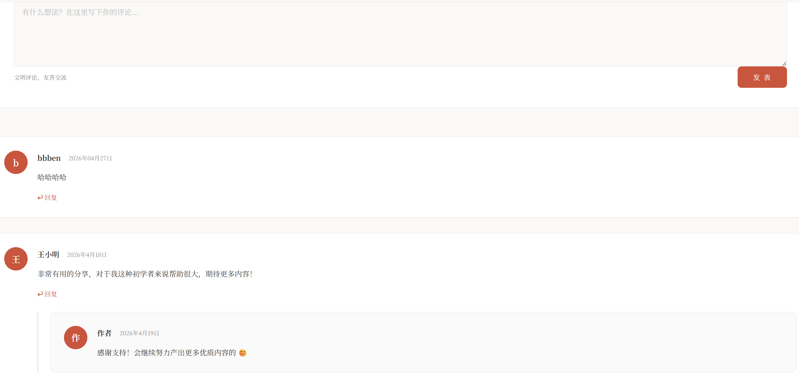

- 评论管理页面，照着文章对应的标签进行修改

```php
<?php
.......
// 删除评论
if (isset($_REQUEST["del"])) {
    $id = $_REQUEST["id"];
    $sql = "delete from comments where id = $id";
    if (mysqli_query($conn, $sql) == TRUE) {
        echo "<script>alert('评论删除成功');location.href='comments_list.php'</script>";
    } else {
        echo "error:" . mysqli_error($conn);
    }
}
    ?>


<?php
            $sql = "select * from comments order by id desc";
            $result = mysqli_query($conn, $sql);
            while ($row = mysqli_fetch_assoc($result)) {
                $sql = "select * from articles where id = '". $row['article_id']. "'";
                $article_result = mysqli_query($conn, $sql);
                $article_row = mysqli_fetch_assoc($article_result);
                $article_title = $article_row["title"];
            ?>
            <tr>
                <td><?php echo $row["id"]; ?></td>
                <td><?php echo $article_title; ?></td>
                <td><?php echo $row["nick"]; ?></td>
                <td><?php echo $row["time"] ?></td>
                <td><?php echo $row["content"]?></td>
                <td>
                    <a href="?del&id=<?php echo $row['id']; ?>" class="delete-btn"
                    onclick="return confirm('确定删除此评论吗？')">删除</a>
                </td>
            </tr>
            <?php } ?>
```

## 4.6 富文本编辑器

- 外部引入一个富文本编辑器https://pan.baidu.com/s/1fxUEFU1JgAX0EvVugXxqzg?pwd=6666，在需要编辑文章的窗口的页面加入

```php
<!-- 引入 UEditor -->
<script src="ueditor/ueditor.config.js"></script>
<script src="ueditor/ueditor.all.min.js"></script>
<script src="ueditor/lang/zh-cn/zh-cn.js"></script>
<script type="text/javascript">
    UE.getEditor('content', {
        initialFrameWidth: '100%',
        initialFrameHeight: 400,
        serverUrl: ''
    });
</script>
```

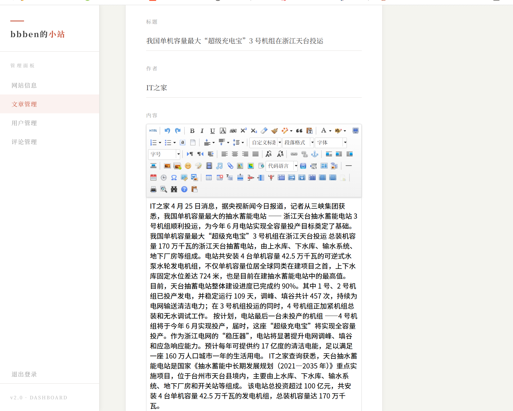

# 5. 博客前台实现

- 新建一个`index.php`文件，访问8080端口时直接访问
- 前台主要就是展示所有的文章内容，后续还可以点进具体的文章页面`article.php`查看以及文章评论的功能
- 最基础前台功能

```php
<!DOCTYPE html>
<html lang="en">

<head>
    <meta charset="UTF-8">
    <meta name="viewport" content="width=device-width, initial-scale=1.0">
    <title>bbben的小站</title>
</head>

<body>
    <h1>bbben的小站</h1>
    <ul>
        <?php
        include("db.php");
        $sql = "select * from articles";
        $result = mysqli_query($conn, $sql);
        while ($row = mysqli_fetch_assoc($result)) {
        ?>
            <li onclick="location.href='article.php?id=<?php echo $row['id']; ?>'">
                <p><?php echo $row['title']; ?></p>
                <p><?php echo $row['author']; ?></p>
                <p><?php echo $row['time']; ?></p>
            </li>
        <?php
        }
        ?>
    </ul>
</body>

</html>
```

- `article.php`展示具体文章内容，根据传过来的`id值`进行查询

```php
<!DOCTYPE html>
<html lang="en">
<head>
    <?php
    include("db.php");
    $id = $_GET['id'];
    $sql = "select * from articles where id='$id'";
    $result = mysqli_query($conn, $sql);
    $row = mysqli_fetch_assoc($result);
    ?>
    <meta charset="UTF-8">
    <meta name="viewport" content="width=device-width, initial-scale=1.0">
    <title>bbben的小站 - <?php echo $row['title']; ?></title>
</head>
<body>
    <h1><?php echo $row['title']; ?></h1>
    <h3><?php echo $row['author']." - ".$row['time']; ?></h3>
    <p><?php echo $row['content']; ?></p>
    <a href="/">返回首页</a>
</body>
</html>
```

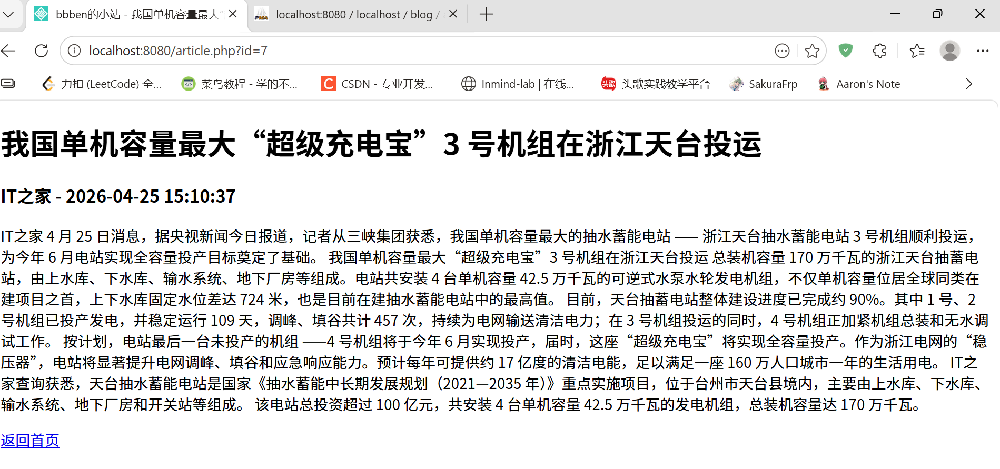

- 后续AI美化一下即可
